# N8Groker — Documentação Técnica e Análise do Projeto

> Ambiente de automação que integra **n8n**, **Docker**, **Ngrok**, **Porteiro**, **Scout Gate** (opcional), **Setup.bat** e **factory_reset** para expor workflows na internet com controle de acesso por IP e observabilidade OSINT na borda.

Guia de entrada: [`README.md`](README.md)

---

## 1. Visão Geral

O **N8Groker** resolve um problema comum ao rodar n8n localmente: expor a instância na internet **sem** configurar roteador, DNS ou firewall manual — e, ao mesmo tempo, **não deixar qualquer visitante entrar direto**.

A solução coloca o **Porteiro** (proxy reverso Node.js na porta `5677`) na frente do n8n. Todo tráfego externo passa por ele antes de chegar ao n8n (`5678`). Visitantes desconhecidos ficam em fila até um administrador aprovar ou bloquear via workflow n8n (e-mail com botões).

Com **`USE_SCOUT=1`** (padrão), o **Scout Gate** entra como camada adicional: `Ngrok → Scout (:4050) → Porteiro (:5677) → n8n`, oferecendo logs de tráfego, aliases IP, blocklist e toggles por rota sem modificar o Porteiro.

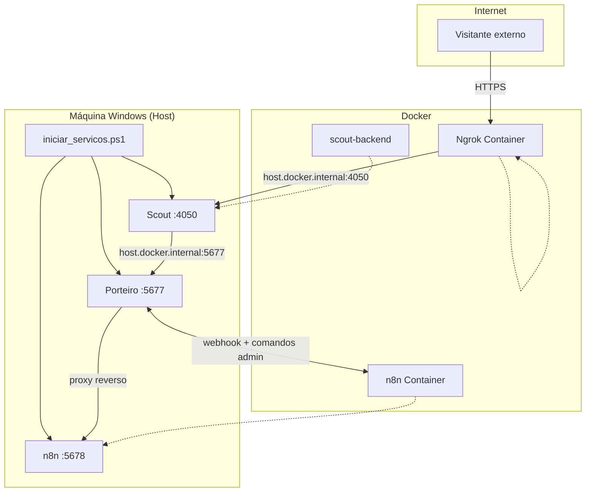

**Modo legado (`USE_SCOUT=0`):** Ngrok aponta directo para `host.docker.internal:5677` (sem Scout).

### Scout Gate — camada OSINT

| Responsabilidade | Scout | Porteiro |
|------------------|-------|----------|
| MITM TCP + logs de sessão | Sim | Não |
| Fila de aprovação por IP | Não | Sim |
| Blocklist na borda | Sim | Via n8n |
| Toggles por container/rota | Sim | Não |

**Operação:** `iniciar_servicos.ps1` sobe o Scout automaticamente. Tecla **`G`** no HUD abre o Control Plane em `http://localhost:8501/?aba=scout`. Neste ramo não há janela Tk; ela continua no `master`. `SCOUT_ENFORCE_FIREWALL=0` por defeito no Windows.

**Rotas Scout vs Ngrok (acesso ao n8n):**

| Papel | Variável / campo | Valor correcto |
|-------|------------------|----------------|
| Onde Ngrok envia tráfego | `SCOUT_PUBLIC_PORT` | `4050` |
| Porta Scout que escuta (rota `porteiro`) | `listen_port` | **igual** a `SCOUT_PUBLIC_PORT` |
| Destino após Scout | `SCOUT_UPSTREAM_HOST:PORT` | `host.docker.internal:5677` |
| Modo da rota porteiro | `mode` | `tcp` |
| Rotas activas recomendadas | aba Scout | **só** `porteiro` |

| Configuração | Resultado |
|--------------|-----------|
| Rota porteiro ON em `:4050` → `host.docker.internal:5677` | URL ngrok funciona; Porteiro aprova IP |
| Ngrok → `:4050` mas rota escuta noutra porta (ex. `5877`) | `ERR_NGROK_3004` — ninguém escuta em 4050 |
| Upstream `127.0.0.1:5677` dentro do container | Falha — 127.0.0.1 é o próprio container |
| Rota `n8n_app` ON (directo `:5678`) | Bypass do Porteiro — evitar |

O script `Sync-ScoutPorteiroRoute` (no boot) e a reconciliação em `redirection_registry.py` corrigem automaticamente a rota `porteiro-manual` com base no `.env`.

**Encerramento:** neste ramo o núcleo fecha com **Q** no HUD. O console não tem botão para parar o núcleo. n8n e Langfuse/LiteLLM param pelos botões da stack. Não há janela para fechar. O loop do HUD ainda honra um `.n8groker.shutdown.request` com `source` `scout_gui` se o arquivo aparecer (resto da versão clássica); este ramo não grava esse arquivo.

### Scout Gate — aba Scout

A gestão (`scout/gate.py`, tecla **G** no HUD) fala HTTP com o backend. `SCOUT_BACKEND_URL` em `ws://127.0.0.1:8765/ws` vira `http://127.0.0.1:8765`. O login do painel protege a seção.

| Bloco | Função |
|-----|--------|
| **Redirecionamentos** | Toggles por rota; modo tcp/http/https; portas manuais; sync Docker |
| **Tráfego** | Sessões (hora, cliente, rota, modo, upstream, bytes) e alertas |
| **Clientes** | IPs vistos persistidos em `data/known_clients.json` — última interação, modo, sessões; alias, bloquear, desbloquear e remover |
| **Configuração** | Endereço HTTP, health check, ngrok, firewall, docker |

**Aliases confiáveis:** IP com alias manual deixa de gerar alertas de tráfego/bloqueio na borda Scout e é removido da blocklist ao nomear.

**Modo de rota persistido:** `mode` (tcp/http/https) guardado em `data/redirections.json`. O sync no boot alinha porta/upstream do `.env` mas **não sobrescreve** o modo já guardado.

**Sync automático:** `Sync-ScoutPorteiroRoute` no `iniciar_servicos.ps1` e `reconcile_porteiro_entry` em `route_config.py` mantêm a rota `porteiro-manual` coerente com `SCOUT_PUBLIC_PORT` e `SCOUT_UPSTREAM_*`.

Não portado da janela do `master`: tick WebSocket de 1 segundo, bipe no alerta e fechar a janela para encerrar a stack. A tabela completa está no README, seção **Paridade da aba Scout**.

---

## 2. Componentes da Stack

| Componente | Tecnologia | Porta | Função |
|------------|------------|-------|--------|
| **Scout Gate** | Docker (Python) | `4050` (MITM), `127.0.0.1:8765` (API) | OSINT: MITM, tráfego, clientes, aliases, blocklist (`USE_SCOUT`). A gestão é a aba Scout do painel |
| **Porteiro** | Node.js nativo | `127.0.0.1:5677` (visitante), `127.0.0.1:5676` (`/n8n/*`) | Proxy reverso, fila por IP, rotas de aprovação só na rede local |
| **n8n** | Docker (`n8nio/n8n`) | `127.0.0.1:5678` | Automação e workflows de aprovação. `localhost:5678` continua direto |
| **Control Plane** | Streamlit | `127.0.0.1:8501` (console), `127.0.0.1:8502` (borda `/painel`) | Infraestrutura, Scout, Chat e, no console, a aba Admin |
| **Ngrok** | Docker (`ngrok/ngrok`) | `4040` (API) | Túnel HTTPS → Scout ou Porteiro |
| **Orquestrador** | PowerShell | — | `iniciar_servicos.ps1`: boot, HUD, shutdown |
| **Setup** | Batch + PowerShell | — | `Setup.bat`: deps e auto-config |
| **Factory reset** | Batch + PowerShell | — | `factory_reset.bat`: limpar dados (cópia) |

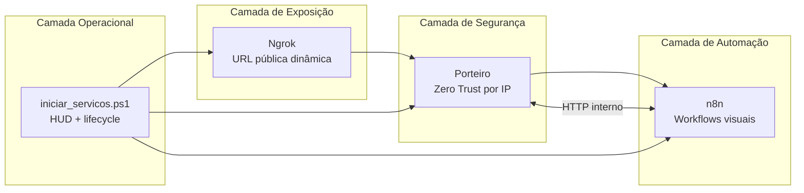

---

## 3. Scripts operacionais e lifecycle

O projecto inclui quatro pontos de entrada distintos:

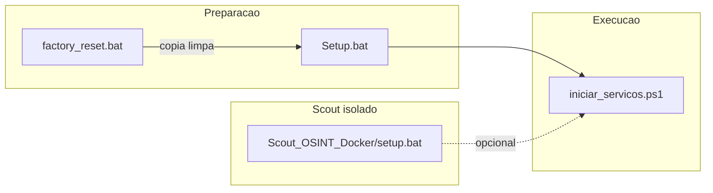

| Script | Quando usar | O que faz |
|--------|-------------|-----------|
| **`Setup.bat`** | Primeira vez ou máquina nova | Checklist de 11 dependências; menu por item: auto-config, abrir link, ignorar, reverificar; pode criar `.env` e rede Docker; **não** sobe serviços nem configura n8n |
| **`factory_reset.bat`** | Cópia do projecto para estado “GitHub limpo” | Confirmação `Excluir`; para containers; apaga `.env`, SQLite n8n, storage Porteiro, Scout/data, venv; recria `.gitkeep`; **não** apaga `Arquivos-n8n/`; opcional **S** recria `.env` a partir do template; **não** apaga imagens Docker |
| **`iniciar_servicos.ps1`** | Operação diária | Boot completo + HUD + sync ngrok + Scout |
| **`Scout_OSINT_Docker/setup.bat`** | Só Scout, sem stack N8Groker | container Docker e standby; G abre o painel |

### Setup.bat — checklist interactivo

Ordem de verificação: ExecutionPolicy → `.env` → chaves ngrok/n8n → Docker instalado/a correr → WSL2 → rede `rede_comunicacao` → Node.js → Python do Control Plane → pastas de dados → portas livres → venv do painel → imagens Langfuse/LiteLLM.

O host pede **Python 3.10+** (Control Plane e geração do `.env`). Nenhum módulo exige 3.11; a imagem Docker do Scout já é 3.11. O Scout sobe no Docker.

Auto-config disponível onde seguro: policy, copiar `.env`, criar rede Docker (`rede_comunicacao`), scaffold de pastas, venv + pip do Control Plane, abrir `.env` no Notepad. O Scout não pede venv de janela: o backend sobe no Docker.

**O que o Setup não faz** (fica para você ou para o `iniciar_servicos.ps1`):

| Não incluído | Quem resolve |
|--------------|--------------|
| Subir containers n8n/ngrok/Scout | `iniciar_servicos.ps1` |
| Criar a conta do produto n8n | Você, no primeiro acesso em `http://127.0.0.1:5678` |
| Abrir a sessão admin do painel | Você, com o JWT (`python -m control_plane.admin_token`) em `http://localhost:8501` |
| Importar / ativar workflows | Você, no editor n8n |
| Configurar SMTP | Você, no node `Email e Espera Aprovacao` |
| Preencher `admin_email` / `admin_token` no workflow | Você, no node `Configuracoes` |
| Instalar Docker, Node ou Python | Setup só verifica e abre links de download |

No fim, o Setup pode **perguntar** se deseja iniciar o `iniciar_servicos.ps1` — isso é opcional e separado do checklist.

### factory_reset.bat — o que apaga vs mantém

| Apagado | Mantido |
|---------|---------|
| `.env`, `.porteiro.pid`, locks supervisor | Código-fonte, compose, workflows |
| `n8n/n8n/data/*` (SQLite) | `.env_template` |
| `n8n/storage/*` (Porteiro) | `Setup.bat`, scripts, `Arquivos-n8n/` |
| `Scout_OSINT_Docker/data/*`, `.venv` | Documentação |

---

## 4. Fluxo de Inicialização (Boot)

O script `iniciar_servicos.ps1` automatiza toda a subida da infraestrutura e mantém um painel (HUD) em tempo real.

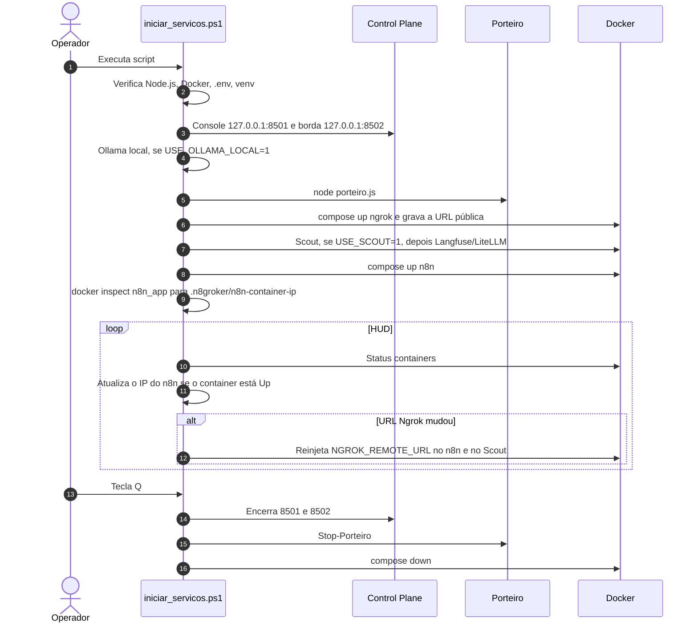

**Pontos-chave do boot:**
- Pré-requisitos validados antes de subir qualquer serviço (Node, Docker, `.env`). Use **`Setup.bat`** numa máquina nova para preparar tudo numa sessão.
- Ordem: Control Plane (console `8501` e borda `8502`), Ollama local se `USE_OLLAMA_LOCAL=1`, Porteiro, ngrok, Scout se `USE_SCOUT=1`, Langfuse/LiteLLM, n8n por último.
- O Scout sobe antes do ngrok, para `scout-backend` existir na rede. A URL pública entra em `SCOUT_NGROK_TUNNEL_URL` e `NGROK_REMOTE_URL` antes do primeiro `up` do n8n. O Scout é recriado uma vez depois da URL.
- Com `USE_SCOUT=1`: sobe `scout-backend`, `Sync-ScoutPorteiroRoute`, Ngrok aponta para `:4050`.
- Sem Scout: Ngrok aponta para `host.docker.internal:5677` (Porteiro).
- Depois que o n8n estabiliza, `docker inspect` de `n8n_app` grava `.n8groker/n8n-container-ip`. Não há IP fixo. O HUD relê esse arquivo enquanto o container está `Up`.
- URL pública é reinjetada em `WEBHOOK_URL` do n8n quando o túnel muda de verdade.
- A tecla **Q** fecha o que este script abriu, inclusive as portas `8501` e `8502`. Processo alheio nessas portas não é morto. Venv recusado não sobe o Streamlit.

---

## 5. Fluxo Principal — Aprovação de Acesso

Este é o fluxo central de valor do projeto: um visitante externo tenta acessar o n8n e passa por verificação humana (ou automatizável) via workflow.

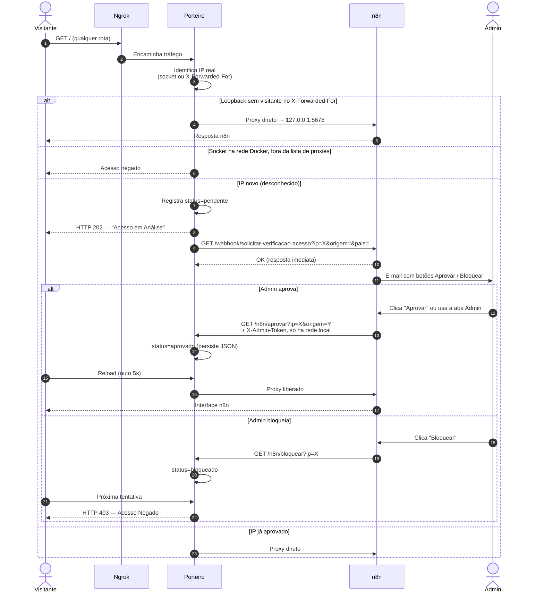

### Estados do visitante no Porteiro

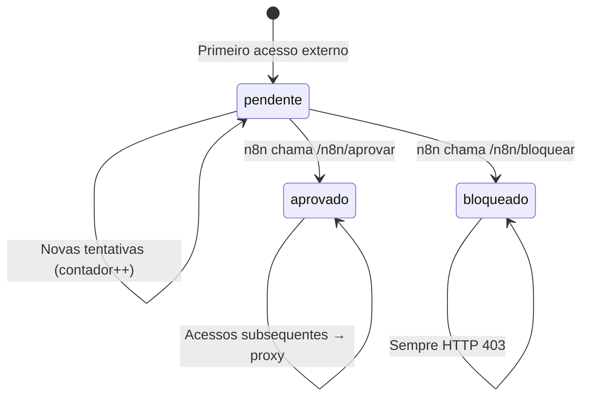

---

## 6. Fluxo de Segurança (Zero Trust)

O Porteiro implementa várias camadas de proteção antes de repassar tráfego ao n8n.

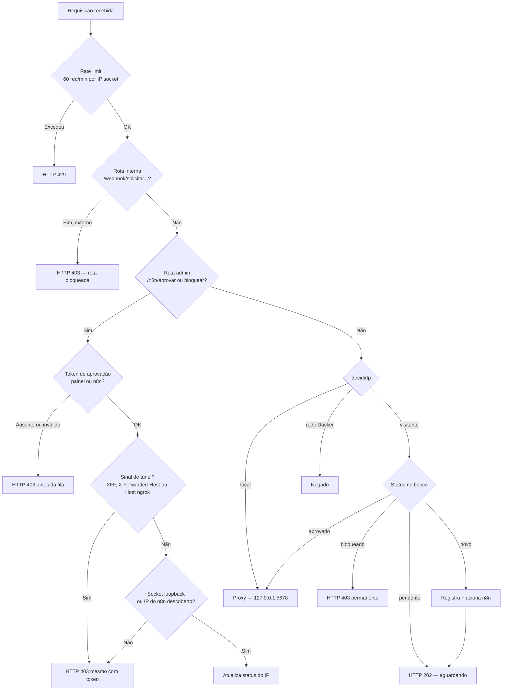

**Decisões de segurança relevantes:**

| Mecanismo | Implementação | Ganho |
|-----------|---------------|-------|
| IP do visitante | `decidirIp` em `Porteiro/identidade.js` | Loopback com `X-Forwarded-For` público é o visitante. `172.16/12` e `192.168.65.0/24` não são imunes |
| X-Forwarded-For condicional | No loopback, ou num proxy listado em `PORTEIRO_TRUSTED_PROXIES` | O ngrok grava o header; o visitante não o remove. O pipe do Scout copia os bytes |
| Rotas admin com token | `X-Admin-Token` igual a `.n8groker/porteiro-painel.token` ou `porteiro-n8n.token`, em qualquer porta e IP | Sem token a resposta é 403, antes do 404 da fila. `PORTEIRO_TOKEN` do `.env` é ignorado |
| Rotas admin só locais | `127.0.0.1:5676`, ou `5677` se o socket for loopback ou o IP de `n8n_app` em `.n8groker/n8n-container-ip`, e sem sinal de túnel | Token válido não abre o domínio ngrok. No Docker Desktop, `host.docker.internal:5676` parece loopback; a proteção é o token |
| Webhook interno bloqueado externamente | `/webhook/solicitar-verificacao-acesso` → 403 via proxy | Visitante não dispara aprovação falsa |
| Rate limiting | 60 req/min por IP de socket | Proteção básica contra DoS |
| Persistência atômica | write `.tmp` + rename | Banco JSON não corrompe em crash |
| Podagem de visitantes | Remove pendentes mais antigos acima de 1000 | Evita crescimento infinito do banco |

---

## 7. Workflow n8n — Aprovação de Acesso

O projecto inclui um workflow em `Workflows_para_Autenticação/Aprovacao de Acesso (Novo).json`:

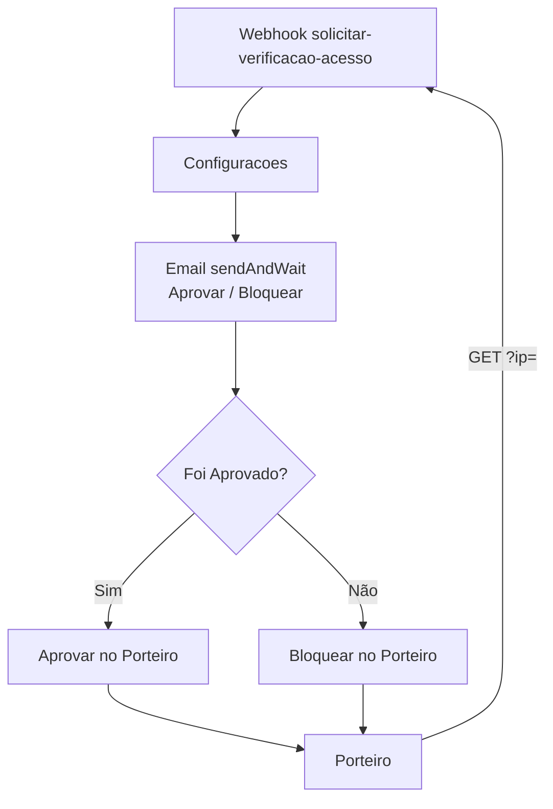

| Etapa | Descrição |
|-------|-----------|
| Webhook | Porteiro notifica IP novo; n8n responde OK de imediato |
| E-mail | Admin recebe botões Aprovar / Bloquear |
| Veredito | n8n chama `/n8n/aprovar` ou `/n8n/bloquear` no Porteiro |

### Configuração

Após importar `Aprovacao de Acesso (Novo).json`:

| Passo | Onde | Detalhe |
|-------|------|---------|
| 1 | n8n (primeiro acesso) | Criar a conta do produto n8n em `http://127.0.0.1:5678` — obrigatório após factory reset. Não é o JWT do painel |
| 2 | Node **Configuracoes** | `admin_email` → e-mail real do aprovador |
| 3 | Node **Configuracoes** | `admin_token` → `{{ $env.PORTEIRO_N8N_TOKEN }}` (já vem no JSON). Se `$env` for recusado, cole `.n8groker/porteiro-n8n.token` |
| 4 | Node **Configuracoes** | `porteiro_url` → `http://host.docker.internal:5677` (já vem no JSON) |
| 5 | Node **Email e Espera Aprovacao** | Credencial **SMTP** só se for usar o node de e-mail. Sem esse node, o SMTP não entra. Ver a seção 7.1 |
| 6 | Barra do workflow | **Activar** — o ficheiro importado traz `"active": false` |

**Tokens de aprovação e `admin_token`:**

- Não ficam no `.env`. O Scout monta esse arquivo. O `iniciar_servicos.ps1` grava `.n8groker/porteiro-painel.token` (aba Admin) e `.n8groker/porteiro-n8n.token` (workflow). O compose do n8n carrega só `.n8groker/porteiro-n8n.env`.
- O Porteiro ignora `PORTEIRO_TOKEN`. Sem token, ou com token errado, `/n8n/*` responde 403 em qualquer porta, inclusive loopback, antes de consultar a fila.
- Um workflow já importado não atualiza sozinho. Se o n8n bloquear `$env`, cole o conteúdo de `porteiro-n8n.token` no campo `admin_token`. Campo vazio fecha a aprovação (403).
- A imagem do n8n lê `NODES_EXCLUDE` (array JSON). `N8N_NODES_EXCLUDE` no `.env` é a lista separada por vírgula; o `iniciar_servicos.ps1` converte e mostra `docker exec n8n_app printenv NODES_EXCLUDE` no log. Tira Execute Command, SSH e os nodes de arquivo local. Vale também para `localhost:5678`. O node Code continua. `N8N_BLOCK_ENV_ACCESS_IN_NODE` não é ligado, porque este workflow lê `$env.PORTEIRO_N8N_TOKEN`.
- `.n8groker/porteiro-hmac.key` tem de ser arquivo, não pasta. O `iniciar_servicos.ps1` cria o arquivo antes do compose e repara pasta vazia. Sem essa chave o painel público não assina o cabeçalho.
- No Docker Desktop, `host.docker.internal:5676` chega como loopback. O bind não isola o outro container. A proteção é o token.

`/n8n/aprovar`, `/n8n/bloquear`, `/n8n/vincular`, `/n8n/fila` e `/n8n/solicitar` não atendem pelo domínio do ngrok. Da máquina, o prefixo é `http://127.0.0.1:5676`. Do container n8n, `http://host.docker.internal:5677`, sem header de proxy. A aba Admin do console fala só com a porta 5676, atualiza a lista na hora e segue mesmo se o webhook do n8n responder 404. Aprovar um par IP e origem não grava `conta_vinculada`. Sem `origem` o dispositivo não fica aprovado. Vincular exige esse par já `aprovado` e não é feito por `/n8n/aprovar`. O webhook manda impressão, origem, navegador, sistema, idioma e horário; `pais` vai vazio. Um workflow já importado não recebe esses campos sozinho.

A conta criada em `http://127.0.0.1:5678` é a conta do produto n8n. O admin do painel não tem usuário nem senha: é o JWT de `python -m control_plane.admin_token`, colado no console em `http://localhost:8501`.

<a id="integrar-porteiro-automacao"></a>

## 7.1 Integrar o Porteiro com outra automação

O Porteiro não precisa de SMTP nem do n8n para decidir. Ele faz duas coisas:

1. **Avisa** que um visitante entrou na fila, com um `GET` local, sem corpo e sem token.
2. **Recebe o veredito** (`aprovar`, `bloquear`, `vincular`) por HTTP, com `X-Admin-Token`, só pela rede da máquina.

O e-mail do workflow `Aprovacao de Acesso (Novo).json` é um jeito de pôr uma pessoa no meio. Dá para trocar esse passo por Slack, Telegram, outro fluxo, outra ferramenta ou um script. O SMTP só é necessário se o fluxo usar o node de e-mail. O passo a passo em linguagem simples, com diagramas, está em [Integrar o aviso do Porteiro](docs/apresentacao/GUIA-DE-USO.md#integrar-aviso-porteiro).

### O destino do aviso é fixo

O aviso sai de `acionarN8n`, em `Porteiro/porteiro.js`. O host é `127.0.0.1`. O caminho é `/webhook/solicitar-verificacao-acesso`, montado por `caminhoWebhook` em `Porteiro/identidade.js`. Os dois estão fixos no código. Isso é intencional e não será mudado.

A única parte que muda é a porta, pela variável de ambiente da sessão `N8N_LOCAL_PORT`. Sem ela, a porta é `5678`. O `iniciar_servicos.ps1` não lê essa variável do `.env`: `Get-EnvValue` não a consulta, e ela não está no `.env.example`. O script sobe `node porteiro.js`, e esse processo herda o ambiente da sessão. Defina a variável na mesma janela, antes de rodar o script:

```powershell
$env:N8N_LOCAL_PORT = "5680"
.\iniciar_servicos.ps1
```

`5680` aqui é só um exemplo de porta livre. Defina a variável de novo se abrir outra janela: um Porteiro que já subiu não passa a ver o valor novo.

### O webhook local pode ser outra aplicação

Qualquer serviço em `127.0.0.1` que atenda esse `GET` recebe o aviso. Não precisa ser o n8n. O Porteiro roda na máquina, com `node porteiro.js`, e o aviso sai do loopback dela. Um programa que só existe dentro do Docker recebe o aviso se a porta estiver publicada em `127.0.0.1`. O Porteiro avisa um destino só: um `GET`, um host, uma porta, um caminho.

Se a outra aplicação usar outra porta, defina `N8N_LOCAL_PORT` como acima. Não ocupe a `5678` enquanto o n8n estiver no ar. O compose publica o n8n em `127.0.0.1:5678`, e dois programas não escutam a mesma porta. O proxy do visitante, `fazerProxy` em `Porteiro/porteiro.js`, continua na `5678` mesmo quando `N8N_LOCAL_PORT` muda. A variável só muda o destino do aviso.

O Porteiro espera no máximo 5 segundos (`setTimeout` em `acionarN8n`) e não segura o visitante: o aviso sai em seguida, com `setImmediate`. O status da resposta vai para o log. Se o destino responder 404 ou estiver fora do ar, a fila continua e o veredito pode vir da aba Admin. Responda rápido, por exemplo `200`, e decida depois. Não deixe a conexão aberta esperando uma pessoa.

Quem pede esse caminho **ao** Porteiro (porta `5677`) recebe 403: `Acesso Negado: Esta rota e bloqueada para acessos externos.` O aviso é uma saída do Porteiro, não uma rota pública.

### Três caminhos

1. **n8n como ponte (recomendado).** Deixe o webhook `solicitar-verificacao-acesso` no n8n e troque o node de e-mail pelo destino que quiser: Slack, Telegram, HTTP Request, formulário ou botão. O veredito volta por `/n8n/aprovar`, `/n8n/bloquear` ou `/n8n/vincular`, com `X-Admin-Token`. Não precisa de SMTP.
2. **Consultar a fila.** A automação chama `GET http://127.0.0.1:5676/n8n/fila` de tempos em tempos, com o token, e age sobre os itens `pendente`.
3. **Outra aplicação no lugar do webhook.** Ela escuta em `127.0.0.1`, no caminho fixo. Se a porta não for `5678`, use `N8N_LOCAL_PORT` na sessão, antes do `iniciar_servicos.ps1`.

O workflow de exemplo aprova e bloqueia. Ele não chama `/n8n/vincular`. Com o Scout, `exige_porteiro` em `Scout_OSINT_Docker/scout/core/porta_apps.py` só abre um app com o IP aprovado, a origem aprovada, `conta_vinculada` igual à conta da sessão e `vinculo` em `ativo`.

### Portas

| Porta / endpoint | Quem escuta | Para que serve | Onde se define | Padrão |
|---|---|---|---|---|
| `5677` | Porteiro, em `127.0.0.1` | Entrada do visitante. Também aceita `/n8n/*` com token, só de loopback ou do IP listado do `n8n_app` | Fixa em `Porteiro/porteiro.js` (`PORTA_DO_PORTEIRO`) | `5677` |
| `5676` | Porteiro, em `127.0.0.1` | Só `/n8n/*`. Outro caminho responde 404: `Esta porta so atende as rotas locais de aprovacao.` | `PORTEIRO_ADMIN_PORT` no ambiente do processo `node` | `5676` |
| `5678` | n8n (`n8n_app`), em `127.0.0.1` | Editor e webhooks do n8n | `n8n/docker-compose.yml` (`ports`) | `5678` |
| `GET /webhook/solicitar-verificacao-acesso` | Quem estiver em `127.0.0.1` na porta do aviso | Saída do Porteiro quando há visitante na fila | Host e caminho fixos. Só a porta muda (`N8N_LOCAL_PORT`) | `127.0.0.1:5678` |
| `4050` | Scout, portal do túnel | Destino do ngrok com `USE_SCOUT=1` (`scout-backend` e `SCOUT_PUBLIC_PORT`) | `SCOUT_PUBLIC_PORT` no `.env` | `4050` |
| `4040` | ngrok, em `127.0.0.1` | API local de onde o Porteiro lê o domínio público (`configurarDominio`) | `ngrok/docker-compose.yml` | `4040` |

Nenhuma rota de veredito aplica o veredito pela URL pública do ngrok. Se o pedido chega com sinal de túnel, a resposta é 403.

### Quando o aviso sai

O aviso sai em três casos: nasce um IP pendente, aparece uma origem nova (também quando o dispositivo da mesma origem muda) e o painel chama `/n8n/solicitar`. Não há botão **Solicitar** na aba Admin. `_pedir_vinculo`, em `control_plane/app.py`, chama essa rota quando alguém entra com token válido e o IP ainda está sem vínculo, na tela **Aguardando aprovação**. Essa chamada leva a conta, então o parâmetro `conta` entra no aviso. Uma visita repetida do mesmo IP, sem origem nova e sem essa chamada, não dispara outro aviso.

Com o Scout, quem cria o pendente é o Scout, na porta `5676`: `tocar` chama `/n8n/tocar` e `registrar` chama `/n8n/registrar-origem` (`porta_apps.py`, URL em `PORTEIRO_FILA_URL`). São dois avisos: um quando o IP nasce e outro quando a origem nova entra. O navegador não recebe o token. O primeiro aviso, o do `tocar`, pode ir com navegador, sistema e idioma vazios, porque essa chamada manda o IP. O aviso da origem nova leva `origem` e `dispositivo`. O `dispositivo` é o SHA-256 da chave pública do navegador, em hexadecimal (`origem.js`).

### Contrato do aviso

```text
GET http://127.0.0.1:<porta>/webhook/solicitar-verificacao-acesso
    ?ip=<ip>&conta=<conta>&dispositivo=<id>&origem=<id>&origem_aprovada=<id>
    &navegador=<nome>&sistema=<nome>&idioma=<tag>&horario=<UTC ISO-8601>&pais=
```

`<porta>` é `N8N_LOCAL_PORT` ou `5678`. É `http` e `GET`, sem corpo e sem token. `conta` só entra quando existe. `pais` vai sempre vazio: não há GeoIP, e o idioma não é copiado para esse campo. `horario` é UTC, gerado no Porteiro.

No node **Configuracoes** do workflow de exemplo, `porteiro_url` já vem `http://host.docker.internal:5677` e `admin_token` já vem `{{ $env.PORTEIRO_N8N_TOKEN }}`. Não grave o token no workflow em texto aberto. Se a imagem do n8n recusar `$env`, o checklist do README manda colar o conteúdo de `.n8groker/porteiro-n8n.token` no campo. Um script nesta máquina lê o arquivo. O valor aceito é o de `.n8groker/porteiro-painel.token` ou o de `.n8groker/porteiro-n8n.token`. O `iniciar_servicos.ps1` cria os dois. `PORTEIRO_TOKEN` é ignorado. Se `PORTEIRO_PAINEL_TOKEN` ou `PORTEIRO_N8N_TOKEN` estiver no ambiente do processo `node`, esse valor vale no lugar do arquivo correspondente.

### O veredito

| Ação | Chamada | Efeito |
|---|---|---|
| Ver a fila | `GET /n8n/fila` | JSON `{visitantes: [...]}` com os registros como estão gravados. Há `status` e `origens`. `conta_vinculada` e `vinculo` aparecem depois de um vínculo aceito |
| Aprovar | `GET /n8n/aprovar?ip=<ip>&origem=<id>` | O par fica `aprovado` (`origens.aprovar`). Não grava `conta_vinculada`. Sem `origem`, nada é aprovado |
| Bloquear | `GET /n8n/bloquear?ip=<ip>&origem=<id>` | Bloqueia essa origem. Sem `origem`, bloqueia o IP inteiro (`fila.bloquear`) |
| Vincular | `GET /n8n/vincular?ip=<ip>&conta=<conta>&origem=<id>` | Liga a conta ao par já aprovado. Sem `origem`, recusa |

| Quem chama | Endereço |
|---|---|
| Processo nesta máquina (script, outra automação, aba Admin) | `http://127.0.0.1:5676` |
| Container `n8n_app` | `http://host.docker.internal:5677` (é o `porteiro_url` do workflow), sem header de proxy |
| Outro container, no Docker Desktop, quando `host.docker.internal` aparece como loopback | A mesma URL, com o token. O bind em `127.0.0.1` não separa esse container. A proteção é o token |
| Socket que não é loopback | Só passa se for o IP do `n8n_app` na faixa `172.16/12`, lido de `.n8groker/n8n-container-ip` (o `iniciar_servicos.ps1` grava com `docker inspect`) ou de `PORTEIRO_N8N_IPS` no ambiente do `node`. A faixa inteira não passa: o Scout também está nela |
| URL do ngrok, ou pedido com `X-Forwarded-For`, `X-Forwarded-Host` ou `Host` do ngrok | Recusado com 403, mesmo com token (`decidirAdmin` em `Porteiro/admin_rede.js`) |

Respostas em texto puro, exceto `fila` e `solicitar` (JSON):

| Código | Texto | Quando |
|---|---|---|
| `200` | `Sucesso! A origem ... do IP ... esta aprovada.` | `aprovar` com origem que está na fila |
| `200` | `Sucesso! A origem ... esta bloqueada.` | `bloquear` com origem |
| `200` | `Sucesso! O IP ... agora esta bloqueado.` | `bloquear` sem origem |
| `200` | `IP ... vinculado a <conta>.` | `vincular` aceito. Este texto não começa com `Sucesso!` |
| `400` | `IP invalido.` | `ip` ausente ou mal formado |
| `400` | `Origem obrigatoria. Dispositivo nao aprovado.` | `aprovar` sem `origem`. Esta conferência vem antes da fila |
| `400` | `Origem obrigatoria.` | `vincular` sem `origem` |
| `400` | `Conta invalida.` | `vincular` com conta fora do padrão: 3 a 64 caracteres, letras, números, ponto, `_` ou `-` |
| `403` | `Token invalido.` ou `Token de aprovacao nao configurado.` | Header ausente ou errado. Vem antes de olhar a fila |
| `403` | `As rotas de aprovacao nao aceitam acesso pelo tunel.` | Header de proxy ou `Host` do ngrok |
| `403` | `As rotas de aprovacao so aceitam a rede local da maquina.` | Socket fora de loopback e fora do IP listado do n8n |
| `404` | `Erro: O IP nao esta na fila de espera.` | `aprovar` (com origem) ou `bloquear` de um IP que não está na fila. Essa recusa não entra em `.n8groker/audit.jsonl` |
| `404` | `Origem nao registrada.` | `aprovar` ou `bloquear` com origem que não pertence a esse IP |
| `404` | `Rota admin desconhecida.` | Caminho `/n8n/` que não é fila, tocar, registrar-origem, aprovar, bloquear, vincular nem solicitar |
| `409` | `O par IP e origem precisa estar aprovado antes do vinculo.` | `vincular` com o par ausente ou ainda não aprovado. Um IP que não está na fila cai aqui, não no 404, quando a chamada traz `origem` |
| `409` | `O IP precisa estar aprovado antes do vinculo.` | O par da origem está aprovado, mas o IP inteiro não está (`fila.vincular`) |
| `429` | `Muitas requisicoes. Aguarde.` | Mais de 60 pedidos por minuto de um socket que não é loopback. A conferência vem antes do token. Loopback não entra no limite |

O veredito aplicado (`aprovar`, `bloquear` ou `vincular` com sucesso) entra em `.n8groker/audit.jsonl`. O Porteiro só decide sobre IP que já está na fila. Para testar, entre antes pelo túnel com um navegador e use o `ip` e a `origem` do aviso, ou os que aparecem em `/n8n/fila`. Aprovar ou bloquear um IP inventado, com origem no caso do aprovar, volta 404.

### O alerta da trilha é outro webhook

`N8GROKER_ALERTA_WEBHOOK`, no ambiente do `scout-backend`, não muda veredito. O padrão no compose do Scout é `http://n8n_app:5678/webhook/alerta-trilha`. `url_do_alerta` e `_webhook_local`, em `Scout_OSINT_Docker/scout/core/trilha.py`, só chamam `http`, com caminho que começa em `/webhook/`, e só para `n8n_app`, `host.docker.internal`, `127.0.0.1`, `localhost` ou o host de `N8N_UPSTREAM_HOST`. Qualquer outro destino é ignorado, sem aviso. Dentro do container, com `SCOUT_BACKEND=1`, `127.0.0.1` e `localhost` são reapontados para `n8n_app` (ou para `N8N_UPSTREAM_HOST`). Para um receptor no host, use `host.docker.internal`.

### Não mude a porta sem ajustar o resto

- `5676`: a aba Admin chama `http://127.0.0.1:5676` (`control_plane/porteiro_admin.py`) e o compose do Scout usa `PORTEIRO_FILA_URL=http://host.docker.internal:5676/n8n/fila`. Se mudar `PORTEIRO_ADMIN_PORT`, os dois param de falar com a fila.
- `5678`: `fazerProxy` usa essa porta fixa, independente de `N8N_LOCAL_PORT`.
- `5676` e `5677`: uma rota manual do Scout não pode escutá-las nem apontar o túnel para elas (`redirection_registry.py`). A rota `porteiro-manual` continua levando o visitante ao `5677`.

---

## 8. Mapa de Rede e Portas

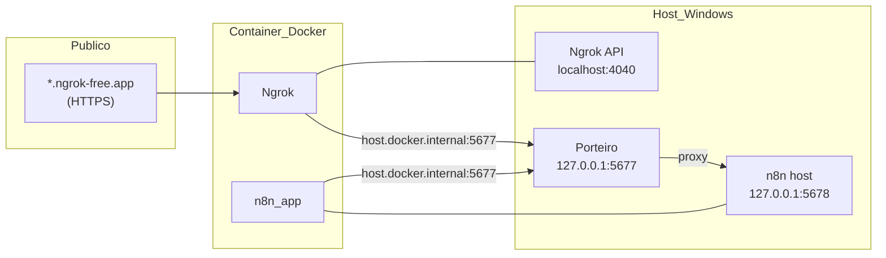

| Porta | Serviço | Exposta externamente? |
|-------|---------|------------------------|
| `4050` | Scout MITM (com `USE_SCOUT=1`) | Sim (via Ngrok). Escuta no host |
| `8765` | Scout API de gestão (HTTP) | Não. Publish `127.0.0.1:8765` |
| `5676` | Porteiro, rotas `/n8n/*` | Não. Escuta só em `127.0.0.1` |
| `5677` | Porteiro, visitante | Sim, só `127.0.0.1`. No Docker Desktop o ngrok chega por `host.docker.internal` |
| `5678` | n8n | Não. Publish `127.0.0.1:5678`. `localhost:5678` é direto |
| `8501` | Control Plane, console | Não. `127.0.0.1`. O browser usa `http://localhost:8501` |
| `8502` | Control Plane, borda `/painel` | Não. `127.0.0.1`. Só o Porteiro encaminha, com HMAC |
| `4040` | Ngrok dashboard/API | Apenas localhost |
| `3000` | Langfuse | UI no host |
| `3030` | Langfuse worker | Health, só localhost |
| `4000` | LiteLLM | UI em `/ui` |
| `9090` | MinIO do Langfuse | Só `127.0.0.1` |
| `11434` | Ollama local | Só se `USE_OLLAMA_LOCAL=1` e o programa existir. Não entra no LiteLLM pelo script |

---

## 9. Persistência de Dados

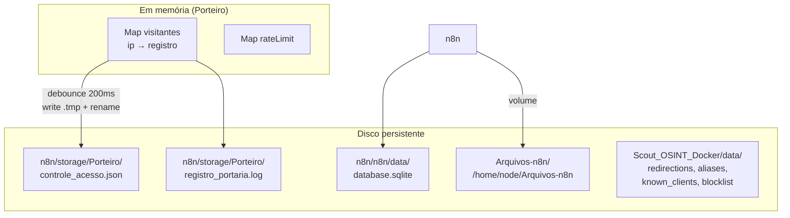

`n8n/storage/Porteiro` existe para o Porteiro (Node no host) e para o HUD. O workflow de aprovação fala com o Porteiro por HTTP, não por arquivo. O compose antigo montava `./n8n/storage` a partir de `n8n/docker-compose.yml`, isto é `n8n/n8n/storage` em `/home/node/.n8n-files`. Nenhum script grava nessa pasta dobrada; o Docker é que a criava no primeiro `up`. Na primeira subida, `setup_projeto.ps1` e `iniciar_servicos.ps1` movem o que houver lá para `Arquivos-n8n/` (sem sobrescrever nome já existente) e deixam o marcador `n8n/n8n/storage/.migrado-para-Arquivos-n8n`. O volume do banco não muda: `./n8n/data` → `/home/node/.n8n` no host `n8n/n8n/data`. O `.gitkeep` solto em `n8n/data/` foi removido; o `factory_reset` ainda apaga essa pasta se uma cópia antiga existir, e não a recria.

No nó **Read/Write Files from Disk** use `/home/node/Arquivos-n8n/entrada.csv`. `N8N_RESTRICT_FILE_ACCESS_TO=/home/node/Arquivos-n8n` e `N8N_BLOCK_FILE_ACCESS_TO_N8N_FILES=true`. `NODES_EXCLUDE` continua tirando Execute Command, SSH e os nodes de arquivo local até o nome sair da lista. Apague o nome e recrie o container para o caminho passar a valer.

**Registro de visitante (exemplo):**
```json
{
  "ip": "203.0.113.42",
  "status": "pendente | aprovado | bloqueado",
  "data_primeiro_acesso": "2026-05-31T12:00:00.000Z",
  "tentativas": 3
}
```

---

## 10. Principais Ganhos do Projeto

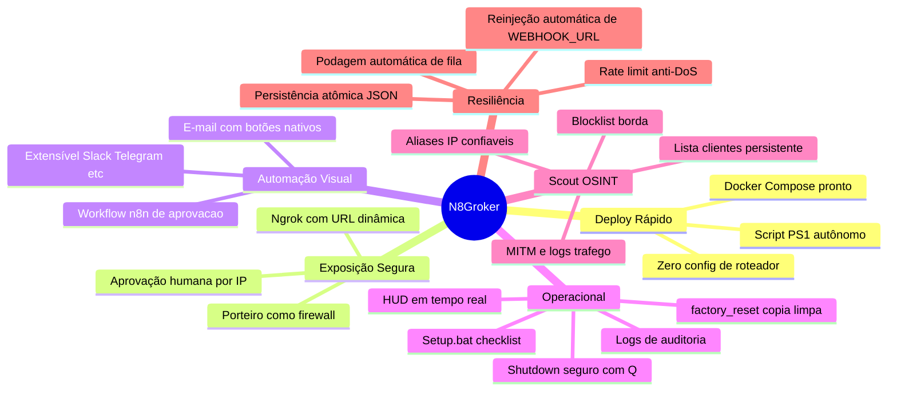

### Resumo dos ganhos

| Área | Antes (cenário típico) | Com N8Groker |
|------|------------------------|--------------|
| **Tempo de setup** | Horas configurando rede, DNS, reverse proxy | Minutos: `.env` + executar `.ps1` |
| **Exposição na internet** | Port forwarding manual ou VPS | Ngrok com URL automática |
| **Controle de acesso** | Basic Auth fixo ou n8n aberto | Fila por IP + aprovação via e-mail |
| **Observabilidade** | Logs espalhados | HUD + Scout (tráfego, clientes) + `registro_portaria.log` |
| **Setup inicial** | Instalar deps manualmente | `Setup.bat` com links e auto-config |
| **Manutenção de URL** | Atualizar webhooks manualmente | Script reinjeta `NGROK_REMOTE_URL` |
| **Segurança** | n8n exposto diretamente | Zero Trust: proxy, rate limit, rotas admin isoladas |
| **Flexibilidade** | Regras hardcoded | Workflows n8n editáveis visualmente |

---

## 11. Variáveis de Ambiente

A lista abaixo é a do `.env.example` (e do `.env_template`, com as mesmas chaves), mais os segredos que ficam fora dela. O Setup chama `scripts/init_env.py` e troca cada `__GENERATE_*__` por um segredo. Não commite o `.env`. Não coloque chave de provider de LLM aqui: modelo e credencial entram pela UI do LiteLLM. A chave do JWT (`admin.key`), a do HMAC do Porteiro e os tokens de aprovação não são variáveis do `.env`: ficam em `.n8groker/`, porque o compose do Scout carrega o `.env`.

| Variável | Propósito |
|----------|-----------|
| `PORTEIRO_USER`, `PORTEIRO_PASS` | Basic Auth do n8n no modelo |
| `N8N_ENCRYPTION_KEY` | Criptografia do banco n8n. Não troque depois do primeiro boot |
| `NGROK_AUTHTOKEN` | Token do ngrok.com. O Setup não inventa este valor |
| `NGROK_REMOTE_URL` | Vazia no `.env.example` e no `.env_template`. O orquestrador define no processo quando o túnel ngrok sobe e reinjeta como `WEBHOOK_URL`. Não preencher à mão. A URL que permanece no `.env` é `SCOUT_NGROK_TUNNEL_URL`. |
| `N8N_RESTRICT_FILE_ACCESS_TO` | `n8n/docker-compose.yml`. Allowlist dos nós de arquivo: `/home/node/Arquivos-n8n`. Na imagem n8n `2.42.5` (2.0+) o padrão é `~/.n8n-files`. Várias pastas separam-se com `;`. O Porteiro não precisa de entrada: não há fluxo lendo `n8n/storage` de dentro do container. Os nodes de arquivo seguem em `NODES_EXCLUDE` até o nome sair da lista. |
| `N8N_BLOCK_FILE_ACCESS_TO_N8N_FILES` | `n8n/docker-compose.yml`. `true`: bloqueia `/home/node/.n8n` e ficheiros internos do n8n. |
| Tokens em `.n8groker/` | `porteiro-painel.token` e `porteiro-n8n.token`. Não são chaves do `.env`. O Porteiro ignora `PORTEIRO_TOKEN` se ele ainda estiver no arquivo antigo |
| `USE_SCOUT` | `1` = Ngrok → Scout → Porteiro; `0` = legado, direto no `5677` |
| `SCOUT_PUBLIC_PORT` | Porta MITM, padrão `4050` |
| `SCOUT_ADMIN_PORT` | API do Scout, padrão `8765`, publicada só em `127.0.0.1` |
| `SCOUT_UPSTREAM_HOST`, `SCOUT_UPSTREAM_PORT` | Destino da rota porteiro, padrão `host.docker.internal` e `5677` |
| `SCOUT_DEFAULT_ROUTE_MODE` | Modo inicial só se a rota ainda não tiver `mode` |
| `SCOUT_LISTEN_PORT_START` | Pool de portas para rotas Docker novas |
| `SCOUT_ENFORCE_FIREWALL` | `0` no Windows |
| `SCOUT_NGROK_TUNNEL_URL` | URL pública gravada pelo script |
| `SCOUT_BACKEND_URL` | `ws://127.0.0.1:8765/ws`. A aba Scout converte para HTTP |
| `NEXTAUTH_URL`, `NEXTAUTH_SECRET`, `SALT`, `ENCRYPTION_KEY`, `TELEMETRY_ENABLED` | Langfuse |
| `LANGFUSE_DB_USER`, `LANGFUSE_DB_PASSWORD`, `LANGFUSE_DB_NAME` | Postgres do Langfuse |
| `CLICKHOUSE_USER`, `CLICKHOUSE_PASSWORD` | ClickHouse do Langfuse |
| `REDIS_AUTH` | Redis do Langfuse |
| `MINIO_ROOT_USER`, `MINIO_ROOT_PASSWORD` | MinIO do Langfuse |
| `LANGFUSE_INIT_ORG_ID`, `LANGFUSE_INIT_ORG_NAME`, `LANGFUSE_INIT_PROJECT_ID`, `LANGFUSE_INIT_PROJECT_NAME` | Org e projeto criados no primeiro boot |
| `LANGFUSE_INIT_USER_EMAIL`, `LANGFUSE_INIT_USER_NAME`, `LANGFUSE_INIT_USER_PASSWORD` | Login inicial. O e-mail do modelo é `admin@example.com` |
| `LANGFUSE_PUBLIC_KEY`, `LANGFUSE_SECRET_KEY` | Par usado pelo Langfuse e pelo callback do LiteLLM |
| `LITELLM_DB_USER`, `LITELLM_DB_PASSWORD`, `LITELLM_DB_NAME` | Postgres do LiteLLM |
| `LITELLM_MASTER_KEY`, `LITELLM_SALT_KEY` | Proxy. Sem modelo pré-cadastrado |
| `LITELLM_UI_USERNAME`, `LITELLM_UI_PASSWORD` | Login da UI em `http://localhost:4000/ui` |
| `USE_OLLAMA_LOCAL` | `1` sobe o Ollama desta máquina se estiver instalado e parado. `0` não mexe no programa |
| `OLLAMA_BASE_URL`, `SUPPORT_CHAT_MODEL` | Chat de suporte. Padrão `http://localhost:11434` e `qwen2.5:7b-instruct`. Não cadastram modelo no LiteLLM |
| `N8N_CREDENTIALS_OVERWRITE_DATA` | Credencial OpenAI do n8n apontando para `http://litellm:4000/v1` |

O script injeta `NGROK_REMOTE_URL` como `WEBHOOK_URL` do n8n. Não preencha essa chave à mão. `PORTEIRO_DATA_DIR` é override opcional da pasta do Porteiro.

---

## 12. Estrutura do Repositório

```
N8Groker/
├── Setup.bat / setup_projeto.ps1   # Checklist dependencias (primeira vez)
├── factory_reset.bat / .ps1        # Reset dados volatil (usar em copia)
├── iniciar_servicos.ps1            # Orquestrador + HUD
├── setup.sh                        # Setup Linux
├── .env.example / .env_template    # Mesmas chaves; segredos nascem no Setup
├── Arquivos-n8n/                   # Arquivos dos fluxos (caminho no nó: /home/node/Arquivos-n8n/)
├── README.md                       # Guia de entrada
├── CONTRIBUTING.md
├── DOCUMENTACAO.md                 # Documentacao tecnica
├── docs/                           # Desenho de acesso multiusuario
├── control_plane/                  # Painel Streamlit (console e borda)
├── llm/                            # Langfuse + LiteLLM
├── Porteiro/
│   └── porteiro.js                 # Proxy + fila (paths relativos)
├── n8n/
│   ├── docker-compose.yml          # publish 127.0.0.1:5678
│   ├── n8n/data/                   # SQLite n8n (gerado)
│   └── storage/Porteiro/           # JSON Porteiro + logs (gerado)
├── ngrok/
│   └── docker-compose.yml
├── Scout_OSINT_Docker/
│   ├── docker-compose.yml          # API 127.0.0.1:8765; MITM 4050
│   ├── setup.bat / setup.ps1       # Scout isolado; G abre o painel
│   ├── scout/                      # Backend Python e cliente HTTP (gate.py)
│   └── data/                       # Rotas, aliases, clientes (gerado)
└── Workflows_para_Autenticação/
    └── Aprovacao de Acesso (Novo).json
```

Contas, auditoria, chaves e o IP do container n8n ficam em `.n8groker/`, fora do git.

---

## 13. Diagrama Completo — Visão End-to-End

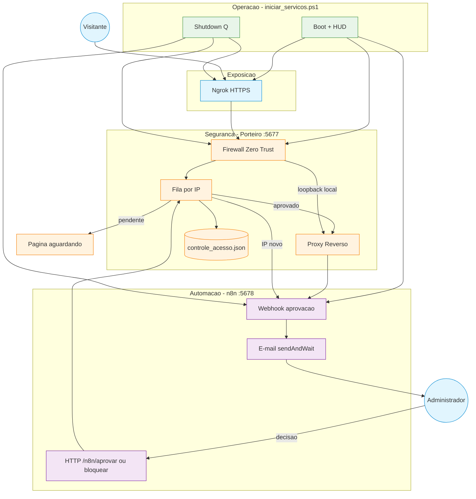

---

## 14. Portabilidade e factory reset

### Portabilidade

| Componente | Portátil? | Notas |
|------------|-------------|-------|
| `iniciar_servicos.ps1` | Sim | Usa `$PSScriptRoot` |
| Docker compose | Sim | Volumes relativos ao ficheiro. O banco é `./n8n/data` (host `n8n/n8n/data`). Arquivos dos fluxos: `../Arquivos-n8n` a partir de `n8n/docker-compose.yml`. |
| Porteiro | Sim | `n8n/storage/Porteiro` relativo a `Porteiro/porteiro.js`; override `PORTEIRO_DATA_DIR`. Não é volume do n8n. |
| Scout data | Sim | `Scout_OSINT_Docker/data/` na pasta do projecto |
| `.env` | Sim | Copiar manualmente (não vai para Git) |

Ao mover o projecto: copiar pasta inteira (incluindo `n8n/n8n/data` e `n8n/storage` se quiser manter estado). Reiniciar stack a partir da nova pasta. Rede `rede_comunicacao` é da máquina, não da pasta.

### factory_reset.bat

Equivalente a estado “pronto para GitHub”: apaga dados voláteis, mantém código. Ver secção 3. **Não** apaga imagens Docker — SQLite n8n está em disco local, não na imagem.

---

## 15. Recomendações Operacionais

1. **Primeira vez (cópia limpa):** `factory_reset.bat` → **`Setup.bat`** → `iniciar_servicos.ps1` → checklist n8n (secção 16).
2. **Importar e activar** `Aprovacao de Acesso (Novo).json` — único workflow de aprovação do projecto.
3. **Token de aprovação é obrigatório** — dois arquivos em `.n8groker/`, não no `.env`. O workflow manda `X-Admin-Token`. Vazio ou errado é 403.
4. **SMTP só se usar o node de e-mail** do workflow de exemplo (`Email e Espera Aprovacao`). Sem esse node, o aviso segue para Slack, Telegram, outro fluxo ou um script, e o veredito volta pelas rotas `/n8n/*`. Ver a seção 7.1.
5. **Não alterar `N8N_ENCRYPTION_KEY`** após a primeira instalação (perda de credenciais criptografadas).
6. **Rede Docker** `rede_comunicacao` — o **Setup.bat** cria automaticamente; comando manual só se o Setup não correu.
7. **Scout:** manter só rota `porteiro` activa em `:4050` → `host.docker.internal:5677`; upstream `127.0.0.1` dentro do container falha.
8. **Aliases Scout:** IPs nomeados manualmente não geram alertas nem blocklist na borda.
9. **Factory reset:** usar `factory_reset.bat` apenas numa **cópia** do projecto — não substitui apagar imagens Docker para limpar n8n.
10. **Portabilidade:** copiar pasta inteira; dados Porteiro em `n8n/storage/Porteiro/` e arquivos dos fluxos em `Arquivos-n8n/`, ambos relativos ao projecto.

---

## 16. Primeira instalação após factory reset

Fluxo completo para uma máquina ou cópia de teste em estado “zero”:

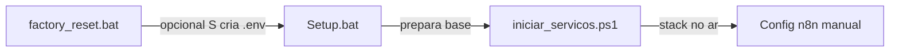

### Passo a passo

| # | Acção | Notas |
|---|--------|-------|
| 1 | **`factory_reset.bat`** | Digite `Excluir`. Use só numa **cópia**, não na pasta principal de desenvolvimento. |
| 2 | Resposta **S** ao `.env` | Recria `.env` a partir de `.env_template` (alternativa: copiar manualmente ou deixar o Setup criar). |
| 3 | **`Setup.bat`** | Preenche checklist; edite `.env` com `NGROK_AUTHTOKEN` e `N8N_ENCRYPTION_KEY`. O token de aprovação nasce no `iniciar_servicos.ps1`, fora do `.env`. |
| 4 | **`iniciar_servicos.ps1`** | Sobe o console em `127.0.0.1:8501`, a borda em `127.0.0.1:8502`, o Ollama se `USE_OLLAMA_LOCAL=1`, Porteiro, ngrok, Scout (se `USE_SCOUT=1`), Langfuse/LiteLLM e o n8n em `127.0.0.1:5678`. |
| 5 | **`http://127.0.0.1:5678`** | Criar a conta do produto n8n (primeiro acesso). Isso não é o admin do painel. |
| 6 | Importar workflow | `Workflows_para_Autenticação/Aprovacao de Acesso (Novo).json`. |
| 7 | Node **Configuracoes** | `admin_email`, `admin_token` (`{{ $env.PORTEIRO_N8N_TOKEN }}` ou o arquivo `porteiro-n8n.token`), confirmar `porteiro_url`. |
| 8 | Node **Email e Espera Aprovacao** | Credencial SMTP só se for usar o node de e-mail. Sem esse node, o SMTP não entra. |
| 9 | **Ativar** o workflow | Só se o aviso for para o n8n. Sem o workflow ativo, o n8n responde 404 ao aviso. A fila continua, e o veredito pode vir da aba Admin ou de outra automação. |
| 10 | Testar | Acessar a URL do ngrok num browser. O IP entra na fila. O e-mail ao admin só sai se o node de e-mail estiver configurado e o workflow ativo. |

O admin do painel é outro passo, e não tem senha. Na raiz, `python -m control_plane.admin_token --init` cria `.n8groker/admin.key` e o comando sem `--init` imprime um JWT de 5 minutos. Cole no campo **Token de admin** de `http://localhost:8501`. A aba Admin cria as contas do painel, sem senha, e emite o JWT de usuário (**Emitir token**). A chave desse JWT é `.n8groker/usuario.key`. A borda (`/painel`, porta `8502`) aceita o token de usuário e recusa o JWT de admin. A mesma aba chama `http://127.0.0.1:5676`. Se o webhook do n8n responder 404, a fila e os botões Aprovar, Reprovar e Vincular continuam valendo.

### factory_reset vs Setup

| | factory_reset | Setup |
|---|---------------|-------|
| **Objetivo** | Apagar dados e voltar ao estado “repo limpo” | Verificar dependências e preparar ambiente |
| **`.env`** | Apaga; opcional **S** recria do template | Pode criar/copiar se não existir |
| **n8n / workflows** | Apaga SQLite e storage | Não mexe no n8n depois de criado |
| **Rede Docker** | Não remove `rede_comunicacao` | Cria se não existir |
| **Quando** | Cópia de teste, demo, reinstalação limpa | Toda máquina nova ou após reset |

---

*Documentação alinhada ao código de `control-plane-plus` em outubro/2026.*
