# N8Groker — Documentação Técnica e Análise do Projeto

> Ambiente de automação que integra **n8n**, **Docker**, **Ngrok**, **Porteiro**, **Scout Gate** (opcional), **Setup.bat** e **factory_reset** para expor workflows na internet com controle de acesso por IP e observabilidade OSINT na borda.

Guia de entrada: [`README.md`](README.md)

---

## 1. Visão Geral

O **N8Groker** resolve um problema comum ao rodar n8n localmente: expor a instância na internet **sem** configurar roteador, DNS ou firewall manual — e, ao mesmo tempo, **não deixar qualquer visitante entrar direto**.

A solução coloca o **Porteiro** (proxy reverso Node.js na porta `5677`) na frente do n8n. Todo tráfego externo passa por ele antes de chegar ao n8n (`5678`). Visitantes desconhecidos ficam em fila até um administrador aprovar ou bloquear via workflow n8n (e-mail com botões).

Com **`USE_SCOUT=1`** (padrão), o **Scout Gate** entra como camada adicional: `Ngrok → Scout (:4050) → Porteiro (:5677) → n8n`, oferecendo logs de tráfego, aliases IP, blocklist e toggles por rota sem modificar o Porteiro.

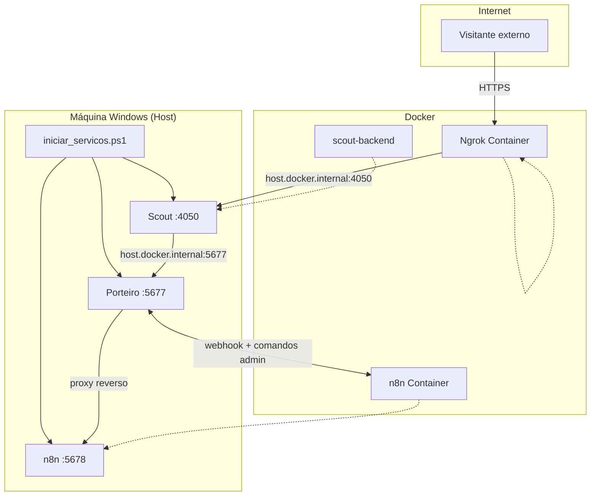

**Modo legado (`USE_SCOUT=0`):** Ngrok aponta directo para `host.docker.internal:5677` (sem Scout).

### Scout Gate — camada OSINT

| Responsabilidade | Scout | Porteiro |
|------------------|-------|----------|
| MITM TCP + logs de sessão | Sim | Não |
| Fila de aprovação por IP | Não | Sim |
| Blocklist na borda | Sim | Via n8n |
| Toggles por container/rota | Sim | Não |

**Operação:** `iniciar_servicos.ps1` sobe o Scout automaticamente. Tecla **`G`** no HUD abre a GUI. `SCOUT_ENFORCE_FIREWALL=0` por defeito no Windows.

**Rotas Scout vs Ngrok (acesso ao n8n):**

| Papel | Variável / campo | Valor correcto |
|-------|------------------|----------------|
| Onde Ngrok envia tráfego | `SCOUT_PUBLIC_PORT` | `4050` |
| Porta Scout que escuta (rota `porteiro`) | `listen_port` | **igual** a `SCOUT_PUBLIC_PORT` |
| Destino após Scout | `SCOUT_UPSTREAM_HOST:PORT` | `host.docker.internal:5677` |
| Modo da rota porteiro | `mode` | `tcp` |
| Rotas activas recomendadas | GUI | **só** `porteiro` |

| Configuração | Resultado |
|--------------|-----------|
| Rota porteiro ON em `:4050` → `host.docker.internal:5677` | URL ngrok funciona; Porteiro aprova IP |
| Ngrok → `:4050` mas rota escuta noutra porta (ex. `5877`) | `ERR_NGROK_3004` — ninguém escuta em 4050 |
| Upstream `127.0.0.1:5677` dentro do container | Falha — 127.0.0.1 é o próprio container |
| Rota `n8n_app` ON (directo `:5678`) | Bypass do Porteiro — evitar |

O script `Sync-ScoutPorteiroRoute` (no boot) e a reconciliação em `redirection_registry.py` corrigem automaticamente a rota `porteiro-manual` com base no `.env`.

**Shutdown repassado Scout → supervisor:** ao fechar a GUI (X), o utilizador pode escolher encerrar toda a stack. A GUI escreve `.n8groker.shutdown.request` na raiz; o `iniciar_servicos.ps1` detecta o ficheiro no loop HUD (~100 ms) e executa `Stop-Tudo` (Ngrok → n8n → Scout → Porteiro).

### Scout Gate — GUI e funcionalidades

A GUI (`Scout_network.py`, tecla **G** no HUD) liga-se ao backend via WebSocket (`SCOUT_BACKEND_URL`).

| Aba | Função |
|-----|--------|
| **Redireccionamentos** | Toggles por rota; selector tcp/http/https; portas manuais; sync Docker |
| **Tráfego** | Sessões em tempo real (hora, cliente, rota, **modo**, upstream, bytes) |
| **Clientes** | IPs vistos persistidos em `data/known_clients.json` — última interacção, modo, sessões; alias/bloquear sem seguir o log |
| **Config** | URL backend, health check |

**Aliases confiáveis:** IP com alias manual deixa de gerar alertas de tráfego/bloqueio na borda Scout e é removido da blocklist ao nomear.

**Modo de rota persistido:** `mode` (tcp/http/https) guardado em `data/redirections.json`. O sync no boot alinha porta/upstream do `.env` mas **não sobrescreve** o modo já guardado.

**Sync automático:** `Sync-ScoutPorteiroRoute` no `iniciar_servicos.ps1` e `reconcile_porteiro_entry` em `route_config.py` mantêm a rota `porteiro-manual` coerente com `SCOUT_PUBLIC_PORT` e `SCOUT_UPSTREAM_*`.

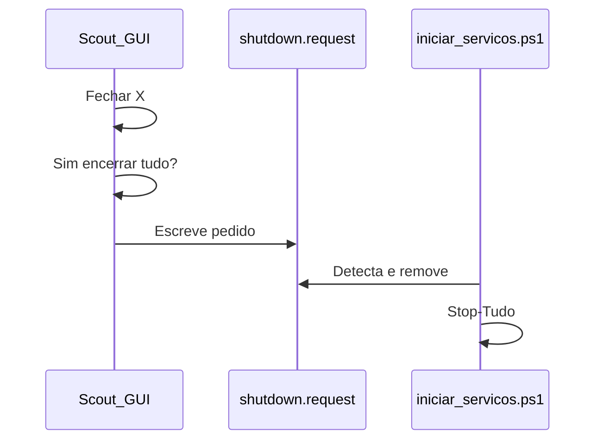

---

## 2. Componentes da Stack

| Componente | Tecnologia | Porta | Função |
|------------|------------|-------|--------|
| **Scout Gate** | Docker (Python) | `4050` (MITM), `8765` (API) | OSINT: MITM, tráfego, clientes, aliases, blocklist (`USE_SCOUT`) |
| **Porteiro** | Node.js nativo | `5677` | Proxy reverso, firewall por IP, fila, JSON portátil |
| **n8n** | Docker (`n8nio/n8n`) | `5678` | Automação e workflows de aprovação |
| **Ngrok** | Docker (`ngrok/ngrok`) | `4040` (API) | Túnel HTTPS → Scout ou Porteiro |
| **Orquestrador** | PowerShell | — | `iniciar_servicos.ps1`: boot, HUD, shutdown |
| **Setup** | Batch + PowerShell | — | `Setup.bat`: deps e auto-config |
| **Factory reset** | Batch + PowerShell | — | `factory_reset.bat`: limpar dados (cópia) |

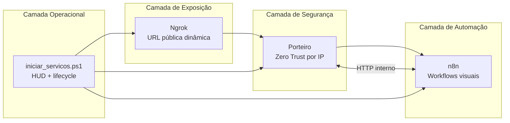

---

## 3. Scripts operacionais e lifecycle

O projecto inclui quatro pontos de entrada distintos:

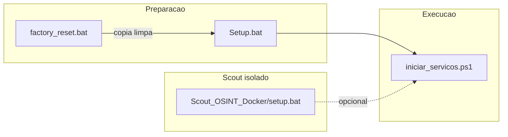

| Script | Quando usar | O que faz |
|--------|-------------|-----------|
| **`Setup.bat`** | Primeira vez ou máquina nova | Checklist de 11 dependências; menu por item: auto-config, abrir link, ignorar, reverificar; pode criar `.env` e rede Docker; **não** sobe serviços nem configura n8n |
| **`factory_reset.bat`** | Cópia do projecto para estado “GitHub limpo” | Confirmação `Excluir`; para containers; apaga `.env`, SQLite n8n, storage Porteiro, Scout/data, venv; recria `.gitkeep`; opcional **S** recria `.env` a partir do template; **não** apaga imagens Docker |
| **`iniciar_servicos.ps1`** | Operação diária | Boot completo + HUD + sync ngrok + Scout |
| **`Scout_OSINT_Docker/setup.bat`** | Só Scout, sem stack N8Groker | venv, container, GUI standby |

### Setup.bat — checklist interactivo

Ordem de verificação: ExecutionPolicy → `.env` → chaves ngrok/n8n → Docker instalado/a correr → WSL2 → rede `rede_comunicacao` → Node.js → Python/Scout (se `USE_SCOUT=1`) → pastas de dados → portas livres.

Auto-config disponível onde seguro: policy, copiar `.env`, criar rede Docker (`rede_comunicacao`), scaffold de pastas, venv + pip Scout, abrir `.env` no Notepad.

**O que o Setup não faz** (fica para você ou para o `iniciar_servicos.ps1`):

| Não incluído | Quem resolve |
|--------------|--------------|
| Subir containers n8n/ngrok/Scout | `iniciar_servicos.ps1` |
| Criar conta admin no n8n | Você, no primeiro acesso em `:5678` |
| Importar / ativar workflows | Você, no editor n8n |
| Configurar SMTP | Você, no node `Email e Espera Aprovacao` |
| Preencher `admin_email` / `admin_token` no workflow | Você, no node `Configuracoes` |
| Instalar Docker, Node ou Python | Setup só verifica e abre links de download |

No fim, o Setup pode **perguntar** se deseja iniciar o `iniciar_servicos.ps1` — isso é opcional e separado do checklist.

### factory_reset.bat — o que apaga vs mantém

| Apagado | Mantido |
|---------|---------|
| `.env`, `.porteiro.pid`, locks supervisor | Código-fonte, compose, workflows |
| `n8n/n8n/data/*` (SQLite) | `.env_template` |
| `n8n/storage/*` (Porteiro) | `Setup.bat`, scripts, `Arquivos-n8n/` |
| `Scout_OSINT_Docker/data/*`, `.venv` | Documentação |

---

## 4. Fluxo de Inicialização (Boot)

O script `iniciar_servicos.ps1` automatiza toda a subida da infraestrutura e mantém um painel (HUD) em tempo real.

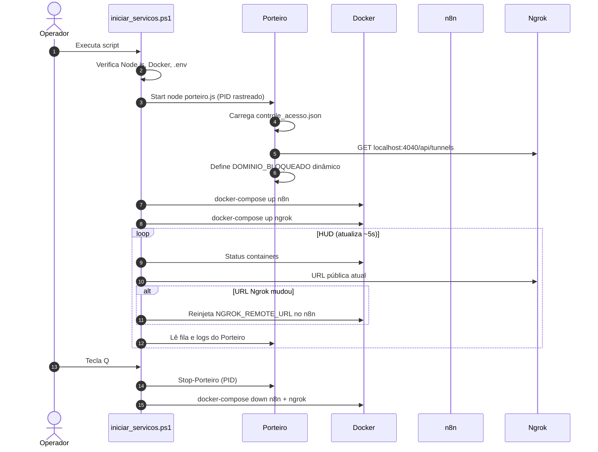

**Pontos-chave do boot:**
- Pré-requisitos validados antes de subir qualquer serviço (Node, Docker, `.env`). Use **`Setup.bat`** numa máquina nova para preparar tudo numa sessão.
- Com `USE_SCOUT=1`: sobe `scout-backend`, `Sync-ScoutPorteiroRoute`, Ngrok aponta para `:4050`.
- Sem Scout: Ngrok aponta para `host.docker.internal:5677` (Porteiro).
- URL pública é reinjetada automaticamente em `WEBHOOK_URL` do n8n quando o túnel muda.

---

## 5. Fluxo Principal — Aprovação de Acesso

Este é o fluxo central de valor do projeto: um visitante externo tenta acessar o n8n e passa por verificação humana (ou automatizável) via workflow.

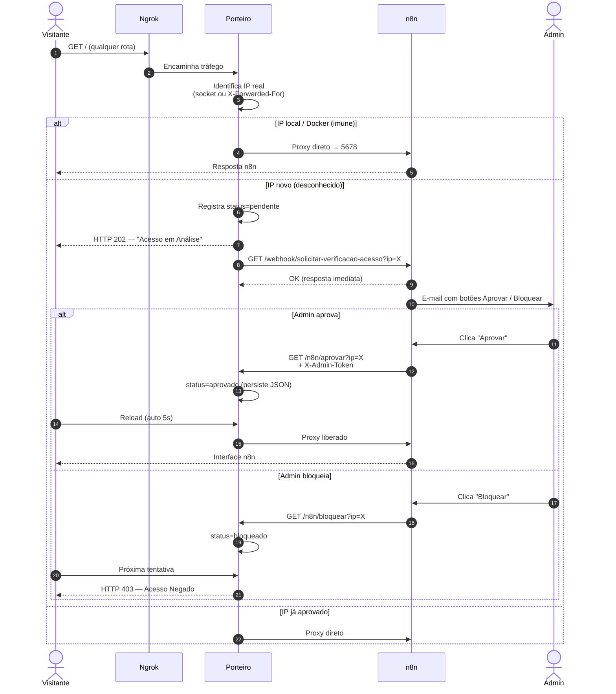

### Estados do visitante no Porteiro

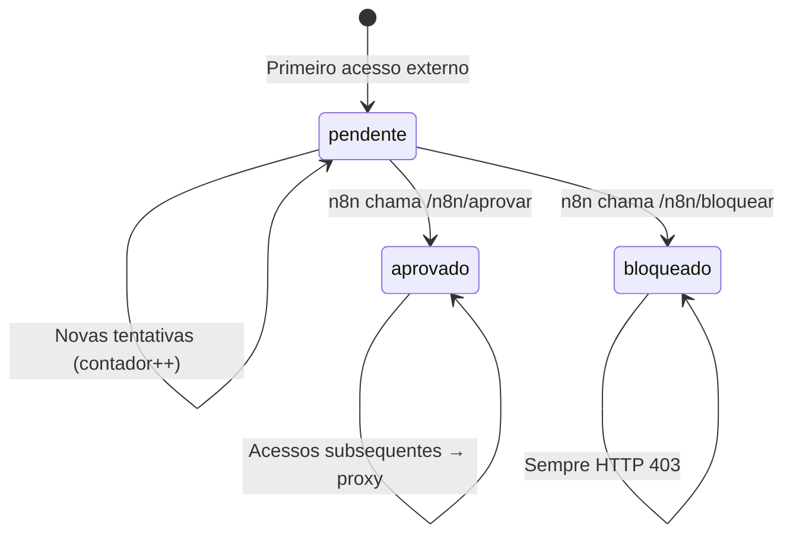

---

## 6. Fluxo de Segurança (Zero Trust)

O Porteiro implementa várias camadas de proteção antes de repassar tráfego ao n8n.

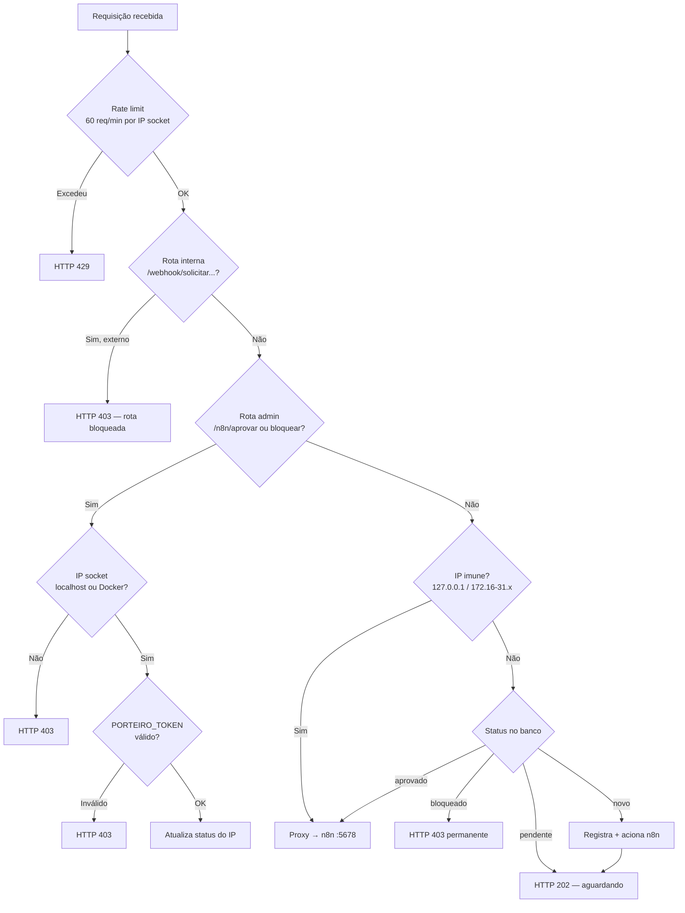

**Decisões de segurança relevantes:**

| Mecanismo | Implementação | Ganho |
|-----------|---------------|-------|
| IP do socket como fonte de verdade | `req.socket.remoteAddress` | Impede spoofing de IP pelo cliente |
| X-Forwarded-For condicional | Só confiável se socket = localhost (Ngrok local) | IP real do visitante sem abrir brecha |
| Rotas admin restritas | Apenas localhost/Docker + token opcional | n8n comanda o Porteiro sem exposição externa |
| Webhook interno bloqueado externamente | `/webhook/solicitar-verificacao-acesso` → 403 via proxy | Visitante não dispara aprovação falsa |
| Rate limiting | 60 req/min por IP de socket | Proteção básica contra DoS |
| Persistência atômica | write `.tmp` + rename | Banco JSON não corrompe em crash |
| Podagem de visitantes | Remove pendentes mais antigos acima de 1000 | Evita crescimento infinito do banco |

---

## 7. Workflow n8n — Aprovação de Acesso

O projecto inclui um workflow em `Workflows_para_Autenticação/Aprovacao de Acesso (Novo).json`:

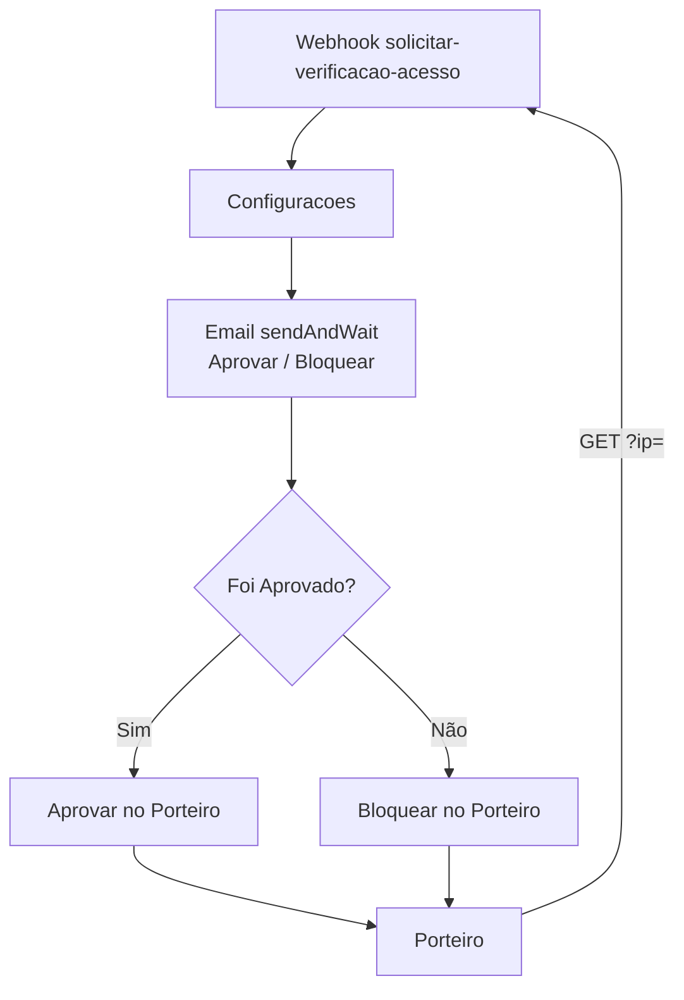

| Etapa | Descrição |
|-------|-----------|
| Webhook | Porteiro notifica IP novo; n8n responde OK de imediato |
| E-mail | Admin recebe botões Aprovar / Bloquear |
| Veredito | n8n chama `/n8n/aprovar` ou `/n8n/bloquear` no Porteiro |

### Configuração

Após importar `Aprovacao de Acesso (Novo).json`:

| Passo | Onde | Detalhe |
|-------|------|---------|
| 1 | n8n (primeiro acesso) | Criar conta **admin** — obrigatório após factory reset |
| 2 | Node **Configuracoes** | `admin_email` → e-mail real do aprovador |
| 3 | Node **Configuracoes** | `admin_token` → vazio **ou** igual a `PORTEIRO_TOKEN` (ver abaixo) |
| 4 | Node **Configuracoes** | `porteiro_url` → `http://host.docker.internal:5677` (já vem no JSON) |
| 5 | Node **Email e Espera Aprovacao** | Credencial **SMTP** (obrigatório para enviar e-mail) |
| 6 | Barra do workflow | **Activar** — o ficheiro importado traz `"active": false` |

**`PORTEIRO_TOKEN` e `admin_token`:**

- O `.env` guarda `PORTEIRO_TOKEN` como referência; o Node **não** lê o `.env` automaticamente.
- Com `admin_token` vazio no workflow e sem token no processo Porteiro, `/n8n/aprovar` e `/n8n/bloquear` aceitam chamadas do container n8n (IP interno Docker).
- Se quiser token: use o **mesmo valor** em `PORTEIRO_TOKEN` (`.env`) e `admin_token` (workflow); para o Porteiro enxergar o token, é preciso exportar a variável ao iniciar o Node (hoje o `iniciar_servicos.ps1` não injecta — copie manualmente para o workflow).

---

## 8. Mapa de Rede e Portas


| Porta | Serviço | Exposta externamente? |
|-------|---------|------------------------|
| `4050` | Scout MITM (com `USE_SCOUT=1`) | Sim (via Ngrok) |
| `8765` | Scout API / WebSocket GUI | Apenas localhost |
| `5677` | Porteiro | Sim (via Ngrok se `USE_SCOUT=0`) |
| `5678` | n8n | Não directamente (só via Porteiro ou localhost) |
| `4040` | Ngrok dashboard/API | Apenas localhost |

---

## 9. Persistência de Dados

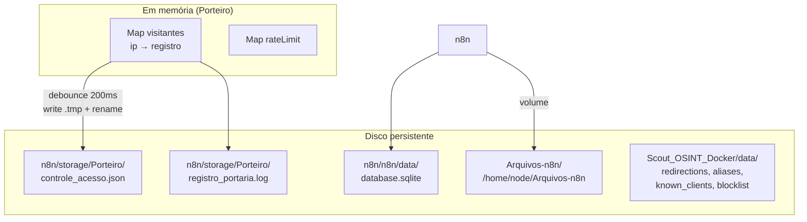

`n8n/storage/Porteiro` existe para o Porteiro (Node no host) e para o HUD. O workflow de aprovação fala com o Porteiro por HTTP, não por arquivo. O compose antigo montava `./n8n/storage` a partir de `n8n/docker-compose.yml`, isto é `n8n/n8n/storage` em `/home/node/.n8n-files`. Nenhum script grava nessa pasta dobrada; o Docker é que a criava no primeiro `up`. Na primeira subida, `setup_projeto.ps1` e `iniciar_servicos.ps1` movem o que houver lá para `Arquivos-n8n/` (sem sobrescrever nome já existente) e deixam o marcador `n8n/n8n/storage/.migrado-para-Arquivos-n8n`. O volume do banco não muda: `./n8n/data` → `/home/node/.n8n` no host `n8n/n8n/data`. O `.gitkeep` solto em `n8n/data/` foi removido; o `factory_reset` ainda apaga essa pasta se uma cópia antiga existir, e não a recria.

No nó **Read/Write Files from Disk** use `/home/node/Arquivos-n8n/entrada.csv`. `N8N_RESTRICT_FILE_ACCESS_TO=/home/node/Arquivos-n8n` e `N8N_BLOCK_FILE_ACCESS_TO_N8N_FILES=true`.

**Registro de visitante (exemplo):**
```json
{
  "ip": "203.0.113.42",
  "status": "pendente | aprovado | bloqueado",
  "data_primeiro_acesso": "2026-05-31T12:00:00.000Z",
  "tentativas": 3
}
```

---

## 10. Principais Ganhos do Projeto

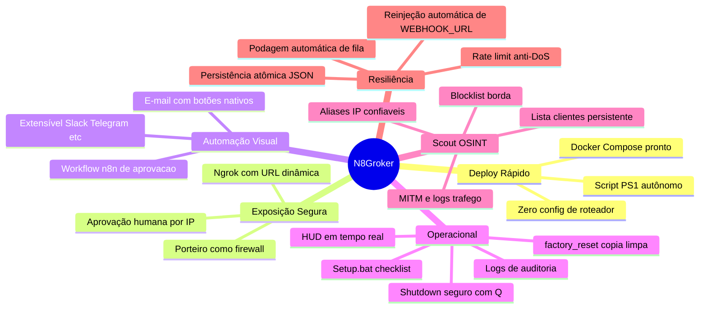

### Resumo dos ganhos

| Área | Antes (cenário típico) | Com N8Groker |
|------|------------------------|--------------|
| **Tempo de setup** | Horas configurando rede, DNS, reverse proxy | Minutos: `.env` + executar `.ps1` |
| **Exposição na internet** | Port forwarding manual ou VPS | Ngrok com URL automática |
| **Controle de acesso** | Basic Auth fixo ou n8n aberto | Fila por IP + aprovação via e-mail |
| **Observabilidade** | Logs espalhados | HUD + Scout (tráfego, clientes) + `registro_portaria.log` |
| **Setup inicial** | Instalar deps manualmente | `Setup.bat` com links e auto-config |
| **Manutenção de URL** | Atualizar webhooks manualmente | Script reinjeta `NGROK_REMOTE_URL` |
| **Segurança** | n8n exposto diretamente | Zero Trust: proxy, rate limit, rotas admin isoladas |
| **Flexibilidade** | Regras hardcoded | Workflows n8n editáveis visualmente |

---

## 11. Variáveis de Ambiente

| Variável | Onde | Propósito |
|----------|------|-----------|
| `NGROK_AUTHTOKEN` | `.env` | Autenticação no Ngrok |
| `N8N_ENCRYPTION_KEY` | `.env` | Criptografia do banco n8n |
| `NGROK_REMOTE_URL` | `.env` (vazia no `.env_template`) | O orquestrador preenche quando o túnel ngrok sobe e reinjeta como `WEBHOOK_URL`. Não preencher à mão. |
| `N8N_RESTRICT_FILE_ACCESS_TO` | `n8n/docker-compose.yml` | Allowlist dos nós de arquivo: `/home/node/Arquivos-n8n`. Na imagem `n8n:latest` (2.0+) o padrão é `~/.n8n-files`. Várias pastas separam-se com `;`. O Porteiro não precisa de entrada: não há fluxo lendo `n8n/storage` de dentro do container. |
| `N8N_BLOCK_FILE_ACCESS_TO_N8N_FILES` | `n8n/docker-compose.yml` | `true` (padrão oficial): bloqueia `/home/node/.n8n` e ficheiros internos do n8n. |
| `PORTEIRO_TOKEN` | `.env` / Node | Token compartilhado n8n ↔ Porteiro |
| `PORTEIRO_USER` / `PORTEIRO_PASS` | `.env` | Basic Auth do n8n (template) |
| `PORTEIRO_DATA_DIR` | `.env` (opcional) | Override pasta dados Porteiro |
| `USE_SCOUT` | `.env` | `1` = Ngrok → Scout → Porteiro; `0` = legado |
| `SCOUT_PUBLIC_PORT` | `.env` | Porta MITM (Ngrok upstream, ex. `4050`) |
| `SCOUT_ADMIN_PORT` | `.env` | API Scout (ex. `8765`) |
| `SCOUT_UPSTREAM_HOST` / `PORT` | `.env` | Destino após Scout (ex. `host.docker.internal:5677`) |
| `SCOUT_DEFAULT_ROUTE_MODE` | `.env` | Modo inicial só se rota ainda sem `mode` guardado |
| `SCOUT_BACKEND_URL` | `.env` | WebSocket GUI (ex. `ws://127.0.0.1:8765/ws`) |
| `SCOUT_NGROK_TUNNEL_URL` | `.env` | URL pública sync pelo script (informativo) |
| `SCOUT_ENFORCE_FIREWALL` | `.env` | `0` no Windows por defeito |

---

## 12. Estrutura do Repositório

```
N8Groker/
├── Setup.bat / setup_projeto.ps1   # Checklist dependencias (primeira vez)
├── factory_reset.bat / .ps1        # Reset dados volatil (usar em copia)
├── iniciar_servicos.ps1            # Orquestrador + HUD
├── .env_template                   # Modelo de configuracao
├── Arquivos-n8n/                   # Arquivos dos fluxos (caminho no nó: /home/node/Arquivos-n8n/)
├── README.md                       # Guia de entrada
├── DOCUMENTACAO.md                 # Documentacao tecnica
├── Porteiro/
│   └── porteiro.js                 # Proxy + firewall IP (paths relativos)
├── n8n/
│   ├── docker-compose.yml
│   ├── n8n/data/                   # SQLite n8n (gerado)
│   └── storage/Porteiro/           # JSON Porteiro + logs (gerado)
├── ngrok/
│   └── docker-compose.yml
├── Scout_OSINT_Docker/
│   ├── docker-compose.yml
│   ├── setup.bat / setup.ps1       # Scout isolado
│   ├── Scout_network.py            # GUI
│   ├── scout/                      # Backend Python
│   └── data/                       # Rotas, aliases, clientes (gerado)
└── Workflows_para_Autenticação/
    └── Aprovacao de Acesso (Novo).json
```

---

## 13. Diagrama Completo — Visão End-to-End


---

## 14. Portabilidade e factory reset

### Portabilidade

| Componente | Portátil? | Notas |
|------------|-------------|-------|
| `iniciar_servicos.ps1` | Sim | Usa `$PSScriptRoot` |
| Docker compose | Sim | Volumes relativos ao ficheiro. O banco é `./n8n/data` (host `n8n/n8n/data`). Arquivos dos fluxos: `../Arquivos-n8n` a partir de `n8n/docker-compose.yml`. |
| Porteiro | Sim | `n8n/storage/Porteiro` relativo a `Porteiro/porteiro.js`; override `PORTEIRO_DATA_DIR`. Não é volume do n8n. |
| Scout data | Sim | `Scout_OSINT_Docker/data/` na pasta do projecto |
| `.env` | Sim | Copiar manualmente (não vai para Git) |

Ao mover o projecto: copiar pasta inteira (incluindo `n8n/n8n/data` e `n8n/storage` se quiser manter estado). Reiniciar stack a partir da nova pasta. Rede `rede_comunicacao` é da máquina, não da pasta.

### factory_reset.bat

Equivalente a estado “pronto para GitHub”: apaga dados voláteis, mantém código. Ver secção 3. **Não** apaga imagens Docker — SQLite n8n está em disco local, não na imagem.

---

## 15. Recomendações Operacionais

1. **Primeira vez (cópia limpa):** `factory_reset.bat` → **`Setup.bat`** → `iniciar_servicos.ps1` → checklist n8n (secção 16).
2. **Importar e activar** `Aprovacao de Acesso (Novo).json` — único workflow de aprovação do projecto.
3. **`PORTEIRO_TOKEN` é opcional** — se usar, repita o valor em `admin_token` no workflow; `.env` sozinho não basta para o Porteiro Node.
4. **Configurar SMTP** no node `Email e Espera Aprovacao` antes de activar o workflow (ou substituir por outro node de aprovação, desde que a saída seja compatível).
5. **Não alterar `N8N_ENCRYPTION_KEY`** após a primeira instalação (perda de credenciais criptografadas).
6. **Rede Docker** `rede_comunicacao` — o **Setup.bat** cria automaticamente; comando manual só se o Setup não correu.
7. **Scout:** manter só rota `porteiro` activa em `:4050` → `host.docker.internal:5677`; upstream `127.0.0.1` dentro do container falha.
8. **Aliases Scout:** IPs nomeados manualmente não geram alertas nem blocklist na borda.
9. **Factory reset:** usar `factory_reset.bat` apenas numa **cópia** do projecto — não substitui apagar imagens Docker para limpar n8n.
10. **Portabilidade:** copiar pasta inteira; dados Porteiro em `n8n/storage/Porteiro/` e arquivos dos fluxos em `Arquivos-n8n/`, ambos relativos ao projecto.

---

## 16. Primeira instalação após factory reset

Fluxo completo para uma máquina ou cópia de teste em estado “zero”:

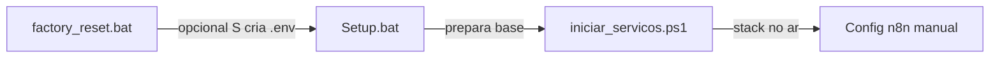

### Passo a passo

| # | Acção | Notas |
|---|--------|-------|
| 1 | **`factory_reset.bat`** | Digite `Excluir`. Use só numa **cópia**, não na pasta principal de desenvolvimento. |
| 2 | Resposta **S** ao `.env` | Recria `.env` a partir de `.env_template` (alternativa: copiar manualmente ou deixar o Setup criar). |
| 3 | **`Setup.bat`** | Preenche checklist; edite `.env` com `NGROK_AUTHTOKEN`, `N8N_ENCRYPTION_KEY` e, se quiser, `PORTEIRO_TOKEN`. |
| 4 | **`iniciar_servicos.ps1`** | Sobe Porteiro, n8n, ngrok e Scout (se `USE_SCOUT=1`). |
| 5 | **`http://localhost:5678`** | Criar conta admin (primeiro acesso). |
| 6 | Importar workflow | `Workflows_para_Autenticação/Aprovacao de Acesso (Novo).json`. |
| 7 | Node **Configuracoes** | `admin_email`, `admin_token` (opcional), confirmar `porteiro_url`. |
| 8 | Node **Email e Espera Aprovacao** | Credencial SMTP. |
| 9 | **Activar** workflow | Sem isto, o Porteiro não dispara aprovação por e-mail. |
| 10 | Testar | Aceder à URL ngrok num browser; deve aparecer fila + e-mail ao admin. |

### factory_reset vs Setup

| | factory_reset | Setup |
|---|---------------|-------|
| **Objetivo** | Apagar dados e voltar ao estado “repo limpo” | Verificar dependências e preparar ambiente |
| **`.env`** | Apaga; opcional **S** recria do template | Pode criar/copiar se não existir |
| **n8n / workflows** | Apaga SQLite e storage | Não mexe no n8n depois de criado |
| **Rede Docker** | Não remove `rede_comunicacao` | Cria se não existir |
| **Quando** | Cópia de teste, demo, reinstalação limpa | Toda máquina nova ou após reset |

---

*Documentação gerada com base na análise do código-fonte em maio/2026.*
