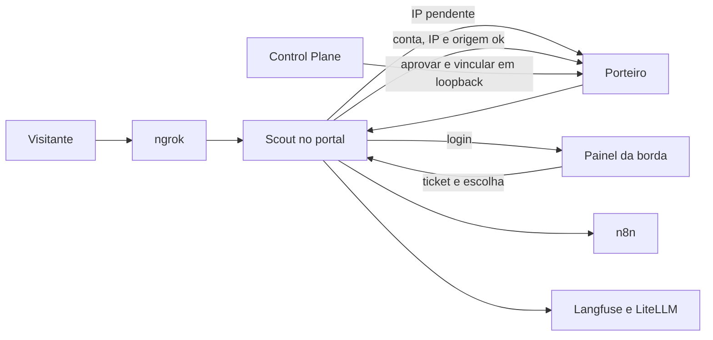

# Entenda o N8Groker

Este guia é o ponto de entrada para quem vai operar ou alterar o ambiente. O texto está em português. O painel interativo que abre o grafo mantém os rótulos da interface em inglês, porque o viewer oficial não tem locale pt-BR. Os resumos, as camadas, o tour e o grafo de domínio foram escritos em português.

O grafo descreve o commit `2c93264` (166 arquivos). Ele não contém token, chave, senha nem IP de máquina real. Os exemplos de IP são de documentação (`127.0.0.1`, a rede de teste `203.0.113.0/24` e o gateway Docker `172.18.0.1`).

## O que é o projeto

O N8Groker é um laboratório pessoal de automação. Ele junta n8n, Docker, ngrok, o Porteiro e o Scout para expor workflows com controle de acesso, e acrescenta um Control Plane em Streamlit mais uma stack LLM local (Langfuse e LiteLLM) sem provider de modelo pré-cadastrado.

Esta cópia já é a linha Control Plane: console, contas, borda e trilha. A janela Tk do Scout não vem aqui.

Linguagens principais: Python, JavaScript (Porteiro e o script de origem), PowerShell 5.1 e YAML de compose. Frameworks de apoio: Streamlit, pytest, Docker Compose e GitHub Actions.

## Arquitetura

Quem está na internet fala com um único domínio do ngrok. O ngrok entrega o pedido ao Scout. O Scout decide se aquilo é página de análise, painel, escolha de app ou o próprio app na raiz. O Porteiro é a segunda checagem, antes de qualquer upstream. O editor do n8n na máquina não passa por esse caminho.



A raiz do túnel sem sessão responde 403, sem redirect e sem dizer que existe um painel. O login só existe em `/painel`. Não há subcaminho por app: o app escolhido é servido na raiz.

## Componentes

| Nome | Porta no host | Papel | Onde está o código |
| --- | --- | --- | --- |
| Control Plane | `127.0.0.1:8501` | Console: infra, Scout, chat e admin | `control_plane/app.py` |
| Painel da borda | `127.0.0.1:8502` | Login do visitante, com base `/painel` | `control_plane/app.py` |
| Portal do Scout | `127.0.0.1:4050` | Entrada do túnel no host. O ngrok fala com `scout-backend` na rede | `Scout_OSINT_Docker/docker-compose.yml`, `scout/core/politica_portal.py` |
| API do Scout | `127.0.0.1:8765` | Rotas, clientes, alias, bloqueio | `Scout_OSINT_Docker/scout/gate.py` |
| Porteiro, fila | `127.0.0.1:5676` | Aprovar, reprovar e vincular, só com token | `Porteiro/porteiro.js` |
| Porteiro, ponta do n8n | `127.0.0.1:5677` | A mesma regra para o workflow, só na rede local | `Porteiro/porteiro.js` |
| n8n | `127.0.0.1:5678` | Editor e webhooks. Também acessível direto, sem a borda | `n8n/docker-compose.yml` |
| API do ngrok | `127.0.0.1:4040` | A URL pública que o HUD lê | `ngrok/docker-compose.yml` |
| Langfuse | `127.0.0.1:3000` | UI de observabilidade de LLM | `llm/docker-compose.yml` |
| Worker do Langfuse | `127.0.0.1:3030` | Processamento do Langfuse | `llm/docker-compose.yml` |
| LiteLLM | `127.0.0.1:4000` | Proxy de modelo, sem provider pré-cadastrado | `llm/docker-compose.yml`, `llm/litellm_config.yaml` |
| MinIO | `127.0.0.1:9090` | Objetos do Langfuse | `llm/docker-compose.yml` |
| Postgres, Redis, ClickHouse | sem porta no host | Dados internos da stack LLM | `llm/docker-compose.yml` |

Postgres do Langfuse, Redis, ClickHouse e o Postgres do LiteLLM não são publicados no host. Eles só existem na rede `rede_comunicacao`.

## Camadas

1. **Orquestração.** `iniciar_servicos.ps1` e os scripts de setup. Criam os arquivos montados antes do compose e sobem os serviços na ordem certa. O boot também cria `maquina.key`, fora de volume. A tecla Q encerra o PID do Keeper se a linha de comando for a dele.
2. **Borda do túnel.** IP do visitante, `origem.js`, política do portal, cookie `n8groker_sessao`, `trilha.jsonl` e a imagem do Scout.
3. **Scout local.** A API da máquina, separada do proxy do túnel.
4. **Porteiro.** Fila, identidade e aprovação. Recusa o túnel.
5. **Control Plane.** Console, contas sem senha, JWT de admin, Keeper, inventário, backup, diagnóstico e chat.
6. **n8n.** Dois workflows, os dois webhooks GET, a pasta `Arquivos-n8n`, três `.gitkeep`, o compose e o serviço. Não são nove arquivos de código.
7. **Stack LLM.** Um compose e oito serviços. O `litellm_config.yaml` não cadastra provider. No boot, `scripts/init_env.py` grava `N8N_CREDENTIALS_OVERWRITE_DATA` com a `LITELLM_MASTER_KEY` gerada e a URL `http://litellm:4000/v1`. O compose do n8n injeta isso em `CREDENTIALS_OVERWRITE_DATA`. No editor, a credencial do tipo OpenAI passa a falar com o proxy. Não há chave de modelo no repositório.
8. **Testes.** Pytest e os testes Node do Porteiro.
9. **Documentação.** Este arquivo, o README, o [índice](README.md) e o desenho das decisões.
10. **Configuração e CI.** Exemplos de `.env` e o workflow que roda pytest e o analisador PowerShell.

## Fluxos principais

### Boot

`iniciar_servicos.ps1` garante chave HMAC, tokens, `sessao.key`, `usuario.key`, geração, `audit.jsonl` e a pasta da trilha antes de qualquer `docker compose`. `maquina.key` nasce no mesmo boot se faltar ou estiver vazia, não entra no `.env` e não é montada no container. Uma pasta vazia no lugar de um arquivo é reparada. Uma pasta com conteúdo aborta sem apagar dado. A tecla Q encerra a stack e o PID do Keeper, e só mata esse PID se a linha de comando ainda for a do Keeper. O Scout sobe e fica saudável. O ngrok aponta para `scout-backend` na porta do portal. Por padrão o boot para no núcleo: n8n e a stack LLM só entram se `STACKS_BOOT` pedir, ou depois, pelo console ou por `-Stack`. Quando o n8n sobe, o log mostra `printenv NODES_EXCLUDE` dentro do container. A imagem lê `NODES_EXCLUDE` como array JSON. A chave do `.env` continua `N8N_NODES_EXCLUDE`, em lista separada por vírgula. O node Code permanece. `N8N_BLOCK_ENV_ACCESS_IN_NODE` fica desligado porque o workflow de aprovação usa `$env`.

### Borda

1. IP novo em `/painel` recebe 202, não o Streamlit. No túnel do dia a dia (ngrok no Scout) essa página é de `porta_apps.py`. A cópia em `Porteiro/porteiro.js` (`paginaAnalise`) é o caminho antigo, quando o túnel cai direto na porta 5677.
2. A página carrega `/origem.js`. O Scout também serve qualquer caminho cujo último nome é `origem.js` ou `origem.html`, para o Streamlit não devolver HTML no lugar do script.
3. O navegador gera uma chave ECDSA P-256 não exportável e registra a origem. O IP escrito na query é ignorado.
4. O admin aprova e vincula no console. Sem origem, a aprovação não marca dispositivo. Uma segunda origem no mesmo IP fica pendente.
5. No login, o usuário cola o JWT que o admin emitiu. Não há senha nem troca de senha.
6. O painel assina um ticket HMAC curto. `Abrir n8n` cai em `/painel/escolher`. O Scout confere IP, geração e a prova da origem, emite o cookie `n8groker_sessao` e redireciona para `/`.
7. Antes de ligar o upstream, o Scout consulta o Porteiro. Aí a trilha grava `LIBERADO` com sid e conta.
8. A raiz sem sessão continua 403.

Cookie, IP e origem sobrevivem a uma queda de conexão enquanto os três baterem. A renovação é deslizante. País vai vazio. Não há MAC.

### Admin e contas

O admin não tem senha de painel. `python -m control_plane.admin_token` emite um JWT Ed25519 de cinco minutos, colado no console `8501`. A borda recusa esse JWT. As contas ficam em `.n8groker/users.json`, sem senha, e o arquivo não é montado no container. O usuário entra com outro JWT. Emitir, revogar e rotacionar a chave de usuário passam pelo Keeper (`python -m control_plane.keeper`), sem porta e sem o painel ler a privada. As permissões estão no token: mudar a lista no console só vale no próximo token.

Rotacionar a chave de usuário sobe a geração de cada conta e derruba o cookie na próxima requisição. O JWT de admin não depende dessa geração nem dessa chave. A gravação da geração é no mesmo arquivo, porque trocar o inode quebra o bind mount no Docker Desktop do Windows.

Girar a chave de admin também passa pelo Keeper e não tem folga. A sessão admin já aberta cai quando o número em `admin-geracao` sobe, inclusive se o arquivo estava ausente ou ilegível. A pública anterior só classifica o token como rotacionado. Colar um token novo continua sendo a entrada. `admin_token --rotate` é o atalho que chama o Keeper. `--init` continua criando `admin.key` no próprio processo.

Revogar um jti na aba Admin invalida aquele token e sobe a geração da conta. Revogar sessão, na aba Scout, derruba só aquele sid. Com o Keeper fora, emitir, revogar e girar ficam desligados; quem já entrou permanece.

### Segurança, em uma página

- A pasta `.n8groker` inteira não entra no Scout. Entram arquivos avulsos. `admin.key`, `usuario.key` e `maquina.key` ficam de fora.
- O Keeper não escuta porta. Um processo por pedido, uma linha JSON, prazo de 3 segundos. A linha não traz a privada. O inventário não lê a privada: `maquina.key` aparece como sim ou não.
- Aprovar, bloquear e vincular pela URL do ngrok responde 403, mesmo com token.
- Nove prefixos negados na janela bloqueiam o IP. Isso é varredura, separada do alias e da blocklist.
- Nodes de shell e de arquivo local saem do n8n, também no `localhost:5678`.
- `trilha.jsonl` guarda `LIBERADO` e `BLOQUEIO`. `auth.jsonl` guarda os passos `auth.*` e não entra no alerta. Nenhuma das duas guarda senha, token nem cookie.

## Tour guiado

O painel interativo repete estes passos, com os arquivos ligados:

1. O que é o projeto, a partir do README e deste guia.
2. O boot no Windows, com `maquina.key` e o PID do Keeper.
3. Como o túnel chega no Scout e como o IP do visitante é lido.
4. A origem antes da aprovação.
5. Login, ticket, cookie `n8groker_sessao` e Abrir n8n.
6. O Porteiro como segunda checagem.
7. As duas trilhas, o sid e o alerta.
8. Contas sem senha, o JWT de admin e o Keeper que emite o JWT de usuário.
9. O modelo de segurança: Keeper, rotação sem folga e a gravação no mesmo inode.
10. A stack LLM, a pasta `Arquivos-n8n`, o CI e o teste `tests/test_fluxo_diario.py`.

## Onde ter cuidado

Estes arquivos concentram regra e são os mais longos: `iniciar_servicos.ps1`, `control_plane/app.py`, `Scout_OSINT_Docker/scout/core/politica_portal.py`, `Scout_OSINT_Docker/scout/core/trilha.py` e `Porteiro/porteiro.js`. Uma mudança de caminho, de cookie ou de montagem quase sempre passa por mais de um deles. O teste do fluxo diário existe para segurar essa combinação.

## Abrir o painel interativo no Windows 10

É preciso Node.js 18 ou mais novo. Na raiz do repositório, no PowerShell:

```powershell
npx https://github.com/Egonex-AI/Understand-Anything/releases/download/v2.9.0/understand-anything-viewer.tgz .
```

O terminal imprime uma URL `http://127.0.0.1:5173/?token=...` e tenta abrir o navegador. Abra essa URL se ele não abrir sozinho. O token muda a cada execução. Tudo é lido do disco, só em loopback, sem LLM e sem enviar o código para fora. A URL fica no release `v2.9.0` (10/07/2026). Para trocar o viewer de propósito, substitua `v2.9.0` pela tag de um release que exista e cujo arquivo `understand-anything-viewer.tgz` responda. Não use `releases/latest/download`.

O que você vê:

- O grafo de arquitetura, colorido por camada, com busca e o tour acima.
- O grafo de domínio (acesso, contas, boot, trilha, stack LLM), com os fluxos na horizontal. Ele repete o mesmo tour de 10 passos e as mesmas 10 camadas, apontando para os fluxos em vez dos arquivos.

Os botões e menus do viewer ficam em inglês. Os textos dos nós estão em português.

## Atualizar o grafo

O grafo commitado é uma foto. Quando o código mudar, rode de novo `/understand` no agente que tiver o plugin [Understand-Anything](https://github.com/Egonex-AI/Understand-Anything). A segunda execução é incremental: só o que mudou de estrutura é reanalisado. O idioma fica em `.ua/config.json` (`outputLanguage`: `pt-BR`).

Não é preciso Git LFS. O `knowledge-graph.json` deste commit fica perto de 1,5 MB, abaixo do patamar de 10 MB em que o projeto do viewer sugere LFS.
