# Guia de uso do Control Plane

Este texto descreve a interface que está no código: os rótulos são os que a tela mostra. As capturas foram feitas com o console em `127.0.0.1:8501`, a borda em `127.0.0.1:8502` e o Porteiro em `127.0.0.1:5677`. n8n, LiteLLM e Langfuse ficaram desligados. O backend do Scout não subiu. A sessão, a trilha e o alerta da aba Scout foram gravados nesta máquina para a lista não ficar vazia. O IP `203.0.113.50` da fila também é um exemplo local. Nada disso é um visitante real, e nenhum arquivo de `.n8groker/` entrou no git.

## Para quem é

- Quem administra a máquina usa o console (`8501`) com o JWT de admin. Ali cria conta, emite token, vê a fila, a trilha e os botões de subir e derrubar a stack. O admin não tem senha.
- Quem entra pelo túnel usa o `/painel` com o token que o admin emitiu. Essa pessoa não cria conta nesta tela e não vê a aba Admin.
- Uma conta comum só vê o que o token trouxer em **Pode ver**, **Pode operar** e **Pode abrir**. Sem nenhuma lista no token, o console mostra: `Este token não traz permissão em nenhum app. No console, a aba Admin emite outro token com Pode ver, Pode operar ou Pode abrir.`

## Como chegar em cada tela

| Onde | Endereço | Quem abre |
| --- | --- | --- |
| Console | `http://127.0.0.1:8501` (a mesma porta em `localhost`) | Admin da máquina, com JWT. O `iniciar_servicos.ps1` sobe este processo com `PANEL_MODE=console`. |
| Aba Scout direto | `http://127.0.0.1:8501/?aba=scout` | A tecla G do HUD abre este endereço. |
| Borda, só na máquina | `http://127.0.0.1:8502/painel` | O Porteiro, por dentro. Abrir esta URL no navegador, sem o Porteiro, mostra o erro do cabeçalho. |
| `/painel` local | `http://127.0.0.1:5677/painel` | Nesta máquina o Porteiro trata `127.0.0.1` como visita local e encaminha para a borda. |
| `/painel` pelo túnel | `https://<url-do-ngrok>/painel` | O ngrok entrega no Scout (porta 4050) quando `USE_SCOUT=1`, e no Porteiro quando o Scout está desligado. Esta gravação não abriu túnel. |

O título da aba do navegador é `Control Plane N8Groker`.

Depois do login, o console mostra quatro opções em linha: **Infraestrutura**, **Scout**, **Chat de suporte** e **Admin**. A Admin só existe no console do admin. Na borda ela não aparece. Uma conta sem permissão de Scout não vê a opção Scout. Chat aparece para quem pode ver ou operar algum app.

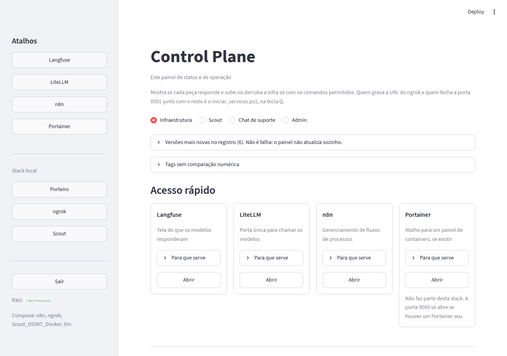

## Login do `/painel` e do console

A borda e o console abrem em **Entrar**. Não há usuário nem senha.

Na borda, a legenda é `Cole o token que o dono emitiu. Não há senha nem cadastro nesta tela.` O campo se chama **Token**.

No console, a legenda é `Cole o token que o admin emitiu. Não há senha nem cadastro nesta tela.` O campo se chama **Token de acesso**.

| Campo ou botão | O que faz | Quando usar | O que acontece depois |
| --- | --- | --- | --- |
| **Token** (borda) ou **Token de acesso** (console) | Recebe o JWT de usuário. O texto fica oculto. | O admin já clicou em **Emitir token** e entregou o valor. | Não há usuário nem senha neste campo. |
| **Entrar** | Confere assinatura, prazo, jti e a chave atual. | Sempre que a sessão estiver fechada. | Token válido no console abre o painel com as listas do token. Na borda, se o IP ainda não está vinculado, cai em **Aguardando aprovação**. Token ruim: `Token expirado.`, `Token revogado.` ou `Token recusado.` |

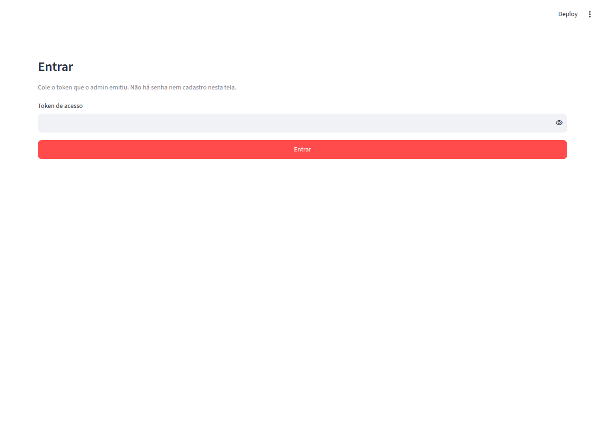

No console, abaixo de **Entrar**, há um segundo bloco. A legenda diz: `Sessão de admin da máquina. Cole o JWT aqui. Ele não vai para a URL.`

| Campo ou botão | O que faz | Quando usar | O que acontece depois |
| --- | --- | --- | --- |
| **Token de admin** | Recebe o JWT. Não vai para a URL. | `python -m control_plane.admin_token` na raiz. A primeira chave é `python -m control_plane.admin_token --init`. O token dura 5 minutos. | A sessão vira admin. |
| **Abrir sessão admin** | Confere a assinatura do JWT. | Uma vez por sessão do navegador. | Abre o console com as quatro seções. |

A legenda debaixo do botão repete: `Na raiz do projeto: python -m control_plane.admin_token. A primeira chave é --init.`

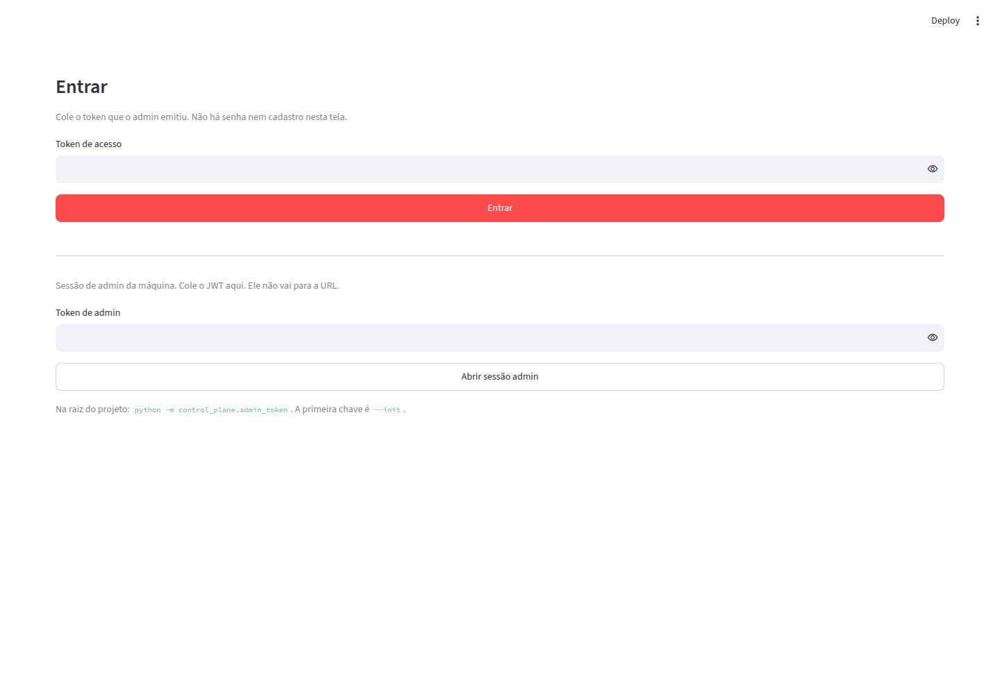

O prazo do token de usuário é `N8GROKER_TOKEN_USUARIO_HORAS` no `.env`. O padrão é 8 horas. Abaixo de 0,25 hora o painel usa 0,25. Acima de 168 horas usa 168. A chave que assina esse token é `.n8groker/usuario.key`, criada no boot do núcleo se faltar, separada de `admin.key`. Ela não entra no git e não é montada no Scout.

Mensagens deste login:

| Mensagem | Significado |
| --- | --- |
| `Token expirado.` | Passou do prazo. O admin emite outro. |
| `Token revogado.` | O admin revogou esse jti, ou revogou a conta. |
| `Token recusado.` | Assinatura errada, chave já rotacionada, token de admin colado no campo de acesso, ou a chave não é a desta máquina. |
| `Conta inativa.` / `Conta não encontrada.` | A conta foi revogada ou não existe mais. |
| `Token já utilizado.` | O JWT de admin já abriu uma sessão. Gere outro. O token de usuário pode ser usado de novo até expirar, ser revogado ou a chave girar. |
| `A borda não aceita o token de admin.` | O JWT do console foi colado no botão de admin. No `/painel` esse botão nem aparece. O campo **Token de acesso** é o do usuário. |
| `Não há admin.key. Rode python -m control_plane.admin_token --init na raiz do projeto.` | A chave de admin ainda não foi criada. |
| `O painel de borda só abre com o cabeçalho assinado pelo Porteiro.` | A URL da porta 8502 foi aberta direto, sem passar pelo Porteiro. Use `5677/painel` ou o túnel. |

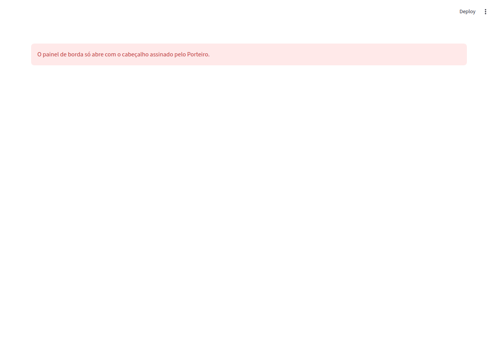

Se a chave HMAC não existe, é pasta, está vazia ou não pôde ser lida, a borda mostra uma destas frases, todas terminando em `O painel de borda não abre sem o cabeçalho assinado.`:

- `A chave HMAC do Porteiro não existe.`
- `A chave HMAC do Porteiro é um diretório, não um arquivo.`
- `A chave HMAC do Porteiro está vazia.`
- `A chave HMAC do Porteiro não pôde ser lida.`

Não há tela de troca de senha. Quem já tinha hash em `users.json` ou em `controle_acesso.json` não entra com essa senha: o hash é ignorado e o admin emite um token novo.

## Aguardando aprovação

Título **Aguardando aprovação**. Legenda: `O token está válido, mas este IP ainda não está vinculado a esta conta. Nenhuma ação roda até o admin vincular. Várias pessoas atrás do mesmo NAT compartilham o IP.`

A barra lateral continua, com **Sair**. Não há Acesso rápido, nem cartão, nem aba.

O painel pede o vínculo ao Porteiro uma vez (`solicitar`). Se o Porteiro local não responder, a tela de espera continua igual: a fila é que não recebe o nome da conta.

No túnel, antes mesmo deste login, um IP novo não chega no Streamlit. A página antiga do Porteiro (túnel direto na porta 5677, Scout desligado) diz **Acesso em Analise**, `Seu IP (<ip>) foi enviado para aprovacao do administrador.` e `Por favor, aguarde alguns instantes. Esta pagina atualiza sozinha.` Se o JavaScript não roda, o texto é: `Se o navegador bloquear JavaScript ou a chave do dispositivo, a origem nao e registrada e o administrador nao consegue aprovar.` Com JavaScript desligado: `JavaScript esta desligado. Sem ele a origem nao e registrada e a aprovacao nao acontece.` No uso com Scout, essa espera de IP novo sai da borda do Scout, não desta página. Esta gravação não abriu o túnel, então essa página não foi capturada.

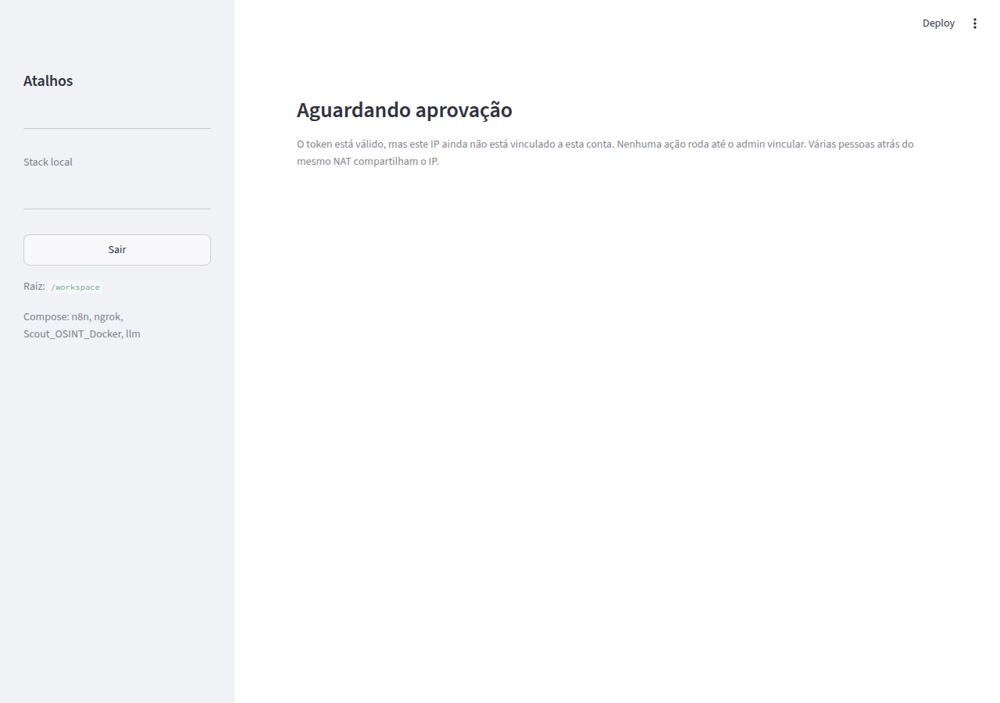

## Acesso rápido

É a escolha de app. Aparece no console para o admin e para quem tem o app em **Pode abrir**. Na borda, só depois que o IP está aprovado e vinculado à conta. `127.0.0.1` nesta gravação não está vinculado, então a escolha ficou no console.

Cada cartão tem o nome, um resumo, o expansor **Para que serve** e o botão **Abrir**.

| Cartão | Resumo na tela | **Abrir** leva a |
| --- | --- | --- |
| **Langfuse** | `Traces e UI. Container langfuse-web na porta 3000.` | `http://localhost:3000` no console. Na borda, `/painel/escolher?app=langfuse`. |
| **LiteLLM** | `Gateway OpenAI-compatível. Modelos entram por esta UI.` | `http://localhost:4000/ui` |
| **n8n** | `Workflows. Container n8n_app. Credencial OpenAI aponta ao LiteLLM.` | `http://localhost:5678` |
| **Portainer** | `Não há Portainer neste repositório. Ajuste a URL se você subir um.` | `http://localhost:9000` |

**Para que serve** abre o texto longo daquele app. No n8n: `Motor de automação dos workflows. A aprovação por e-mail e os webhooks rodam aqui, e a credencial OpenAI do editor aponta para o LiteLLM.`

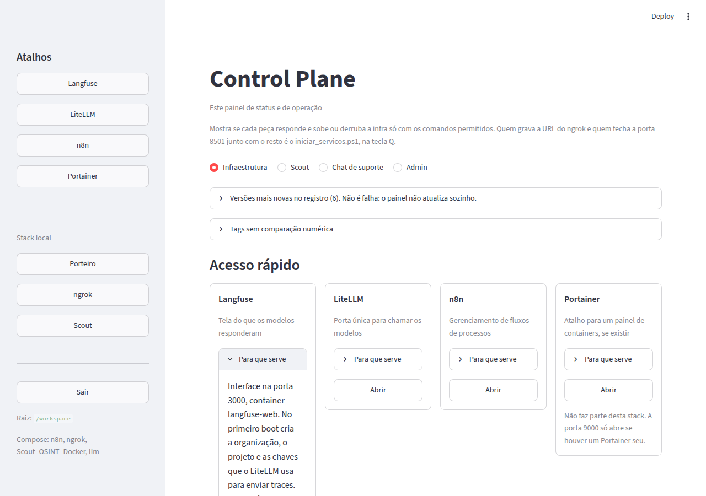

| Aviso no cartão | Significado |
| --- | --- |
| `Não faz parte desta stack. A porta 9000 só abre se houver um Portainer seu.` | Só o Portainer. O repositório não sobe esse programa. |
| `Fora do ar. Abrir não carrega enquanto este programa estiver parado.` | O cartão de status do mesmo app está **Fora do ar**. O link existe; a página do app não. |

Na borda, **Abrir** pede o cookie de sessão ao Scout antes do clique. Sem o Scout na frente, esse caminho não é o portal de escolha do Scout.

## Infraestrutura

A seção começa pelo título **Control Plane**, o resumo `Este painel de status e de operação` e o detalhe: `Mostra se cada peça responde. O núcleo (Porteiro, Scout, ngrok e os painéis) sobe pelo HUD ou pelo botão Iniciar núcleo; n8n e Langfuse/LiteLLM ligam e desligam por stack. O console não desliga o núcleo. Quem grava a URL do ngrok e quem fecha a porta 8501 junto com o resto é o iniciar_servicos.ps1, na tecla Q.`

### Selos e cartões

Subtítulo **Status da infraestrutura**. A legenda, com os números desta instalação (limite lento 1000 ms, tempo esgotado 2 s):

`🟢 No ar: resposta esperada e até 1000 ms. 🟡 Resposta estranha: HTTP diferente ou acima de 1000 ms. 🔴 Fora do ar: o programa não está escutando, ou o tempo esgotou (2s). Fora do ar não é falha desta tela. n8n, LiteLLM e Langfuse ficam assim enquanto não foram iniciados. O botão abaixo refaz só esta seção e grava um ponto no histórico.`

| Selo | Quando aparece | Texto embaixo, exemplos |
| --- | --- | --- |
| **🟢 No ar** | HTTP esperado, dentro do tempo. | `HTTP 204 em 3 ms.` O Porteiro espera 204. |
| **🟡 Resposta estranha** | Respondeu, mas o código não é o esperado, ou passou de 1000 ms. | `Resposta HTTP 404 (esperado 200).` ou `Resposta lenta (1400 ms).` |
| **🔴 Fora do ar** | Nada escutando, ou o tempo esgotou. | `Conexão recusada. O serviço parece parado.` `Tempo esgotado na checagem.` `Sem resposta HTTP.` `Sem conexão com o serviço.` `Falha de certificado TLS.` `Não foi possível consultar este serviço.` |

Outras linhas do cartão:

| Texto | Significado |
| --- | --- |
| `Ainda sem checagem.` | A seção ainda não consultou esse app. |
| `Sem checagem HTTP: não publica porta neste painel.` | Banco interno ou a aba Scout. Não fica vermelho por não ter porta. |
| ``Container `n8n_app` `` | Nome do container que **Reiniciar container** mexe. Os outros: `ngrok_service`, `scout-backend`, `langfuse-web`, `langfuse-worker`, `litellm`, `langfuse-minio`. |
| `Processo no host. Sem reinício por container.` | O Porteiro. Não há botão de reinício no cartão. |
| `Peça interna ou programa no host. Sem botão de reinício.` | Sem porta e sem botão. |

Os grupos são **Stack N8Groker** (n8n, Porteiro, ngrok, Scout, Aba Scout), **Langfuse, LiteLLM e MinIO** e **Bancos internos, sem porta no host** (Postgres do Langfuse, ClickHouse, Redis, Postgres do LiteLLM).

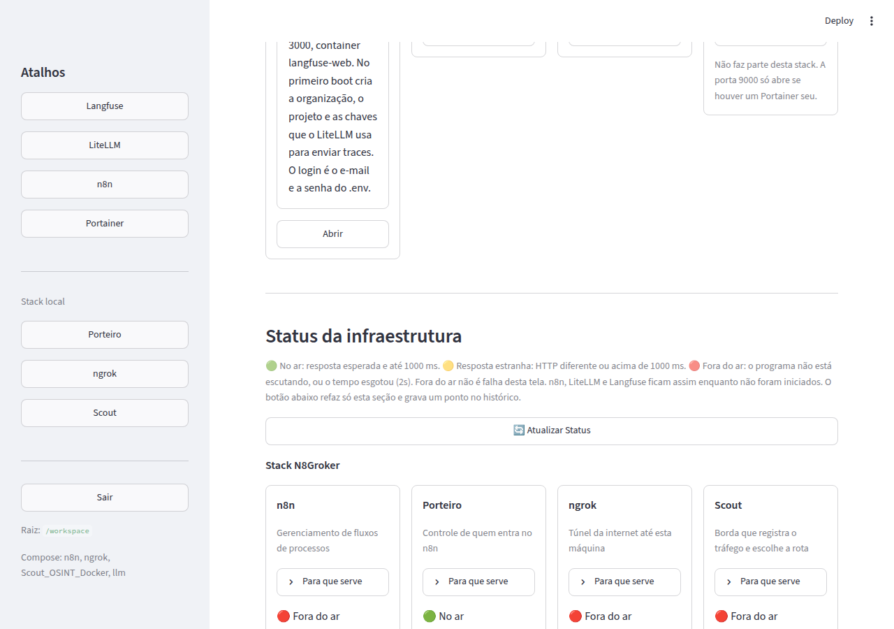

| Botão | O que faz | Quando usar | O que acontece depois |
| --- | --- | --- | --- |
| **🔄 Atualizar Status** | Consulta de novo só esta seção e grava um ponto no histórico. | Depois de subir ou derrubar alguma coisa, ou para sair de `Ainda sem checagem.` | Os selos mudam. Enquanto consulta: `Consultando serviços...` |
| **Reiniciar container** | `docker restart` daquele container. Só em cartão com container e checagem, para quem pode operar. | O app travou e o Docker está no ar. | Aviso verde no canto com o detalhe, e o status é consultado de novo. Sem Docker: `Docker não está no PATH. Abra o Docker Desktop e tente de novo.` |
| **Abrir** | No Acesso rápido e na barra. Abre o endereço do app. | Quando o selo está **No ar**, ou para tentar mesmo assim. | Uma aba nova. Se estiver fora do ar, a legenda do cartão avisa antes. |

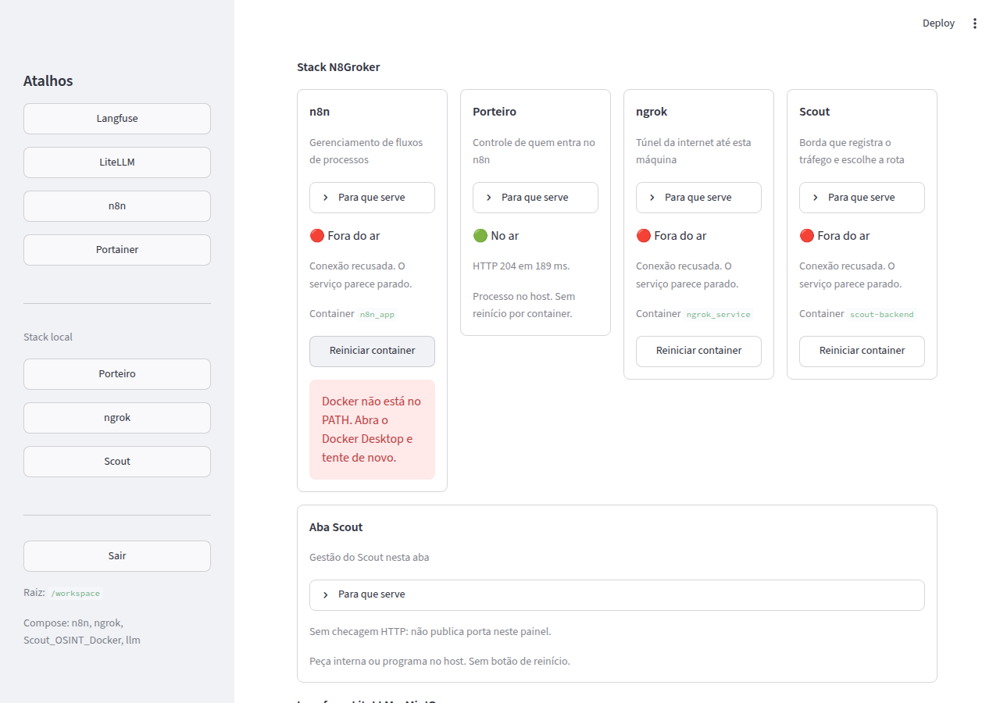

`«n8n_app» não está na lista de containers permitidos.` aparece se o nome não for um dos containers desta stack. `A operação excedeu o tempo limite (60s).` se o restart não volta nesse prazo.

### Versões

Expansor `Versões mais novas no registro (N). Não é falha: o painel não atualiza sozinho.` Cada linha é do tipo `library/postgres está em 17.11 e o registro tem 18.6. O painel não atualiza sozinho.`

Se não houver versão mais nova: `Imagens pinadas conferidas. Nenhuma tag mais nova. O painel não atualiza sozinho.`

Outro expansor, **Tags sem comparação numérica**, cobre digest pinado e tag que não é semver puro. O MinIO entra pelo digest. O ngrok está em `3.39.8-debian` e cai nesse expansor. O n8n está em `2.42.5`: se o registro tiver uma tag numérica mais nova, a linha entra no expansor de versões. O painel não troca a tag.

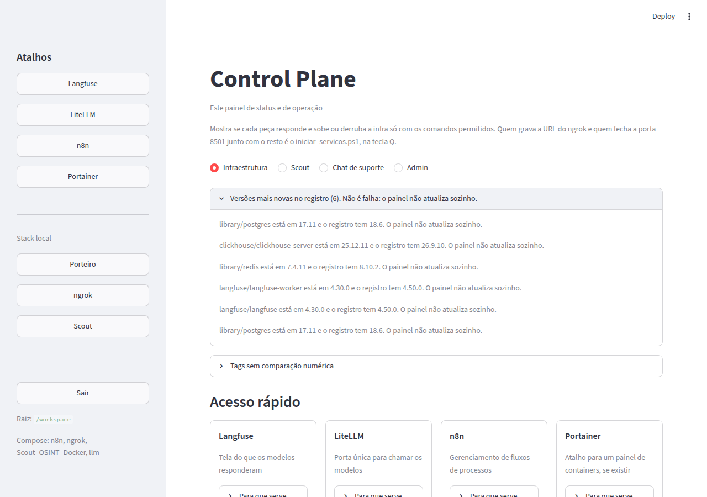

### CPU e memória

Subtítulo **CPU e memória**. Legenda: `Leitura de docker stats --no-stream, reaproveitada por 20 segundos para não travar o painel.`

Com Docker e container rodando, a tabela tem **Container**, **CPU** e **Memória**. Sem leitura: `Sem leitura de CPU e memória. O Docker não respondeu, ou não há container em execução. O restante do painel segue.`

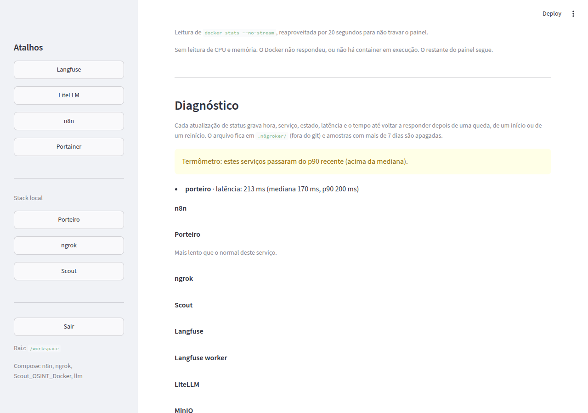

### Diagnóstico

Subtítulo **Diagnóstico**. Cada **Atualizar Status** grava hora, serviço, estado, latência e o tempo até voltar a responder. O arquivo fica em `.n8groker/`, fora do git. Amostra com mais de 7 dias é apagada.

| Texto | Significado |
| --- | --- |
| `Termômetro: ainda sem histórico. Use Atualizar Status para gravar o primeiro ponto.` | Nenhuma amostra ainda. |
| `Termômetro: nenhum serviço acima do próprio p90. Com menos de 5 pontos anteriores não há linha de base.` | Há histórico, nada fora do normal. |
| `Termômetro: estes serviços passaram do p90 recente (acima da mediana).` | A latência ou o tempo até ficar saudável passou do p90. |
| `Mais lento que o normal deste serviço.` | Esse cartão do gráfico está na lista do termômetro. |

O gráfico tem duas séries: `latência (ms)` e `estado (2 no ar, 1 estranho, 0 fora do ar)`.

| Botão | O que faz | Depois |
| --- | --- | --- |
| **Gerar diagnóstico** | Monta um zip com status, histórico, logs recentes, `compose ps` e versões. Segredo de chave sai como `redigido`. | Aparece **Baixar diagnóstico (.zip)**. Se falhar: `Não consegui montar o zip de diagnóstico.` |
| **Baixar diagnóstico (.zip)** | Entrega `diagnostico-n8groker.zip`. | O arquivo baixa no navegador. |

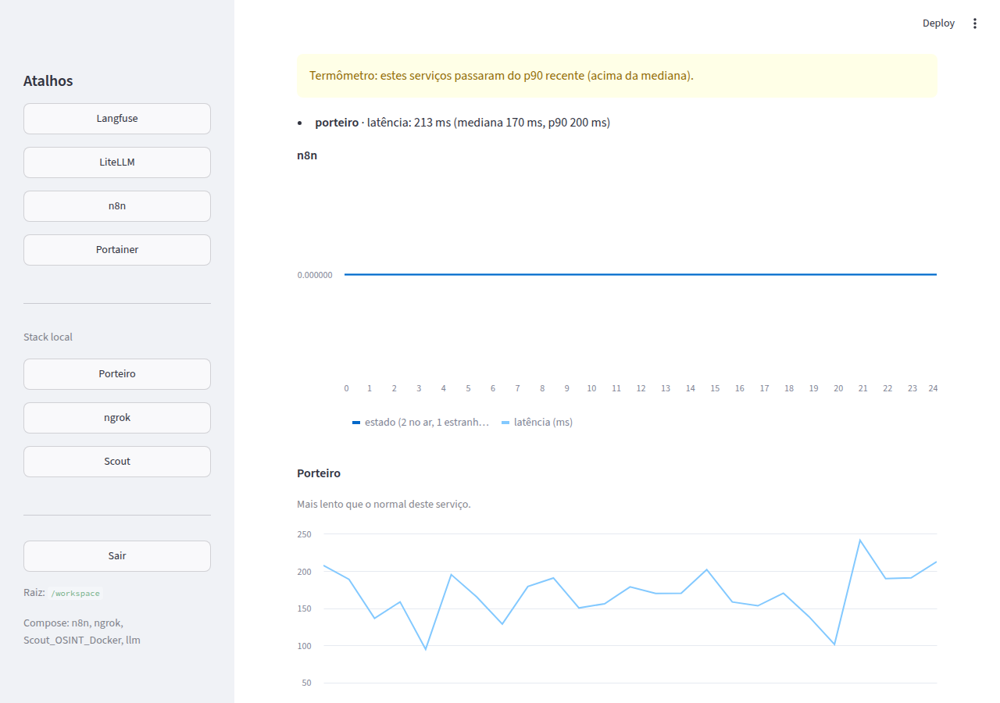

### Operações

Subtítulo **Operações**. Quem não é admin só vê esta seção se tiver **Pode operar** em n8n, Langfuse ou LiteLLM. A borda (`/painel`) não mostra estes botões. A legenda explica que o núcleo é Porteiro, Scout se `USE_SCOUT=1`, ngrok e a rede Docker `rede_comunicacao`, que os painéis 8501 e 8502 sobem com o HUD, e que n8n e Langfuse/LiteLLM são stacks à parte. A URL pública do ngrok continua no HUD.

**Núcleo.** A legenda diz que este console não desliga o núcleo: parar daqui fecharia o painel ou o túnel e trancaria quem está administrando, inclusive de longe. A tecla Q no HUD encerra o núcleo e as stacks que estiverem no ar. Não há botão **Parar núcleo**.

| Botão | O que faz | Quem | O que acontece depois |
| --- | --- | --- | --- |
| **Iniciar núcleo** | Cria a rede `rede_comunicacao` se faltar, sobe o Porteiro, o Scout (se `USE_SCOUT=1`) e o ngrok. Não sobe n8n nem Langfuse/LiteLLM. | Só o admin. | Cada passo vira `concluído.` ou um aviso. No fim, `Núcleo iniciado.` Quem não é admin lê `Só o admin inicia o núcleo.` |

**n8n.** Se Langfuse ou LiteLLM estão fora do ar, um aviso azul diz: `A stack LLM está fora do ar. O n8n sobe mesmo assim. A credencial OpenAI aponta para http://litellm:4000/v1 e só responde quando Langfuse e LiteLLM estiverem no ar. Isso não é erro.`

| Botão | O que faz | Quem | O que acontece depois |
| --- | --- | --- | --- |
| **Iniciar n8n** | `docker compose up -d` de `n8n/docker-compose.yml`. | Admin, ou **Pode operar** em n8n. | O aviso azul, se a stack LLM estiver fora, e `n8n: concluído.` |
| **Parar n8n** | Pede confirmação. Ainda não derruba. | O mesmo. | Aviso: derruba o n8n sem apagar volumes e não mexe na stack LLM. |
| **Confirmar parada do n8n** | `docker compose down`, sem `-v`. | O mesmo. | `n8n: concluído.` |
| **Cancelar** | Fecha a confirmação. | O mesmo. | Nada é derrubado. |
| **Reiniciar n8n** | `docker compose restart` do n8n. | O mesmo. | `n8n: concluído.` |

**Langfuse e LiteLLM.** A legenda diz que as duas peças sobem e descem juntas. Quem só pode operar uma delas não vê os botões e lê: `Para ligar ou desligar esta stack é preciso Pode operar em Langfuse e em LiteLLM.`

| Botão | O que faz | Quem | O que acontece depois |
| --- | --- | --- | --- |
| **Iniciar Langfuse e LiteLLM** | `docker compose up -d` de `llm/docker-compose.yml`. | Admin, ou **Pode operar** nas duas. | `Langfuse e LiteLLM: concluído.` Sem as chaves do `.env`: `Chaves ausentes no .env. Rode o Setup para gerá-las. O n8n segue sem o proxy.` |
| **Parar Langfuse e LiteLLM** | Pede confirmação. | O mesmo. | Aviso de que o n8n, se estiver no ar, continua e a credencial deixa de responder. |
| **Confirmar parada da stack LLM** | `docker compose down`, sem `-v`. | O mesmo. | `Langfuse e LiteLLM: concluído.` |
| **Reiniciar Langfuse e LiteLLM** | `docker compose restart`. | O mesmo. | `Langfuse e LiteLLM: concluído.` |

Quem ligou ou desligou fica na trilha (`.n8groker/trilha`), com a conta no passo, por exemplo `guia ligou n8n`, e o resultado `STACK`.

No PowerShell, sem abrir o HUD: `.\iniciar_servicos.ps1 -Stack n8n`, `-Stack n8n -Acao parar`, `-Stack n8n -Acao reiniciar`, e o mesmo com `llm`. Isso não derruba o núcleo. O boot normal (`.\iniciar_servicos.ps1` sem `-Stack`) sobe só o núcleo. `STACKS_BOOT=n8n,llm` no `.env` lista o que sobe junto com o núcleo; vazio deixa só o núcleo. O botão **Iniciar núcleo** não lê essa variável.

`Parada cancelada: confirme a ação antes de derrubar a stack.` é a trava se a confirmação não chegar na execução.

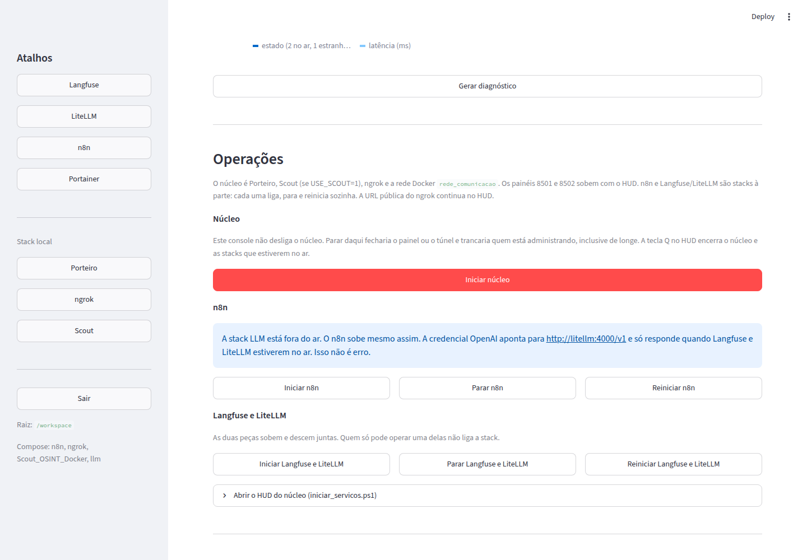

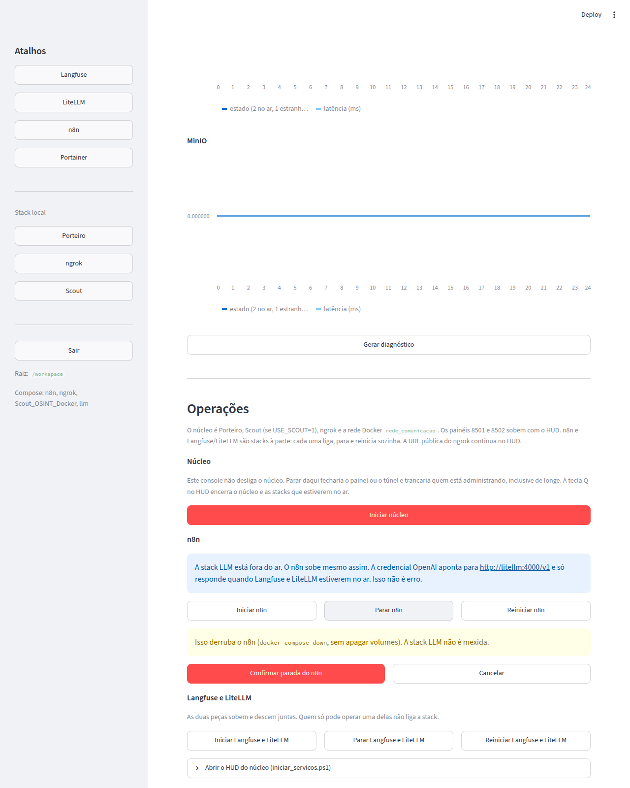

Expansor **Abrir o HUD do núcleo (iniciar_servicos.ps1)**, só para o admin. A legenda diz que abre o orquestrador do núcleo numa janela nova, no Windows, que n8n e Langfuse/LiteLLM só entram no boot se `STACKS_BOOT` pedir, e que fechar a janela ou pressionar Q encerra o núcleo e as stacks que estiverem no ar. Ollama e o Docker Desktop só fecham se o script os abriu nesta sessão.

| Botão | Nesta VM | No Windows |
| --- | --- | --- |
| **Abrir HUD do núcleo** | `O orquestrador é um script PowerShell do Windows. Neste sistema, use «Iniciar núcleo» e os botões de cada stack.` | `HUD do núcleo aberto numa janela nova.` Se o script não está na raiz: `iniciar_servicos.ps1 não encontrado na raiz do projeto.` Se não há PowerShell: `PowerShell não encontrado.` |

Outras frases de operação, se aparecerem: `Docker não está no PATH. Abra o Docker Desktop e tente de novo.` `O Docker está no PATH, mas o motor não respondeu. Abra o Docker Desktop e espere ele ficar no ar.` `Compose fora da lista permitida.` `Arquivo de compose não encontrado.` `A operação excedeu o tempo limite (180s).` `Não encontrei o executável «docker». Confira se ele está no PATH.` `Algo inesperado impediu a operação. Nenhum detalhe técnico foi exibido aqui.` `Sem permissão para esta ação.` (a conta não tem **Pode operar** naquele app, ou na stack LLM só tem uma das duas).

### Backup e restauração

Subtítulo **Backup e restauração**. Os arquivos ficam em `.n8groker/backups`, fora do git. Postgres usa `pg_dump`. O n8n copia o SQLite. ClickHouse e MinIO arquivam o volume com tar. Restaurar pede confirmação e para os serviços que usam esse dado.

| Campo ou botão | O que faz | Depois |
| --- | --- | --- |
| **O que guardar** | Lista: `Postgres do Langfuse (pg_dump)`, `Postgres do LiteLLM (pg_dump)`, `SQLite do n8n`, `Volume do ClickHouse`, `Volume do MinIO`. | Escolhe o alvo dos dois botões. |
| **Fazer backup** | Grava um arquivo desse alvo. | `Backup gravado em .n8groker/backups.` ou o motivo. Falha genérica: `Não consegui fazer o backup.` |
| **Arquivo para restaurar** | Os backups já gravados desse alvo, o mais novo primeiro. | Sem arquivo: `Nenhum backup deste alvo nesta máquina.` O select nem abre. |
| **Eu confirmo a restauração. Os serviços afetados serão parados antes.** | Trava. Sem a marca, nada restaura. | `Marque a confirmação. Nada foi restaurado.` |
| **Restaurar** | Para o que usa esse dado, grava o arquivo e sobe de novo. | `Restauração concluída. Os serviços que tinham sido parados foram iniciados de novo.` |

Sem Docker: `Docker não está no PATH. Abra o Docker Desktop e tente de novo.` Sem o SQLite do n8n: `Não encontrei o SQLite do n8n em n8n/n8n/data/database.sqlite.` `Restauração cancelada: confirme a ação antes de restaurar.` se a confirmação não entra na execução. `Não consegui restaurar.` é a falha genérica.

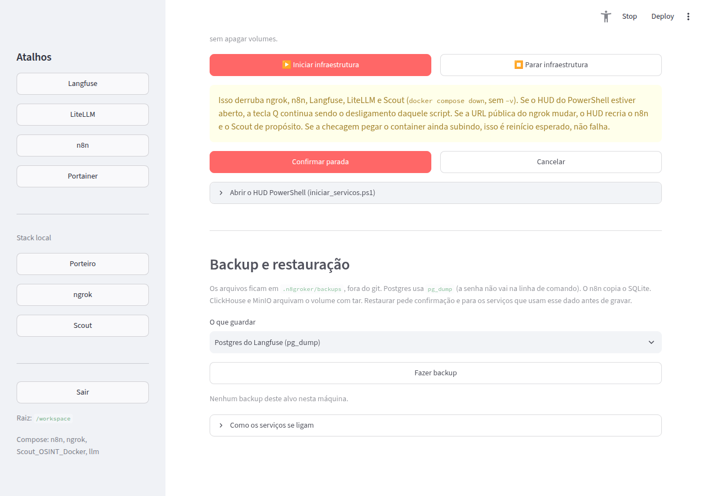

### Como os serviços se ligam

Expansor no fim da seção:

- **LiteLLM → Langfuse:** callback `langfuse_otel` para `http://langfuse-web:3000`, com as chaves do headless init.
- **n8n → LiteLLM:** credencial OpenAI (`openAiApi`) aponta para `http://litellm:4000/v1`.
- **Modelos:** nenhum provider vem pronto. Cadastre na UI do LiteLLM.
- **Login Langfuse:** e-mail `admin@example.com` e a senha `LANGFUSE_INIT_USER_PASSWORD` do `.env`.
- **Login LiteLLM:** usuário `LITELLM_UI_USERNAME` ou a `LITELLM_MASTER_KEY` do `.env`.

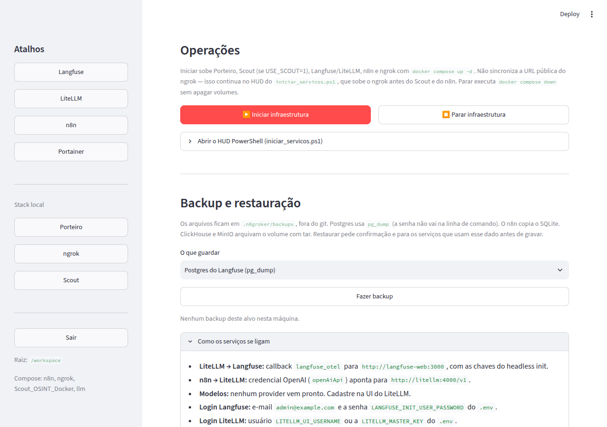

## Barra lateral

Título **Atalhos**. Os mesmos apps de **Pode abrir**: Langfuse, LiteLLM, n8n, Portainer. Cada um abre o endereço, como **Abrir**.

Depois, **Stack local**, com link para ngrok, Porteiro e Scout quando a conta pode abrir esses ids. **Sair** encerra a sessão deste navegador e volta para **Entrar**. Embaixo: `Raiz: <pasta do projeto>` e `Compose: n8n, ngrok, Scout_OSINT_Docker, llm`.

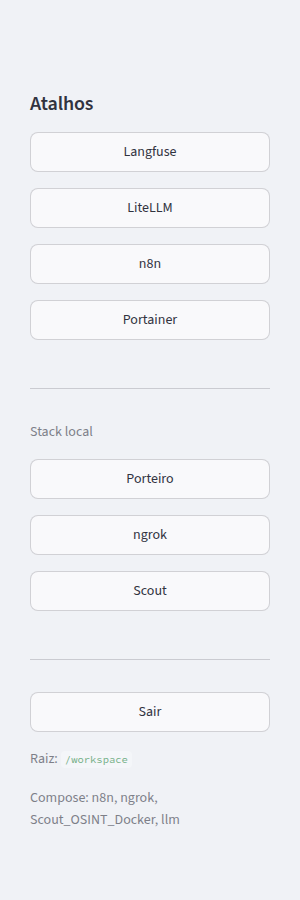

Na borda, **Sair** volta para a tela abaixo: um campo **Token**, sem usuário e sem senha.

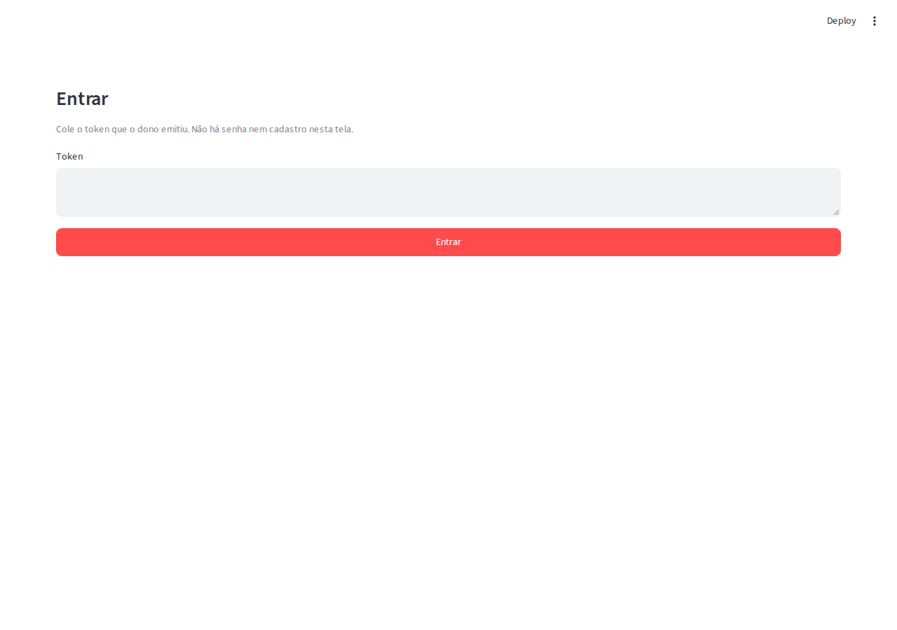

## Scout

A opção **Scout** abre o subtítulo **Scout**. Legenda: `As mesmas operações da antiga gestão do Scout, agora nesta aba. O backend é o scout-backend na porta 8765. Mudança de rota, alias, bloqueio e firewall pede confirmação.`

No console do admin, o bloco **Sessões, trilha e alertas** vem primeiro. Legenda: `Só esta sessão admin, no console. A trilha fica em .n8groker/trilha/trilha.jsonl. Não guarda senha, token nem cookie. Alerta não bloqueia o acesso.`

### Sessões ativas

Cada linha é `conta · ip`, e a legenda `sessão <sid> · origem <origem> · app <app> · início <hora> · ativa há <tempo>`. Sem sessão viva: `Nenhuma sessão ativa.` A sessão some depois de 15 minutos sem ser vista de novo (`N8GROKER_SESSAO_SEG`, padrão 900).

| Botão | O que faz | Depois |
| --- | --- | --- |
| **Revogar sessão** | Marca aquele sid. O próximo pedido desse cookie cai. | Aviso verde: `Sessão revogada. O próximo pedido desse cookie cai.` A linha sai na hora. |

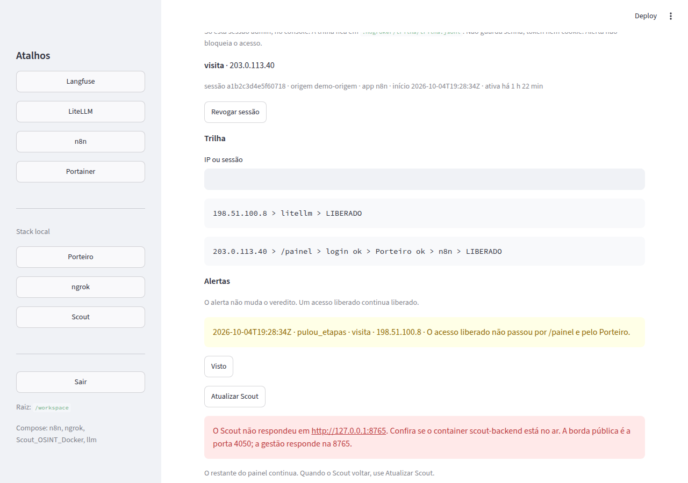

### Trilha por IP

Título **Trilha**. Campo **IP ou sessão**.

- Vazio: as linhas legíveis que existem.
- Um IP: só esse IP.
- 16 caracteres hexadecimais: trata como sid, não como IP.

Cada linha é um bloco de código, no máximo as 30 últimas. Forma: `203.0.113.40 > /painel > login ok > Porteiro ok > n8n > LIBERADO`. Um bloqueio termina em `BLOQUEIO (motivo)`. Sem linha: `Nenhum checkpoint nessa leitura.`

### Alertas da trilha

Título **Alertas**. Legenda: `O alerta não muda o veredito. Um acesso liberado continua liberado.` Sem alerta: `Nenhum alerta.`

A frase é `hora · regra · conta · ip · detalhe`. Sem o **Visto**, ela fica em aviso amarelo. Com **Visto**, vira a legenda `visto · ...`.

| Botão | O que faz |
| --- | --- |
| **Visto** | Marca aquele alerta como lido. Não bloqueia e não libera ninguém. |

Regras que o código grava:

| Regra | Detalhe |
| --- | --- |
| `pulou_etapas` | `O acesso liberado não passou por /painel e pelo Porteiro.` |
| `trocas_app` | `N trocas de app na janela.` Padrão: 4 trocas em 60 segundos. |
| `horario` | `Hora N UTC fora de A-B.` Só se a conta tiver faixa de hora. |
| `bloqueios_antes` | `N bloqueios seguidos de um acesso liberado.` Padrão: 3. |
| `dois_ips` | `A conta também está em <outro ip>.` Duas sessões vivas da mesma conta. |

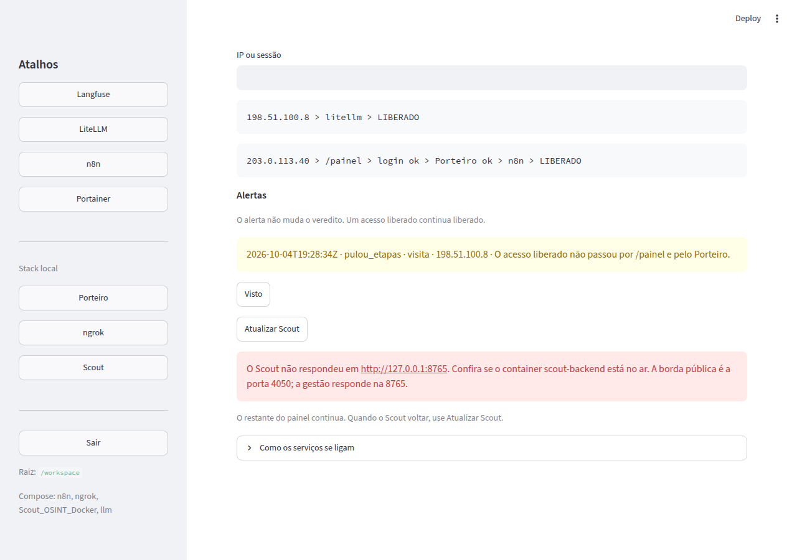

### Quando o backend responde

**Atualizar Scout** apaga a leitura anterior e pede de novo. Com o backend no ar, a aba segue. Sem ele, para aqui:

`O Scout não respondeu em http://127.0.0.1:8765. Confira se o container scout-backend está no ar. A borda pública é a porta 4050; a gestão responde na 8765.`

E a legenda: `O restante do painel continua. Quando o Scout voltar, use Atualizar Scout.`

Nesta captura o backend estava desligado, então os controles abaixo não apareceram. Eles existem no código e passam a aparecer quando o Scout responde:

| Controle | O que faz | Confirmação |
| --- | --- | --- |
| **Backend: no ar** | Legenda `Ativos N · total N · novos N`. | Não é botão. |
| **Sincronizar Docker** | Pede para reler os containers. Rota nova entra desligada. | `Pedir ao Scout para reler os containers? Rotas novas entram desligadas.` |
| **Sincronizar firewall** | Reaplica o firewall com as portas atuais. | `Reaplicar o firewall do Scout com as portas atuais?` |
| **Incluir porta manual** | Nome, **Porta upstream** (1–65535, valor inicial 5680) e **Incluir porta**. A porta nasce desligada, com destino `host.docker.internal`. | `Incluir a porta manual «nome» para host.docker.internal:porta, desligada?` |
| Cartão da rota | `nome · NOVO`, `ATIVO` ou `INATIVO`. Legenda com origem, porta Scout, upstream e modo. | |
| **Modo** e **Gravar modo** | `tcp`, `http` ou `https` numa rota já ligada. | `Gravar o modo tcp na rota <id>?` |
| **Ativar** / **Desativar** | Liga ou desliga a rota. | `Ativar a rota <id>?` ou `Desativar a rota <id>?` |
| **Nome**, **Porta Scout**, **Upstream (host:porta)** | Só em rota manual. | |
| **Salvar rota manual** | Grava nome, porta e upstream. | `Gravar as alterações da rota manual <id>?` |
| **Apagar rota manual** | Remove a rota. | `Apagar a rota manual <id>? Isso não tem desfazer automático.` |
| **Tráfego** | Até 80 sessões recentes: hora, cliente, rota, modo, upstream, bytes, `bloqueado sim/não`. Vazio: `Sem sessões recentes.` | |
| **Alertas** (deste backend, não os da trilha) | Até 15 linhas `hora mensagem`. Vazio: `Sem alertas.` | |
| **Clientes** | IP, alias, última vez, modo, rota, sessões, bytes, bloqueado. Vazio: `Nenhum cliente registrado.` | |
| Campo com placeholder `Alias para <ip>` e **Gravar alias** | Nome amigável do IP. | `Gravar o alias de <ip>?` |
| **Bloquear IP** | Bloqueia na borda do Scout. | `Bloquear <ip> na borda do Scout?` |
| **Desbloquear** | Tira o IP do bloqueio. | `Tirar <ip> do bloqueio da borda?` |
| **Remover da lista** | Some da lista de clientes. | `Remover <ip> da lista de clientes?` |
| **Health Check** | Lê a gestão e mostra Ngrok, porta pública, Admin API, firewall, Docker e containers. | O texto fica na própria seção **Configuração**. |
| **Confirmar** / **Cancelar** | Toda mudança de rota, alias, bloqueio ou firewall. | **Cancelar** registra `Ação cancelada. Nada foi enviado ao Scout.` |

Dois avisos que param antes da confirmação:

- `Ativar n8n_app expõe o n8n direto e ignora a fila do Porteiro. Para o acesso normal, deixe só a rota do Porteiro. Nada foi alterado ainda.` A confirmação ainda é pedida em seguida.
- `Não é recomendado ativar o proxy para ngrok_service. A rota continua desligada.` Aqui nada é enviado.

`O Scout recusou a operação.` aparece quando a resposta vem com `ok: false` e sem texto. Se houver `reason`, `error` ou `detail`, a frase é `O Scout recusou a operação: <esse texto>`. O `reason` mais comum do firewall Linux é `iptables indisponível ou desactivado`.

Outras frases do Scout, quando o campo está errado:

| Mensagem | Significado |
| --- | --- |
| `O Scout respondeu com um texto que não é JSON.` | A gestão respondeu, mas o corpo não é JSON. |
| `Upstream vazio. Use host:porta.` / `Upstream precisa ser host:porta.` | O campo de upstream não tem os dois lados. |
| `Host de upstream inválido.` | O host não passou na conferência. |
| `Porta de upstream inválida. Use 1–65535.` | Porta fora da faixa. |
| `Porta Scout inválida. Use 1–65535.` | A porta de escuta da rota manual está fora da faixa. |
| `A porta 5677 é do Porteiro e não pode ser escuta nem destino de uma rota do Scout.` | O mesmo para 5676. |
| `Modo recusado. Use tcp, http ou https.` | Outro valor no modo. |
| `Nome de rota recusado.` | Nome vazio ou com caractere recusado. |
| `Nada para gravar nessa rota.` | O patch foi vazio. |
| `Rota recusada.` / `IP recusado.` / `Alias recusado.` | O identificador não passou. |
| `Ação do Scout recusada.` / `Consulta do Scout recusada.` | A operação não está na lista que esta aba pode chamar. |
| `A ação do Scout não pôde ser concluída.` | Falha sem detalhe. Nada deve ter mudado. |

## Admin

Só no console, opção **Admin**. A borda não tem esta aba.

### Contas

Subtítulo **Contas**. Legenda: `Não há senha. Pode ver, Pode operar e Pode abrir entram no token, na hora de emitir. Gravar listas só guarda o modelo do próximo token: um token já emitido não muda. O token aparece uma vez para copiar e não fica gravado em claro.`

| Campo ou botão | O que faz | Quando usar | Depois |
| --- | --- | --- | --- |
| **Usuário da nova conta** | 3 a 64 letras, números, ponto, `_` ou `-`. | Uma conta por pessoa. | |
| **Pode ver** | Apps que a conta enxerga no painel. A ajuda do campo é `Apps que a conta enxerga no painel.` Placeholder: `Escolha os apps`. | Quem só acompanha status. | Sem isto no token, o app não entra na grade. |
| **Pode operar** | `Apps em que a conta pode iniciar, parar ou mudar rota.` | Quem pode **Reiniciar container** ou mexer no Scout. | |
| **Pode abrir** | `Apps que aparecem em Acesso rápido.` | Quem deve ver o atalho. | |
| **Criar conta** | Grava a conta, sem senha. | Com o usuário válido. | `Conta <nome> criada. Emita um token para ela entrar.` |

O item `Select all` dentro da lista é texto do Streamlit, em inglês. Não é um rótulo deste painel.

A conta já criada mostra `situação ativo · ver ... · operar ... · abrir ...`. Listas vazias aparecem como `—`.

| Campo ou botão | O que faz | Depois |
| --- | --- | --- |
| **Revogar conta** | Desativa a conta e os tokens dela. | `Conta revogada. Os tokens dela deixam de entrar e o cookie cai na próxima requisição.` Se a geração não gravar: `Não consegui gravar a geração da sessão desse usuário. A sessão de admin continua aberta.` |
| **Pode ver (nome)**, **Pode operar (nome)**, **Pode abrir (nome)** | Abrem já com o modelo gravado. | Não mudam um token que já saiu. |
| **Gravar listas de nome** | Substitui o modelo pelo que está marcado agora. | `Listas gravadas. Valem no próximo token. O token já emitido continua com as listas de quando saiu.` |
| **Emitir token para nome** | Grava as listas marcadas e assina um JWT novo. | O token aparece numa caixa. A legenda diz: `Copie agora. Este token não fica em disco. Apague da tela quando terminar.` |
| **Apagar token da tela (nome)** | Tira o JWT da tela. | Não revoga. Quem já copiou ainda entra, até o prazo, a revogação ou a rotação. |
| **Revogar jti** seguido de 8 caracteres | Invalida aquele token e sobe a geração da conta. | `Token revogado. A sessão ligada a ele cai na próxima requisição.` A revogação de um sid na aba Scout continua sendo outra coisa: derruba só aquela sessão. |

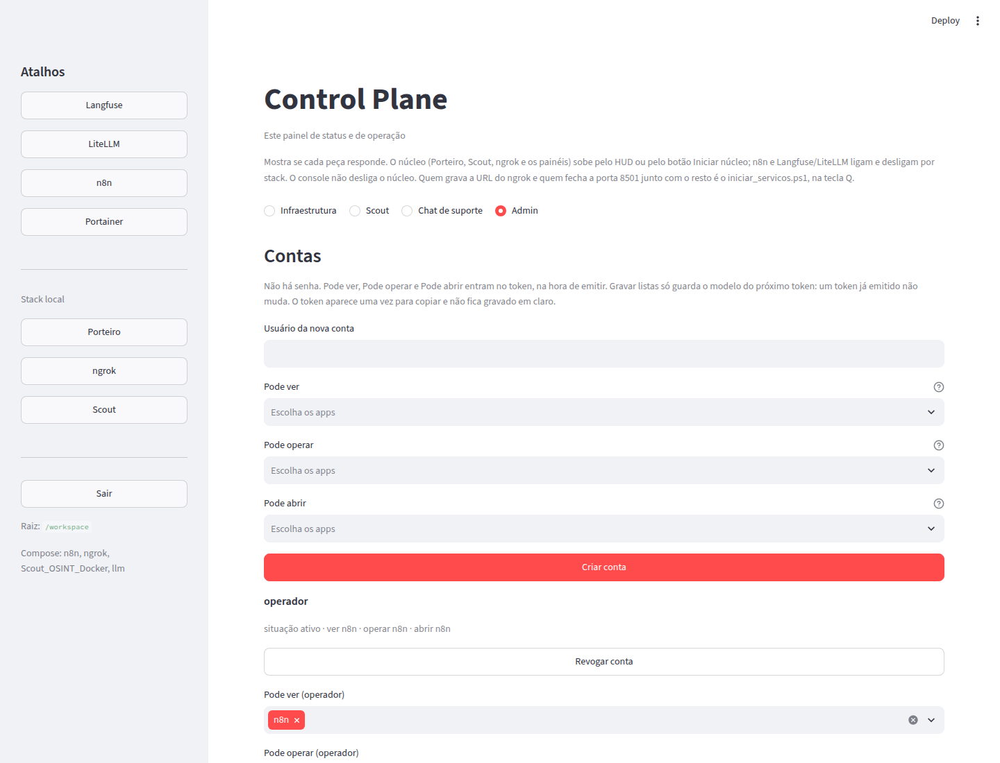

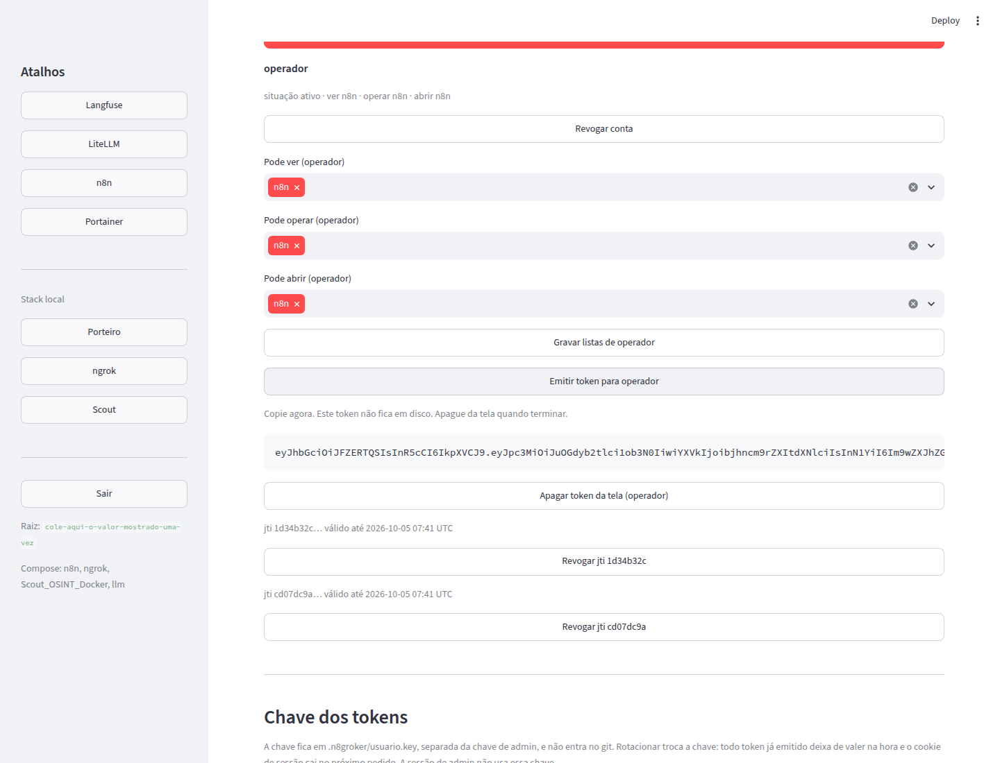

### Chave dos tokens

Subtítulo **Chave dos tokens**. Legenda: `A chave fica em .n8groker/usuario.key, separada da chave de admin, e não entra no git. Rotacionar troca a chave: todo token já emitido deixa de valer na hora e o cookie de sessão cai no próximo pedido. A sessão de admin não usa essa chave.`

| Botão | O que faz | Depois |
| --- | --- | --- |
| **Rotacionar chave** | Pede confirmação. | O aviso: `Todo token de usuário emitido antes deixa de valer agora. As sessões deles caem na próxima requisição.` |
| **Confirmar rotação** | Troca `usuario.key` e sobe a geração das contas. | `Chave trocada. Os tokens antigos não entram mais.` A sessão de admin continua aberta. |
| **Cancelar rotação** | Não troca a chave. | O aviso some. |

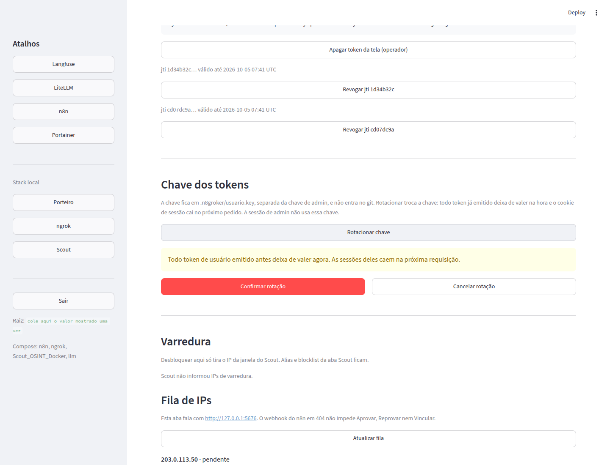

| Mensagem | Significado |
| --- | --- |
| `Usuário recusado. Use de 3 a 64 letras, números, ponto, _ ou -.` | Nome fora do padrão. |
| `Já existe uma conta com esse usuário.` | Escolha outro nome. |
| `Conta não encontrada.` | A conta sumiu entre a leitura e o clique. |
| `Lista de permissão recusada.` | Um id da lista não é um app desta stack. |
| `usuario.key é uma pasta, não um arquivo. Esvazie e remova a pasta antes de subir o núcleo. Nada foi apagado.` | O Docker criou uma pasta no lugar do arquivo. O boot também para nesse caso. |
| `Não consegui gravar a chave ou o registro do jti. Nenhum token foi mostrado.` | A emissão não completou. Não há token para copiar. |

Os ids que a lista oferece são os do código: `n8n`, `porteiro`, `ngrok`, `scout`, `langfuse`, `langfuse-worker`, `litellm`, `minio`, `scout-gui`, `langfuse-postgres`, `langfuse-clickhouse`, `langfuse-redis`, `litellm-db`.

### Varredura

Subtítulo **Varredura**. Legenda: `Desbloquear aqui só tira o IP da janela do Scout. Alias e blocklist da aba Scout ficam.`

| Texto ou botão | Significado |
| --- | --- |
| `Scout não informou IPs de varredura.` | A porta 8765 não respondeu. Nesta captura é o estado esperado. |
| `Nenhum IP bloqueado por varredura.` | O Scout respondeu e a lista está vazia. |
| **Desbloquear** seguido do IP | Pede `POST /varredura/desbloquear`. |
| `IP liberado da varredura.` | O Scout aceitou. |
| `Não consegui desbloquear no Scout.` | O pedido não chegou. |

### Fila de IPs

Subtítulo **Fila de IPs**. Legenda: `Esta aba fala com http://127.0.0.1:5676. O webhook do n8n em 404 não impede Aprovar, Reprovar nem Vincular.`

**Atualizar fila** apaga a leitura e busca de novo.

Cada IP visível está `pendente` ou `aprovado`. Bloqueado sai da lista. A legenda traz data, `conta pedida`, `vínculo`, e, se houver, `Origens: <origem> (pendente)` ou `(aprovado)`. Outra linha: navegador, sistema, idioma, horário, país (`vazio` se não veio) e dispositivo. Sem ninguém: `Nenhum IP pendente ou aprovado.`

| Campo ou botão | O que faz | Quando usar | Depois |
| --- | --- | --- | --- |
| **Conta para vincular** | Nome da conta. Começa com a conta pedida, ou com a já vinculada. | Antes de **Vincular**. | 3 a 64 letras, números, ponto, `_` ou `-`. |
| **Aprovar** | Só enquanto o IP está `pendente`. Aprova a origem pendente, se houver. | O IP e a origem são de quem você quer deixar entrar. | A fila é lida de novo. O IP passa a `aprovado` quando o Porteiro aceita. |
| **Reprovar** | Bloqueia o IP. | Visita que não deve entrar. | O IP sai da lista visível. |
| **Vincular** | Liga o IP aprovado à conta, na origem já aprovada. | Depois do **Aprovar**, para a pessoa sair de **Aguardando aprovação**. | A legenda de vínculo mostra a conta. |

O sucesso do Porteiro não vira um banner. A linha é redesenhada. A recusa aparece em vermelho, com o texto do Porteiro, não com o JSON.

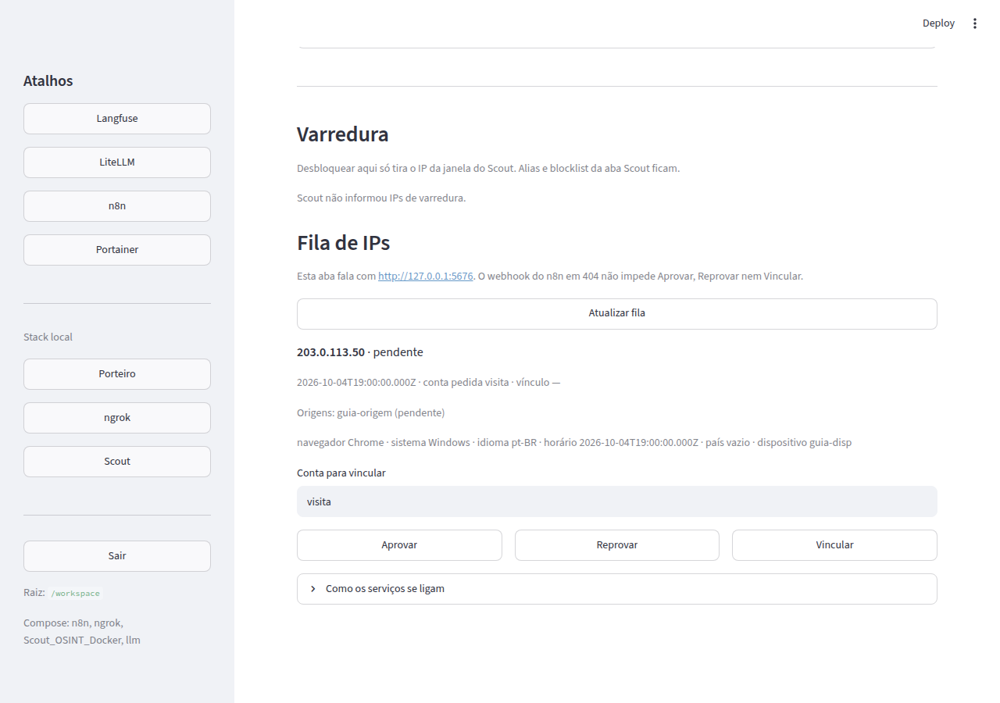

Mensagens da fila e do Porteiro:

| Mensagem | Significado |
| --- | --- |
| `Não há .n8groker/porteiro-painel.token. O iniciar_servicos.ps1 cria esse arquivo. Sem ele a fila responde 403.` | O painel não tem o token da porta 5676. |
| `O Porteiro local não respondeu em 127.0.0.1:5676.` | O processo do Porteiro está parado. |
| `Fila indisponível.` | Não houve leitura e não houve um motivo mais específico. |
| `Sem o Porteiro em 127.0.0.1:5676 a fila não carrega. O veredito de quem já entrou não muda.` | A fila falhou. Quem já estava aprovado continua aprovado. |
| `Não foi possível ler a fila do Porteiro.` / `A fila não veio em JSON.` | A porta respondeu algo que esta aba não lê. |
| `Ação recusada.` | O nome da ação não é solicitar, aprovar, bloquear ou vincular. |
| `O Porteiro recusou.` | A recusa veio sem `reason`, `error`, `detail` nem `texto`. |
| `Token invalido.` | O token enviado não é o do arquivo. |
| `Token de aprovacao nao configurado.` | O Porteiro subiu sem token. As rotas `/n8n/` ficam em 403. |
| `IP invalido.` | O IP da ação não tem formato de IP. |
| `Erro: O IP nao esta na fila de espera.` | Esse IP não está no registro. |
| `Origem obrigatoria. Dispositivo nao aprovado.` | **Aprovar** sem uma origem pendente. |
| `Origem nao registrada.` | A origem pedida não está nesse IP. |
| `Origem obrigatoria.` | **Vincular** sem origem. |
| `O par IP e origem precisa estar aprovado antes do vinculo.` | A origem ainda está pendente. Aprove primeiro. |
| `O IP precisa estar aprovado antes do vinculo.` | O IP inteiro ainda não está aprovado. |
| `Conta invalida.` | **Conta para vincular** vazia ou fora do padrão (3 a 64, letras, números, ponto, `_`, `-`). |
| `Origem invalida.` | O navegador mandou origem ou dispositivo com caractere fora de letras, números, `_` e `-`, ou maior que 128. |
| `Muitas requisicoes. Aguarde.` | Mais de 60 pedidos por minuto daquele IP no Porteiro. |
| `Acesso Negado Permanentemente.` | O IP está bloqueado. Não é a tela do painel; é a resposta do Porteiro ao visitante. |
| `Acesso Negado: Esta rota e bloqueada para acessos externos.` | Alguém tentou o webhook interno pelo proxy. |
| `n8n offline ou reiniciando.` | O proxy não alcançou a porta 5678. |
| `Painel de borda offline.` | O proxy não alcançou a porta 8502. |
| `As rotas de aprovacao nao aceitam acesso pelo tunel.` | A fila foi chamada pelo endereço público. Ela só atende na máquina, na 5676. |
| `As rotas de aprovacao so aceitam a rede local da maquina.` | O socket não é local. |

O webhook de alerta do Scout não muda veredito. Esta aba não o chama.

## Chat de suporte

Opção **Chat de suporte**. Subtítulo igual. A legenda traz o endereço e o modelo lidos do `.env` (padrão `http://localhost:11434` e `qwen2.5-coder:7b`): `Ollama em <url>, modelo <modelo>. Status e logs rodam na hora. Iniciar, parar e reiniciar só depois de Confirmar. Este chat não desliga o Control Plane. Um modelo de 7B pode errar um passo.`

| Peça | O que faz | Depois |
| --- | --- | --- |
| Aviso do Ollama | A sonda em `/api/tags` falhou, ou o modelo não está baixado. | O campo de pergunta fica desligado. O resto do painel continua. |
| **Baixar modelo** | Só se a mensagem citar `ollama pull <modelo>`. | Abre a confirmação. |
| `O download só começa se você confirmar. Não é um comando livre.` | Lembrete antes do download. | |
| **Confirmar download** / **Cancelar download** | Roda `ollama pull`, ou desiste. | Sucesso recarrega a sonda. |
| Campo `Pergunte como usar a stack` | Manda a pergunta ao Ollama, com o status atual. | A resposta entra na conversa. |
| **Confirmar** / **Cancelar** | Uma ação de iniciar, parar ou reiniciar pedida pelo modelo. | `Ação executada: ...` ou `Ação cancelada. Nada foi executado.` |
| **Limpar conversa** | Apaga o histórico desta sessão do navegador e qualquer ação pendente. | A tela volta ao aviso e ao campo. |

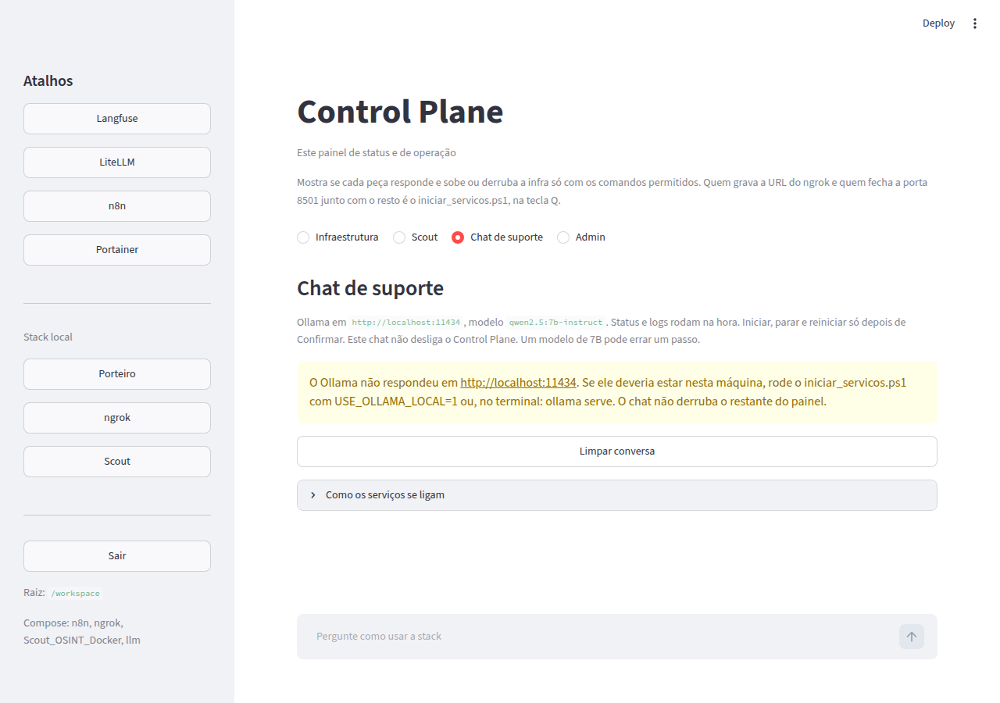

| Mensagem | Significado |
| --- | --- |
| `O Ollama não respondeu em http://localhost:11434. Se ele deveria estar nesta máquina, rode o iniciar_servicos.ps1 com USE_OLLAMA_LOCAL=1 ou, no terminal: ollama serve. O chat não derruba o restante do painel.` | Nada escuta na porta do Ollama. |
| `O Ollama está no ar, mas o modelo <modelo> não está baixado. Rode no terminal: ollama pull <modelo>. O painel só baixa se você confirmar o botão. Sem esse modelo o chat não abre.` | Falta o modelo. |
| `O comando ollama não está no PATH. Instale o Ollama e rode de novo.` | O botão de download não achou o programa. |
| `Nome de modelo recusado. Nada foi baixado.` | O nome do modelo não passou na conferência. |
| `O download do modelo excedeu o tempo limite.` | O pull passou de 600 s. |
| `ollama pull <modelo> falhou.` | O comando voltou com erro. O final da saída vem na mesma frase. |
| `Não consegui falar com o Ollama. Nada foi executado.` | A conversa quebrou no meio. |
| `O Ollama respondeu com um texto que não é JSON. Nada foi executado.` | Corpo inesperado. |
| `O Ollama respondeu fora do formato esperado. Nada foi executado.` | JSON que não é um objeto. |
| `A resposta do Ollama veio incompleta. Nada foi executado.` | A resposta cortou. |
| `A confirmação não chegou na execução. Nada foi feito.` | O **Confirmar** não fechou a ação. |
| `A ação não pôde ser concluída. Nenhum detalhe técnico foi exibido aqui.` | Falha na execução. |
| `Ação pendente.` | O modelo pediu algo e a frase específica não veio. |

## Sair

**Sair**, na barra lateral, apaga a sessão deste navegador: admin, conta, listas e a espera de aprovação. A próxima tela é **Entrar**. Não apaga a conta, não revoga o IP e não derruba container.

## Tarefas do dia a dia

**Liberar um IP novo.** A pessoa abre o `/painel` pelo túnel. Se o IP é novo, ela fica na página de análise até a origem entrar na fila. No console, **Admin**, **Atualizar fila**. Confira IP, origem, navegador e a conta pedida. **Aprovar**. Quando a origem estiver `aprovado`, preencha **Conta para vincular** e **Vincular**. A pessoa atualiza o `/painel` e sai de **Aguardando aprovação**.

**Dar a uma conta o acesso a um app.** **Admin**, na conta, marque o app em **Pode ver** para enxergar o cartão, em **Pode operar** para reiniciar ou mexer no Scout, em **Pode abrir** para o atalho. **Emitir token para &lt;nome&gt;** e entregue o JWT. **Gravar listas** sozinho não muda o token que já está na mão da pessoa. Ela cola o token novo em **Token de acesso**.

**Revogar uma sessão suspeita.** **Scout**, no bloco de sessões, **Revogar sessão** na linha da conta e do IP. O aviso confirma. O próximo pedido daquele cookie cai. Isso não bloqueia o IP na fila nem na blocklist do Scout.

**Ver por que alguém foi barrado.** **Scout**, campo **IP ou sessão**, o IP da pessoa. A linha termina em `BLOQUEIO (motivo)` ou em `LIBERADO`. Se houver alerta amarelo, leia a regra (`pulou_etapas`, `dois_ips`, `login_recusado`, e as outras da tabela). O alerta não é o que barrou. Na **Fila de IPs**, `bloqueado` não aparece; `pendente` ainda espera **Aprovar**. No `/painel`, `Aguardando aprovação` é token válido com IP sem vínculo. Login com token vencido, revogado ou de assinatura inválida entra na trilha como `login recusado`, com o motivo, e gera um alerta que não bloqueia o resto.

**Reiniciar um app travado.** No cartão, **Reiniciar container**. Só vale com o Docker no PATH e o container no ar. Para a stack do app, **Iniciar n8n**, **Parar n8n** ou **Reiniciar n8n** (e os equivalentes de Langfuse e LiteLLM). **Parar** pede confirmação. O núcleo não tem botão de parar: no Windows, a tecla Q do HUD desliga o núcleo e as stacks que estiverem no ar; G abre a aba Scout. O chat só reinicia depois de **Confirmar**.

## Problemas comuns

| O que você vê | O que é | O que fazer |
| --- | --- | --- |
| **🔴 Fora do ar** e `Conexão recusada. O serviço parece parado.` | O programa não está escutando. Com n8n, LiteLLM e Langfuse parados, é o estado esperado do boot só do núcleo. | **Iniciar n8n** ou **Iniciar Langfuse e LiteLLM** com o Docker aberto. O núcleo, se faltar, é **Iniciar núcleo** ou o `iniciar_servicos.ps1`. Depois **🔄 Atualizar Status**. |
| **🟡 Resposta estranha** | Respondeu com HTTP diferente ou lento. | Leia o código esperado na legenda do cartão. Não é a mesma coisa que parado. |
| **Aguardando aprovação** | Token válido, IP sem vínculo. | **Aprovar** a origem e **Vincular** a conta. |
| Origem `pendente` na fila | O navegador registrou o dispositivo e ninguém aprovou. | **Aprovar**. **Vincular** antes disso devolve `O par IP e origem precisa estar aprovado antes do vinculo.` |
| `Token recusado.` no campo de admin | JWT de admin velho, repetido ou de outra chave. | `python -m control_plane.admin_token` de novo. Não cole esse JWT em **Token de acesso**. |
| `Token expirado.` / `Token revogado.` / `Token recusado.` em **Token de acesso** | O JWT de usuário venceu, foi revogado, ou a chave `usuario.key` já girou. | **Emitir token** de novo. Se todos caíram juntos, alguém confirmou **Rotacionar chave**. |
| `Docker não está no PATH. Abra o Docker Desktop e tente de novo.` | Esta máquina não achou o `docker`. Reiniciar, iniciar, parar e backup dependem dele. | Abra o Docker Desktop e tente o mesmo botão. |
| `O Scout não respondeu em http://127.0.0.1:8765...` | O container `scout-backend` está parado. A trilha local ainda aparece, porque é arquivo. | Suba o Scout. **Atualizar Scout**. |
| `O Ollama não respondeu em http://localhost:11434...` | O chat está sem modelo. O painel segue. | `ollama serve`, ou o HUD com `USE_OLLAMA_LOCAL=1`. |
| `Sem permissão para esta ação.` | A conta não tem **Pode operar** (ou a ação é só de admin). | Ajuste as listas, ou entre com o JWT. |
| `O painel de borda só abre com o cabeçalho assinado pelo Porteiro.` | URL da 8502 aberta à mão. | Use `/painel` no Porteiro ou no túnel. |
| `Fila indisponível.` ou `O Porteiro local não respondeu em 127.0.0.1:5676.` | O Porteiro não está na porta de administração. | Suba o `porteiro.js`. Quem já entrou não muda de veredito por causa disso. |
| `Não foi possível ler a configuração do Control Plane.` | O painel não carregou a configuração. | Veja o log do Streamlit. A tela não mostra o traceback. |
| `Falta dependência do painel (...).` | O venv tem o Streamlit e falta outro módulo, em geral `cryptography`. | `python -m pip install -r control_plane/requirements.txt` com o Python desse venv. O `iniciar_servicos.ps1` reinstala quando o requirements muda. |

## O que estas capturas simularam

- Porteiro (`node porteiro.js`, portas 5677 e 5676) e os dois Streamlit rodaram de verdade.
- n8n, LiteLLM, Langfuse, MinIO, ngrok e o container do Scout ficaram desligados. Os selos **Fora do ar** são esse fato.
- A sessão e a trilha da captura da aba Scout foram escritas na hora, para a lista não abrir vazia, e não ficam como conta do produto. Não houve túnel nem webhook de alerta.
- O IP `203.0.113.50` foi colocado na fila local para **Aprovar**, **Reprovar** e **Vincular** aparecerem. Não é um visitante.
- Não há Docker nesta VM, nem túnel ngrok, nem Docker Desktop do Windows.
