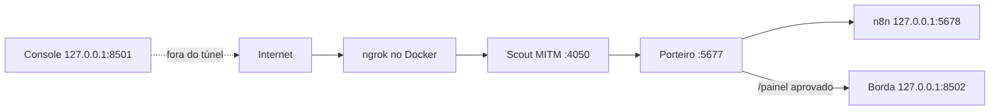
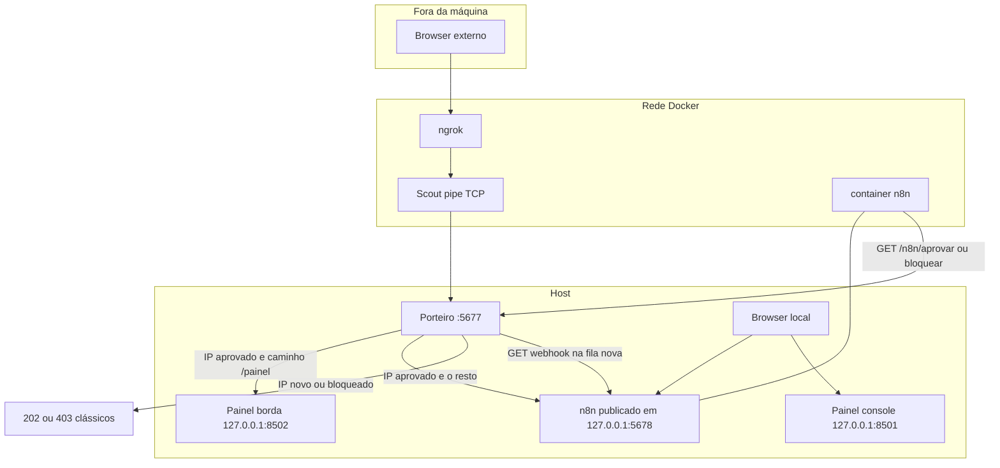
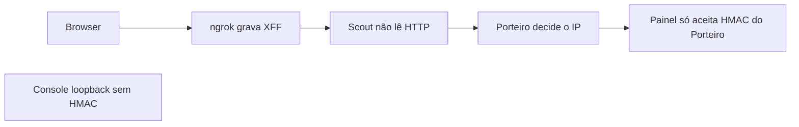
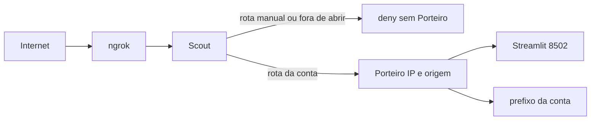

# Desenho: acesso externo multiusuário ao Control Plane

Registro do desenho. As decisões 1 a 8 da seção 9 estão fechadas e o código de `control-plane-plus` já as aplica. As decisões 9 a 22 e a seção 12 são proposta, sem código, e não mudam porta nem compose. A seção 12 é a borda que o Gabriel descreveu (ngrok, depois o Scout, depois o Streamlit), com a revisão de rota por conta, Porteiro como segunda camada e ID de origem preso à chave de dispositivo. Esta revisão espera a aprovação dele antes de qualquer código. O `master` não entra aqui: a janela Tk do Scout continua só na versão clássica.

A seção 1 descreve o código atual. Onde um parágrafo conta o ponto de partida, antes das contas e do painel de borda, ele está marcado como linha de base.

Invariantes que este desenho não pode quebrar:

- O n8n da máquina local continua em `http://127.0.0.1:5678` e `http://localhost:5678`, direto, sem Porteiro e sem login do painel. É ali que se monta o fluxo humano de aprovar IP.
- Acesso externo ao n8n continua no fluxo clássico do Porteiro (fila, e-mail no n8n, aprovar ou bloquear).
- IP que chega pela rede Docker (ngrok ou Scout) não é localhost.
- Nada apaga IP de teste, alias, cliente conhecido ou blocklist do Scout. Quem limpa isso é o usuário. IP de cliente é o que a conexão trouxer agora, sem lista padrão gravada no código.

## 1. O que o código faz hoje

### 1.1 Caminho externo

Com `USE_SCOUT=1`, o `iniciar_servicos.ps1` aponta o ngrok para a porta pública do Scout (`SCOUT_PUBLIC_PORT`, padrão 4050). Sem Scout, o alvo é `5677`.

O compose do ngrok (`ngrok/docker-compose.yml`) sobe `ngrok http ${NGROK_TUNNEL_HOST:-host.docker.internal}:${NGROK_TUNNEL_TARGET:-5677}`. Com Scout, o script define o host `scout-backend` e a porta do portal. O ngrok termina o HTTPS e abre um HTTP até esse nome na rede Docker. Não é um túnel TCP cru. Sem Scout, o alvo continua `host.docker.internal` e a porta do Porteiro.

A rota `porteiro-manual` do Scout escuta essa porta pública e encaminha para `SCOUT_UPSTREAM_HOST:SCOUT_UPSTREAM_PORT` (no uso integrado, `host.docker.internal:5677`). O Porteiro escuta `127.0.0.1:5677` e, quando deixa passar, abre outro HTTP para `127.0.0.1:5678`. No Docker Desktop o container ainda alcança esse loopback por `host.docker.internal`.

O console do Control Plane fica fora do túnel, em `127.0.0.1:8501`. O painel de borda escuta `127.0.0.1:8502` com `baseUrlPath=painel`. O Porteiro só o encaminha em `/painel` (HTTP e `upgrade`), depois do IP aprovado, e grava o header HMAC `x-n8groker-client`. A raiz do túnel continua no n8n. A API do Scout (`8765`) e o n8n (`5678`) publicam só em `127.0.0.1`. As rotas `/n8n/*` chamadas da máquina usam `127.0.0.1:5676`.

### 1.2 Porteiro: identidade, fila e aprovação

Arquivo: `Porteiro/porteiro.js`. Estado em memória e em `n8n/storage/Porteiro/controle_acesso.json`. Log em `n8n/storage/Porteiro/registro_portaria.log`.

Registro de visitante, um por IP:

| Campo | Valor |
| --- | --- |
| `ip` | IP que o Porteiro adotou como real |
| `status` | `pendente`, `aprovado` ou `bloqueado` |
| `data_primeiro_acesso` | ISO na primeira vez |
| `tentativas` | sobe a cada GET `/painel` (`/n8n/tocar`) e no visitante direto do Porteiro. `/origem.js` não soma |
| `ultima_vista` | ISO da última visita em `/painel` ou do registro da origem |

O registro também pode ter `conta_solicitada`, `conta_vinculada` e `vinculo`. O teto é 1000 registros; acima disso saem os pendentes mais antigos. Rate limit: 60 requests por minuto por IP de socket. Socket localhost não entra no limite.

Quem decide o IP é `Porteiro/identidade.js` (`decidirIp`). O socket chega de `req.socket.remoteAddress`, com `::ffff:` removido.

| Socket | O que vale |
| --- | --- |
| `127.0.0.1` ou `::1`, sem `X-Forwarded-For` ou com ele em localhost | operador local: proxy direto para `127.0.0.1:5678` |
| loopback com `X-Forwarded-For` público (não localhost e não rede Docker) | visitante |
| loopback com `X-Forwarded-For` em `172.16/12` ou `192.168.65.0/24` | negar |
| IP na lista `PORTEIRO_TRUSTED_PROXIES`, com `X-Forwarded-For` válido | visitante. Sem IP de cliente, negar |
| `172.16/12` ou `192.168.65.x` fora dessa lista | negar. A faixa Docker inteira não é imune |
| LAN ou IP público no socket | visitante, e o header é ignorado |

Rotas de visitante:

| Situação | Resposta |
| --- | --- |
| Local (loopback sem visitante no header) | proxy para `127.0.0.1:5678` |
| IP novo | grava `pendente`, HTTP 202 com a página «Acesso em Análise», e em seguida chama o n8n |
| `pendente` | de novo o 202; `tentativas` aumenta |
| `aprovado`, caminho que não é `/painel` | proxy do n8n |
| `aprovado`, `/painel` ou `upgrade` | painel de borda em `127.0.0.1:8502`, com HMAC |
| `bloqueado` | HTTP 403 «Acesso Negado Permanentemente» |
| Rede Docker que não é proxy confiável | negar |
| Caminho `/webhook/solicitar-verificacao-acesso` vindo de fora | HTTP 403, para o visitante não disparar o fluxo |

No caminho do Scout, o GET `/painel` chama `/n8n/tocar` com o token do painel e `Host: 127.0.0.1`, sem o `X-Forwarded-For` do visitante. Isso cria a linha pendente ou soma `tentativas` e grava `ultima_vista`. A página 202 carrega `/origem.js`. O script gera a chave e o ID e chama `/painel/registrar-origem` antes do Aprovar. Sem JavaScript ou sem WebCrypto o texto da página diz que a origem não foi registrada.

O aviso ao n8n é um GET local, sem corpo:

`http://127.0.0.1:5678/webhook/solicitar-verificacao-acesso?ip=<ip>`

O workflow `Workflows_para_Autenticação/Aprovacao de Acesso (Novo).json` recebe esse webhook, responde na hora e manda e-mail com Aprovar / Bloquear (`emailSend` + `sendAndWait`). O veredito volta ao Porteiro:

| Ação | Chamada | Header |
| --- | --- | --- |
| Aprovar | `GET http://host.docker.internal:5677/n8n/aprovar?ip=<ip>` | `X-Admin-Token` com `admin_token` do node Configuracoes |
| Bloquear | `GET http://host.docker.internal:5677/n8n/bloquear?ip=<ip>` | o mesmo |

Essas rotas, mais `/n8n/vincular`, `/n8n/fila` e `/n8n/solicitar`, só atendem se o socket for loopback ou o IP do container `n8n_app` **e** a requisição não tiver passado pelo túnel. A faixa `172.16.0.0/12` inteira não é admin: o Scout também está nela. O IP do n8n é descoberto na subida (`docker inspect` de `n8n_app`, gravado em `.n8groker/n8n-container-ip`) e relido em cada rota, porque o Porteiro sobe antes do container. Lista vazia recusa a faixa Docker. Não há IP fixo no código. `X-Forwarded-For`, `X-Forwarded-Host` ou `Host` de domínio ngrok recusam com HTTP 403, mesmo com `X-Admin-Token` válido. Há uma segunda escuta só em `127.0.0.1:5676`, que o Scout e o ngrok não encaminham; a aba Admin usa essa URL. O n8n no container continua em `http://host.docker.internal:5677`, sem header de proxy. No Docker Desktop esse salto costuma aparecer como loopback e sem `X-Forwarded-For`, então o loopback sem sinal de túnel continua aceito como rede. Isso não substitui o token. `X-Admin-Token` é obrigatório em qualquer porta e de qualquer IP, inclusive loopback. Sem token, ou com token errado, a resposta é HTTP 403 antes da fila: o corpo não é «O IP nao esta na fila de espera». O Porteiro ignora `PORTEIRO_TOKEN` do ambiente e do `.env`. Em cada pedido ele lê `.n8groker/porteiro-painel.token` (aba Admin) e `.n8groker/porteiro-n8n.token` (workflow). O `iniciar_servicos.ps1` cria os dois. O compose do n8n recebe só o segundo, em `.n8groker/porteiro-n8n.env`. O Scout continua montando `../.env` e não vê esses arquivos. No Docker Desktop, `host.docker.internal:5676` chega como loopback: o bind `127.0.0.1` não separa o outro container, e a lista de IP do n8n também não. A proteção é o token. Token válido não atravessa sinal de túnel. IP ausente da fila, já com token e rede aceitos, responde 404.

O ngrok em modo `http` grava `X-Forwarded-For` na conexão de backend. O visitante não remove esse header: quem escreve é o agente, depois do TLS. O pipe TCP do Scout copia os bytes e não corta o header. Tráfego que de fato veio do ngrok chega com o header, e a rota admin recusa. O que não fica garantido é uma segunda conexão do container do Scout, sem passar pelo ngrok e portanto sem o header. Por isso o Scout recusa escuta e destino `5676` e `5677` em rota manual, patch e sync, exceto a `porteiro-manual`, cujo upstream continua o do ambiente (o visitante segue para o `5677`). Alias não cria rota.

O proxy do n8n (`fazerProxy`) é `http.request` para `127.0.0.1:5678`. O caminho `/painel` trata `upgrade` e encaminha o WebSocket ao painel de borda. As rotas `/n8n/*` não entram nesse encaminhamento: o túnel que chega com header de proxy ou Host do ngrok toma 403.

### 1.3 Scout: encaminhamento e o IP que ele vê

`Scout_OSINT_Docker/scout/core/mitm_proxy.py` abre um TCP em `0.0.0.0` na `listen_port` da rota ligada e copia bytes para `upstream_host:upstream_port`. O modo `tcp`, `http` ou `https` fica no `redirections.json` e no log da sessão. O pipe não muda por causa do modo: não há parser HTTP, não há injeção de header e não há troca de Host.

O IP guardado na sessão é o do visitante, lido na hora. O ngrok conecta em `scout-backend` na rede Docker. O Scout resolve `ngrok_service` a cada pedido e só então lê o último `X-Forwarded-For`, que é o valor que o ngrok acrescenta ([upstream headers](https://ngrok.com/docs/gateway/endpoints/http)). O primeiro valor o visitante pode forjar. O gateway (`172.18.0.1` no Docker Desktop, quando o salto era `host.docker.internal`) e qualquer outro container não estão nessa lista: o header deles não vira o IP do cliente, e o socket Docker não vira localhost nem admin. Se o DNS do ngrok falhar, a visita é negada.

Alias, `known_clients.json` e blocklist são dados que o usuário administra na aba Scout. Este desenho não os usa como lista de identidade e não prevê limpeza, deduplicação forçada nem IP padrão no lugar de um peer vazio.

A API de gestão (`8765`) sai no compose como `127.0.0.1:8765:8765`. A porta do portal (`4050`) também sai em `127.0.0.1` no host. O ngrok não usa essa publicação: fala com `scout-backend:4050` na rede. A LAN não fala com a `4050`. De dentro do Scout, o painel é `host.docker.internal:8502` e os apps são `n8n_app`, `langfuse-web` e `litellm`. `127.0.0.1` dentro do container é o próprio Scout.

### 1.4 O que cada salto enxerga

| Salto | IP que o processo vê | Header de cliente |
| --- | --- | --- |
| ngrok (`http`) | o cliente da internet, no agente | grava `X-Forwarded-For` no HTTP que segue |
| Scout | peer TCP (ngrok / rede Docker) | não lê; os bytes do ngrok seguem intactos, modo tcp inclusive |
| Porteiro | peer TCP de quem abriu o 5677. `X-Forwarded-For` só entra se esse peer for `127.0.0.1` ou `::1` | copia todos os headers para o n8n |
| n8n via Porteiro | `127.0.0.1`, porque o proxy sai da própria máquina | o `X-Forwarded-For` do ngrok, se ninguém tiver cortado |
| n8n direto | quem conectou em `5678`. No browser local, é loopback | não passa pelo Porteiro |
| Painel console | ninguém de fora. Serviço só em `127.0.0.1:8501` | não está no túnel |
| Painel de borda | o Porteiro, em `127.0.0.1:8502` | HMAC `x-n8groker-client` escrito pelo Porteiro; o header que o visitante mandou é apagado |

No Windows 10 do Gabriel, em 01/10/2026, com o HEAD `da88280` e o túnel do ngrok aberto a partir de outro IP, o `registro_portaria.log` registrou `[NOVO] IP 203.0.113.10 registrado como PENDENTE.` O visitante viu «Acesso em Análise» com HTTP 202, e o n8n respondeu 404 porque o fluxo ainda não existia. O aviso do ngrok chama esse mesmo endereço de «Website IP».

Esse resultado fecha o caminho, lendo o código que produziu a linha:

1. O ngrok em modo `http` termina o HTTPS e grava `X-Forwarded-For` com o IP público do browser.
2. O Scout não lê HTTP. `mitm_proxy.py` copia os bytes; o header segue inteiro até o Porteiro.
3. `obterIpReal` só consulta `X-Forwarded-For` quando o socket é `127.0.0.1` ou `::1`. Se o peer fosse `172.16/12`, `ehImune` pularia a fila e não haveria `[NOVO]`. Se o peer fosse o gateway `192.168.65.x`, o IP gravado seria esse gateway, não `203.0.113.10`.
4. Logo, nesta máquina o socket que o Porteiro aceitou era loopback. O IP público chegou no header, preservado pelo Scout, e não no `peername` do TCP.

O número acima é o que a conexão trouxe naquele teste. Não é lista, não entra no código e não é IP padrão.

O código atual fecha esse caminho: a rede Docker não é localhost. `X-Forwarded-For` fora do loopback só vale se o peer estiver na lista explícita de proxies desta subida. Sem IP de cliente, o acesso é negado. O loopback com header público continua valendo, porque é o caminho que já funcionou no Windows.

Risco da linha de base, já fechado: `ehImune` tratava `172.16/12` como passagem direta, e um peer `192.168.65.x` viraria a chave da fila. `decidirIp` recusa esses sockets quando eles não estão na lista de proxies. Não há mais imunidade da faixa Docker.

### 1.5 Painel hoje

Linha de base, substituída: havia uma conta só em `.n8groker/auth.json` e a sessão era o booleano `cp_authenticated`. Se esse JSON ainda tiver o formato antigo (`username`, `salt` e `hash` no topo), a primeira leitura o renomeia para `.n8groker/auth.json.legado` e ele deixa de autenticar.

O código atual guarda as contas em `.n8groker/users.json`: `username`, listas `ver`, `operar` e `abrir` (modelo do próximo token) e `status`. Não há senha nem auto-cadastro. Hash antigo nesse arquivo, ou em `controle_acesso.json`, é ignorado. O admin da máquina não tem usuário nem senha. Quem abre a sessão admin cola um JWT Ed25519 de 5 minutos (`python -m control_plane.admin_token`) no campo **Token de admin** do console. A chave privada fica em `.n8groker/admin.key` (modo 0600), com a pública em `.n8groker/admin.pub`. Nenhuma das duas entra no `.env`. A borda recusa esse JWT. O `jti` do admin vale uma vez. O usuário entra com outro JWT, assinado por `.n8groker/usuario.key`. As permissões que valem na sessão são as claims desse token.

Dois processos do mesmo `control_plane/app.py`:

| Processo | Bind | Quem entra |
| --- | --- | --- |
| Console (`PANEL_MODE=console`) | `127.0.0.1:8501` | operador local. A aba Admin só com a sessão do JWT |
| Borda (`PANEL_MODE=edge`) | `127.0.0.1:8502`, `baseUrlPath=painel` | visitante aprovado, via Porteiro, com HMAC. Sem HMAC o login nem começa |

Não há troca de senha. Na borda, token válido com IP ainda sem `conta_vinculada` fica em **aguardando aprovação**. O vínculo mora no `controle_acesso.json` do Porteiro (`vinculo: ativo` e status `aprovado`). Várias pessoas atrás do mesmo NAT compartilham o vínculo daquele IP. A aba Admin fala só com `http://127.0.0.1:5676` (fila, aprovar, reprovar, vincular) e atualiza a lista na hora, mesmo quando o webhook do n8n responde 404. Cada veredito entra em `.n8groker/audit.jsonl`. Stack, backup, diagnóstico e a aba Admin não são um papel: só a sessão admin do console. `python -m control_plane.auth --reset` não apaga `users.json` nem `audit.jsonl` e não cria senha de admin. **Rotacionar chave** troca `usuario.key` e derruba os cookies de usuário na próxima requisição. A sessão de admin continua.

`st.context.ip_address` não prova loopback. No Streamlit 1.64, peer `127.0.0.1` ou `::1` vira `None`. A trava é o endereço de escuta mais `PANEL_MODE`. O HMAC da borda usa `st.context.headers` (`X-N8groker-Client`), escrito pelo Porteiro com o IP que ele adotou. Ações de start, stop, restart, logs, Scout, chat, backup e diagnóstico passam pela checagem dentro da função, não só pelo botão escondido. Com `PANEL_MODE` vazio (os testes), a checagem não trava o processo.

## 2. Bloqueios

Estes pontos eram o problema no início do desenho. As correções desta seção estão no código. O item 2 e a frase «um túnel só termina no n8n» descrevem a linha de base: hoje `/painel` e o `upgrade` já vão para `127.0.0.1:8502`.

1. **IP real não chega ao painel, e hoje nem ao Porteiro, quando o salto anterior é container.** `X-Forwarded-For` só vale com socket localhost. O compose não faz o ngrok nem o Scout conectarem como `127.0.0.1`. Peer Docker não pode herdar esse atalho.
2. **O proxy do Porteiro não fala WebSocket.** Sem handler de `upgrade`, o Streamlit não permanece aberto.
3. **`st.context.ip_address` não serve.** Atrás do proxy local ele é `None`. Header cru, inclusive `X-Forwarded-For`, também não serve: quem alcança `127.0.0.1:8501` pode escrevê-lo.
4. **Um túnel só, hoje, termina no n8n.** Incluir o painel no mesmo ngrok exige o Porteiro separar caminho, senão o n8n externo perde a fila ou o painel toma a raiz.
5. **Portas do host.** `5678` (n8n) e `8765` (API do Scout) ficam em `127.0.0.1`. Quem está na máquina abre os dois direto. A LAN não alcança essas portas.

Correção proposta para (1) e (3), sem fingir que o Docker é localhost:

- O Porteiro calcula o IP do visitante na hora, a partir da conexão atual.
- Socket `127.0.0.1` ou `::1` (já normalizado, sem `::ffff:`) é o único caso em que o peer é a própria máquina. Isso cobre um proxy que realmente escuta em loopback. Não cobre container.
- Socket na rede Docker, no gateway do Docker Desktop ou em `host.docker.internal` é salto externo. Não é imune. Não usa a regra do localhost.
- Desses peers, só uma lista explícita de proxies (o container do Scout quando `USE_SCOUT=1`, ou o do ngrok quando o túnel cai direto no `5677`) pode fazer o Porteiro ler o `X-Forwarded-For` que o ngrok gravou. A lista é de processo conhecido, descoberta na subida (IP atual do container), não uma lista de clientes. Se o IP do visitante não vier nesse header, o Porteiro recusa o acesso externo. Não há IP padrão.
- Quem conecta direto no `5677` com um IP público ou de LAN usa o socket, e o header é ignorado.
- No caminho do painel, o Porteiro apaga qualquer header `X-N8Groker-Client` vindo de fora e grava um novo, com o IP que ele mesmo adotou e um HMAC. A chave desse HMAC fica em `.n8groker/`, não no `.env`: o compose do Scout carrega `../.env` dentro do container, e um segredo no `.env` sairia do host. Não é o token de aprovação do workflow (`.n8groker/porteiro-n8n.token`). O painel de borda só aceita esse HMAC, e só se o peer do WebSocket for `127.0.0.1`.

Correção para (2): no caminho do painel, o Porteiro trata `upgrade` e faz o pipe do WebSocket para o Streamlit de borda, com o mesmo critério de IP da request HTTP. O restante dos caminhos continua no proxy HTTP atual do n8n.

Correção para o console local não se misturar com a borda: dois processos do mesmo código.

| Processo | Bind | Quem usa | Sem o HMAC |
| --- | --- | --- | --- |
| Console | `127.0.0.1:8501` | tecla G, browser na máquina | sem JWT de admin não abre a aba Admin. Não há tela de criar conta |
| Borda | `127.0.0.1:8502` | só o Porteiro, depois da fila | login de usuário. JWT de admin é recusado |

Os dois leem o mesmo arquivo de contas. A borda usa `server.baseUrlPath=painel`. O console não. `8501` e `8502` não saem em `0.0.0.0`.

## 3. Caminho desejado

Visitante externo: ngrok, Scout, Porteiro, e só então o painel se o IP estiver `aprovado`. IP desconhecido ou bloqueado nem vê o login do painel: continua o 202 ou o 403 de hoje. O n8n externo segue o mesmo portão, no outro caminho.

Operador na máquina: `http://127.0.0.1:5678` direto no n8n, e `http://127.0.0.1:8501` direto no console. Nenhum dos dois pede a fila do Porteiro.

Confiança, no sentido de quem tem o direito de afirmar um IP:

O Scout não é fronteira de identidade. O painel não acredita no browser. O n8n em loopback não é fronteira de visitante: é a ferramenta local de configurar a aprovação.

### 3.1 Loopback contra tráfego Docker

| Origem | Como se reconhece | Efeito |
| --- | --- | --- |
| Browser na máquina em `:5678` | TCP no n8n, peer `127.0.0.1` ou `::1`, porta do compose | n8n direto. O Porteiro não vê esse request |
| Browser na máquina em `:8501` | processo console, escuta só em loopback | campo do JWT de admin. Sem o token, não há poderes de admin |
| Container n8n chamando `/n8n/aprovar` ou `/n8n/bloquear` | peer é o IP descoberto de `n8n_app`, ou loopback sem sinal de túnel | continua podendo dar o veredito. A faixa Docker inteira não passa |
| ngrok ou Scout chegando no `:5677` | peer Docker ou gateway, não é `127.0.0.1` | visitante só se o peer estiver na lista de proxies e o `X-Forwarded-For` for válido. Fora da lista, negar |
| Alguém na LAN em `:5677` | peer que não é loopback nem proxy conhecido | fila, chave = socket, header ignorado |

`ehImune` não vale mais. A faixa `172.16/12` inteira não é admin: o Scout também está nela. O veredito do container n8n passa só se o socket for o IP descoberto de `n8n_app`, ou loopback sem sinal de túnel. Isso não libera o visitante.

O mapeamento do n8n é `127.0.0.1:5678:5678`. O browser da máquina em `http://127.0.0.1:5678` e `http://localhost:5678` continua direto, sem Porteiro e sem login do painel. A LAN deixa de alcançar o n8n sem passar pelo túnel.

## 4. Contas, papéis, permissões e IP

Arquivos novos sob `.n8groker/`, gitignored, no mesmo critério do `auth.json`. O admin não é uma linha dessa lista: não tem usuário nem senha. Quem prova o admin é um JWT de vida curta, assinado com chave que só existe na máquina (secção 4.2). Não há tela «Criar conta» para visitante nem no primeiro acesso.

Papel, definido pelo admin, com três listas de ids já usados no painel (`n8n`, `porteiro`, `ngrok`, `scout`, `langfuse`, `litellm`, e os outros de `default_services`):

| Lista | O que permite |
| --- | --- |
| `ver` | status e texto do card |
| `operar` | start, stop, restart e logs daquele app |
| `abrir` | atalho que abre a URL do app |

Listas vazias são o padrão. Subir ou derrubar a stack inteira, backup, restauração, zip de diagnóstico e a aba Admin ficam com a sessão de admin da máquina, não com um papel atribuível a um usuário. Não há um id de app para isso. Nenhum usuário comum recebe esse conjunto.

Conta de usuário: `username`, `status` e as três listas, que são o modelo do próximo token. Não há senha, nem `must_change_password`, nem `role_id`, nem `bound_ip` nesse JSON. O vínculo do IP fica no `controle_acesso.json` do Porteiro (`conta_vinculada`, `vinculo: ativo`, status `aprovado`). Quem cria a conta é o admin, na aba Admin do console, e quem emite o JWT é o mesmo admin. O visitante só vê o campo do token. As permissões da sessão são as claims. Gravar a lista não muda um token já emitido. Não existe auto-cadastro.

Vínculo de IP: o IP observado na aprovação, a hora, e o estado `ativo` ou `aguardando`. Não se grava IP de exemplo. Se a conexão não trouxer IP, o estado externo é negado.

Sessão de borda, em memória: id da sessão Streamlit, usuário, IP avalizado pelo HMAC, hora. Cada rerun confere de novo o HMAC e o vínculo. `st.session_state` sozinho não concede permissão.

Auditoria, append-only, `.n8groker/audit.jsonl`: hora, usuário (ou `admin` da máquina), IP, ação, alvo, resultado. Entra login, login recusado (prazo, assinatura, revogação), emissão, rotação, «aguardando aprovação», aprovação e bloqueio de IP, vínculo, abertura de sessão admin, e cada start, stop, restart, log, ação do Scout e atalho aberto. O JWT em si não entra na linha. O log do Porteiro continua para a fila; a auditoria do painel é a que tem usuário.

### 4.1 Integração com o fluxo que o usuário monta no n8n

O n8n não ganha um aprovador paralelo. O contrato que já existe permanece a porta da fila:

1. Porteiro, ao ver IP novo, chama `GET http://127.0.0.1:5678/webhook/solicitar-verificacao-acesso?ip=<ip observado>`.
2. O workflow que o usuário ativar responde e fala com a pessoa (o JSON do repositório usa e-mail; outro canal serve, desde que o veredito volte nas rotas abaixo).
3. Aprovar: `GET /n8n/aprovar?ip=<ip>` com `X-Admin-Token` se o token existir.
4. Bloquear: `GET /n8n/bloquear?ip=<ip>`, mesmo header.

IP aprovado libera o proxy externo do n8n e, no mesmo portão, o caminho `/painel`. IP pendente ou bloqueado não chega no Streamlit. IP reencaminhado ou desconhecido cai de novo nesse webhook. Nada disso exige login do painel.

Senha roubada, IP diferente: a pessoa só alcança o formulário se o Porteiro já tiver `aprovado` aquele IP. O login pode autenticar a senha e, se `bound_ip` for outro, a sessão fica em **aguardando aprovação**, com as três listas vazias. Nenhuma ferramenta, atalho ou botão opera. O painel pede ao Porteiro, em loopback, para tocar o mesmo webhook com o IP observado e o usuário:

`GET http://127.0.0.1:5678/webhook/solicitar-verificacao-acesso?ip=<ip>&conta=<username>`

O parâmetro `conta` é novo e opcional. O workflow atual, que só lê `ip`, continua aprovando a fila do n8n. Para o vínculo da conta, o workflow que o usuário editar distingue `conta` preenchido e, no veredito, chama uma rota nova, também só de socket admin:

`GET /n8n/vincular?ip=<ip>&conta=<username>`

`/n8n/aprovar` não grava `bound_ip`. Aprovar um visitante do n8n não entrega o papel do painel. Sem o vínculo, a sessão permanece sem permissão. Bloquear o IP continua no `/n8n/bloquear` e corta os dois: n8n externo e painel.

Primeira vez de uma conta sem `bound_ip`: o mesmo `vincular`, depois que o IP já está `aprovado`. Até lá, aguardando. A sessão de admin no console `8501` não usa vínculo de IP e não usa senha: é a máquina, pela secção 4.2.

O Scout não entra nessa decisão. Alias e IP de teste lá ficam como o usuário deixou.

### 4.2 Admin é a máquina, com JWT de vida curta

Isto substitui a tela «Criar conta do administrador» de `control_plane/auth.py`. O admin não digita usuário nem senha. A prova é um JWT assinado com chave que fica só no host. Quem está na máquina lê a chave de verificação; o processo do painel não recebe a chave que assina.

**Por que não HS256.** HS256 usa o mesmo segredo para assinar e verificar. Esse segredo teria de estar na memória do Streamlit. O `docker-compose` do Scout ainda faz `env_file: ../.env`, então um segredo colocado no `.env` entra no container. A chave de admin não vai para o `.env`.

**Algoritmo: EdDSA com Ed25519.** Par de chaves em `.n8groker/`, modo `0600`, gitignored, fora de volume de container:

| Arquivo | Quem lê |
| --- | --- |
| `.n8groker/admin.key` | só o comando que emite o token, na máquina |
| `.n8groker/admin.pub` | o painel console, para verificar |

A chave privada não é carregada pelo Streamlit. A pública é a chave de validação que o operador da máquina pode abrir.

**Emissão.** Na raiz do projeto, na própria máquina:

`python -m control_plane.admin_token`

O comando lê `admin.key`, imprime um JWT compacto uma vez no stdout e não grava o token em arquivo. Validade de 5 minutos (`exp = iat + 300`). Não sobe o painel. Se `admin.key` não existir, o comando recusa: a criação da primeira chave é explícita, `python -m control_plane.admin_token --init`, também só na máquina. Isso no lugar do primeiro acesso que hoje pede para criar a conta.

Claims:

| Claim | Valor |
| --- | --- |
| `alg` | `EdDSA` |
| `iss` | `n8groker-host` |
| `aud` | `n8groker-console` |
| `sub` | `admin` |
| `iat`, `nbf` | hora do host |
| `exp` | `iat` mais 300 segundos |
| `jti` | 16 bytes aleatórios, em hex |

O painel recusa token cujo `exp - iat` passe de 600 segundos, mesmo com assinatura boa. O comando só emite 300. Relógio: os dois lados usam o relógio do host, então não há skew de rede entre emissor e verificador. Tolerância de 30 segundos em `nbf` e `exp` cobre um passo de NTP. Fora isso, token morto; emite-se outro.

**Como o token entra no painel.** Só no console `127.0.0.1:8501`, num campo de senha, colado uma vez. Ao aceitar, o valor sai do campo e fica na sessão daquele WebSocket. A auditoria registra «sessão admin aberta» sem o token. Não se usa parâmetro de URL. A URL cai no histórico do browser, no log de acesso, no `Referer` e em `st.query_params` antes de qualquer script apagá-la. Tirar o parâmetro depois não desfaz isso.

**Onde vale.** Só no processo console (`PANEL_MODE=console`, escuta `127.0.0.1:8501`). O processo de borda (`8502`) não tem caminho que aceite esse JWT: a mesma string colada lá não abre admin. `st.context.ip_address` não serve para provar loopback. No Streamlit 1.64, peer `127.0.0.1` ou `::1` vira `None`, o mesmo resultado de «não sei o IP». A trava é o endereço de escuta mais o modo do processo, não o header `Origin`, que o cliente escreve.

**Replay.** Cada `jti` aceito vai para `.n8groker/admin-jti.json` até o `exp`, gitignored. Reiniciar o painel não reabre o token. A sessão já aberta continua admin até o WebSocket fechar ou o processo do console cair. Os 5 minutos limitam o roubo do token antes do uso, não a aba que o operador deixou aberta na máquina. Um segundo uso do mesmo token falha.

**Rotação.** `python -m control_plane.admin_token --rotate` gera par novo, guarda a pública anterior por 300 segundos e depois ela deixa de ser aceita. Token emitido no instante da troca ainda passa nesse intervalo. Não há segunda chave privada antiga.

**Migração do `auth.json` antigo.** Esse arquivo era uma conta só: `username`, `salt`, `hash`, `n`, `r`, `p`. Essa conta era o admin por senha. Ela não vira usuário admin e não continua entrando. Na primeira subida do código novo, se o JSON tiver esse formato antigo, ele é renomeado para `.n8groker/auth.json.legado` e ignorado. A senha lá dentro para de valer. Usuários passam a viver em `.n8groker/users.json`, vazio até o admin da máquina criar cada um na aba Admin. `python -m control_plane.auth --reset` deixa de ser «apague e crie o admin de novo». Ele não cria senha de admin, não apaga `users.json` nem `audit.jsonl`. Perder `admin.key` não tranca a máquina: quem tem o disco roda `--init` de novo (a chave anterior deixa de verificar). Quem não tem a máquina não recupera admin. Não há reset pela borda.

**Aba Admin**, só com sessão admin já aberta no console: criar conta (usuário e listas, sem senha), emitir token, revogar jti, rotacionar a chave e editar as três listas do próximo token. A borda não mostra essa aba. Visitante externo não cria conta.

## 5. Páginas e checagem no servidor

Streamlit não tem middleware. Arquivo em `pages/` continuaria alcançável pela URL mesmo fora do menu, então as seções não viram arquivos soltos. No código elas ficam num `st.radio` ligado a `?aba=` (`infra`, `scout`, `chat` e `admin`). Não há `st.navigation`. A aba Admin só entra na lista quando a sessão do console é admin. Na borda ela não aparece. A borda mostra login por token, e nada de criar conta. Não há tela de troca de senha. A checagem que impede a ação está na função (`allows` / `exigir`), não só no menu.

A checagem que importa fica nas funções que já executam: `operations`, logs, atalhos, aba Scout, ferramentas do chat. A página só deixa de desenhar. Um id fora da lista da conta volta erro e linha de auditoria, com ou sem botão.

| Superfície | Permissão |
| --- | --- |
| Card e status | `ver` |
| Start, stop, restart, logs | `operar` no id daquele container |
| Atalho | `abrir` |
| Scout: leitura | `ver` em `scout` |
| Scout: toggle, rota, alias, bloqueio, firewall | `operar` em `scout`, com a confirmação que já existe |
| Chat | as mesmas listas. Ferramenta de um app fora da lista é recusada. O chat não ganha ação nova |
| Stack inteira, backup, diagnóstico, aba Admin | sessão admin do console, não um usuário |

Atalho «abrir» é link. Não autentica a pessoa no n8n, no Langfuse ou no LiteLLM. O n8n aberto por atalho externo continua sujeito ao Porteiro se a URL for a do túnel. O atalho local do console pode apontar para `http://127.0.0.1:5678`.

Sessão Streamlit é o WebSocket. Reiniciar o painel derruba todo mundo. Reconexão no mesmo IP avalizado refaz a checagem. Cookie copiado para outro IP falha o HMAC ou o `bound_ip`. Duas pessoas atrás do mesmo NAT compartilham o IP: o vínculo não separa isso.

## 6. Ameaças

| Ameaça | O que segura | O que não segura |
| --- | --- | --- |
| Senha roubada | Sem IP `aprovado`, nem há formulário. Com IP aprovado e `bound_ip` diferente, a sessão fica sem permissão até `/n8n/vincular` | Se o admin vincular o IP do atacante de propósito, o papel vale. NAT compartilhado também |
| `X-Forwarded-For` forjado | Porteiro ignora o header fora do proxy conhecido. No caminho do painel o header de cliente é reescrito com HMAC. Peer Docker não usa a regra do localhost | Se a lista de proxies aceitar um peer que o atacante consiga ocupar, o header volta a valer. A lista é a desta subida, não `172.16/12` inteiro |
| Abrir `8501` ou `8502` pela internet | Os dois ficam em `127.0.0.1`. Borda sem HMAC nega | Processo na própria máquina fala com o console. Isso é o operador local |
| Replay da sessão | Cada rerun exige HMAC do IP atual e o vínculo | Replay no mesmo IP, dentro da vida do WebSocket, passa |
| Admin preso do lado de fora | Não há senha de admin para perder. Quem está na máquina emite outro JWT. `--reset` não apaga usuários nem a auditoria | Quem não tem o disco da máquina não vira admin. Não há rota externa de emissão |
| Chave privada vazada | Ela não está no `.env` nem no processo do painel. `8501` não escuta fora do loopback, então a chave sozinha, longe da máquina, não abre a aba Admin | Quem copiar `admin.key` e também conseguir um processo em `127.0.0.1:8501` emite token. Isso já é acesso à máquina |
| Token vazado | 5 minutos, `jti` de uso único, só o console aceita. Auditoria e URL não guardam o token | Nesse intervalo, alguém na própria máquina pode colar o token antes do operador. Terminal com o stdout ainda na tela é essa janela |
| Relógio | Emissor e painel são o mesmo host. Tolerância de 30 segundos. `jti` já gasto continua gasto se o relógio voltar | Salto do relógio para a frente, além do `exp`, invalida o token ainda não usado. Emite-se outro |
| Fila do n8n confundida com papel | `/n8n/aprovar` não grava vínculo | Workflow que chamar `/n8n/vincular` para qualquer IP aprovado entrega o papel. O padrão do JSON não faz isso; o usuário precisa incluir o passo |
| Bypass do n8n pela LAN | O compose publica só `127.0.0.1:5678:5678` | Quem já está na máquina abre o n8n direto. Isso é o operador local |
| API do Scout em `8765` | Publicada só em `127.0.0.1`. A `4050` pública não muda e os dados do Scout não são apagados | Quem já está na máquina fala com a API. Isso é o operador local |

## 7. O que muda em cada peça

| Peça | Mudança | O que não muda |
| --- | --- | --- |
| Porteiro | Visitante deixa de ser imune por `172.16/12`. Proxy conhecido, IP lido na hora, recusa se não houver IP. Caminho `/painel` e `upgrade` para `8502`, com HMAC. Webhook ganha `conta` opcional. Rota `/n8n/vincular` | `202` / `403`, `/n8n/aprovar`, `/n8n/bloquear`, webhook atual, proxy do n8n para o resto dos caminhos |
| n8n | Nenhum compose obrigatório. O usuário estende o workflow se quiser o vínculo de conta | `127.0.0.1:5678` direto. Workflow atual segue aprovando IP do n8n |
| Scout | Nenhuma alteração de rota para este acesso. O pipe TCP permanece | Alias, clientes, blocklist, IPs de teste. Sem limpeza e sem IP padrão |
| Painel | Contas criadas na aba Admin, papéis, três listas, borda em `8502` só com login, JWT Ed25519 no console, checagem nas funções, auditoria, estado aguardando, troca obrigatória de senha | Allowlist de container. Confirmação das ações que já pedem. `8501` continua em loopback |
| ngrok | O mesmo túnel, se o Porteiro separar `/painel` | URL pública continua sendo a do HUD |

`server.allowedHosts` da borda tem de aceitar o host do ngrok, que muda. O HUD já reescreve URL quando o túnel muda; a lista de hosts do Streamlit entra nesse mesmo ponto. Sem isso o WebSocket da borda recusa o Origin. Cookie de XSRF do Streamlit atrás de HTTPS do ngrok e HTTP interno é teste de integração, não suposição: a fase 1 mede isso no Windows.

## 8. Fases e testes

Cada fase só avança com a anterior verde. Testes são de unidade com socket e header falsos, mais um ensaio manual no Windows. Não há IP de cliente fixo nos testes: o caso fornece o peer e o header, e o resultado usa exatamente esse valor.

1. **Identidade no Porteiro.** Peer loopback lê `X-Forwarded-For`. Peer `172.18.x` ou `192.168.65.x` não é localhost e não é imune. Peer na lista do proxy lê o header; sem header, nega. Peer LAN usa o socket. `/n8n/aprovar` vindo de `172.18.x` só passa se esse IP for o do container n8n descoberto na subida. Nenhum teste grava ou apaga arquivo do Scout.
2. **n8n local intocado.** Um teste de contrato lê o compose e o proxy: o destino do visitante aprovado segue `127.0.0.1:5678`, e não existe regra nova que escute no lugar dessa porta. Manual: com a stack no ar, o browser da máquina abre `http://127.0.0.1:5678` sem página do Porteiro e sem login do painel, enquanto um IP novo no túnel ainda vê o 202.
3. **Caminho do painel.** HTTP `/painel` e o `upgrade` só com IP `aprovado`. Pendente recebe o 202 clássico, não o Streamlit. HMAC presente só depois do portão. `8502` sem HMAC não autentica.
4. **Contas e páginas.** Não há tela de criar conta na borda nem no console antes do JWT de admin. Papel com um app em `ver` não chama `docker restart`. Chat com ferramenta fora da lista é recusado. Atalho só se `abrir`. Token válido com IP ainda sem vínculo fica aguardando, listas vazias, até `/n8n/vincular` daquele IP e daquele usuário. `/n8n/aprovar` sozinho não preenche `bound_ip`. O JWT de admin aceito no console é recusado na borda. O segundo uso do mesmo `jti` de admin falha. Token de usuário com `aud` ou `iss` errado falha. `auth.json` legado não autentica. Hash de senha antigo não autentica.
5. **Auditoria e recuperação.** Linha com usuário, IP e hora em login, veredito e ação, sem o JWT no texto. `--reset` não apaga `users.json` nem `audit.jsonl` e não cria senha de admin. `--rotate` faz a chave anterior caducar em 300 segundos.
6. **Ensaio Windows.** Anotar o peer real que o Porteiro vê com Scout ligado. Confirmar que não é `127.0.0.1`. Abrir o n8n local. Abrir o túnel com IP novo, aprovar no workflow, entrar no `/painel`, ver aguardando, vincular, ver só os apps do papel.

## 9. Decisões para fechar antes de implementar

1. **Fechado pelo teste de 01/10/2026.** O Porteiro não imprime o socket: imprime o IP que `obterIpReal` adotou. No Windows com Scout e ngrok, esse valor foi o IP público (`X-Forwarded-For` do ngrok, bytes preservados pelo pipe do Scout, socket loopback). A lista de proxies continua só para peer que não seja loopback. Sem IP de cliente o acesso é negado, e `172.16/12` ou `192.168.65.x` não viram localhost. O caminho do loopback com header permanece.
2. **Fechado:** o vínculo da conta é um passo à parte (`conta` + `/n8n/vincular`). `/n8n/aprovar` não grava `conta_vinculada`.
3. **Fechado:** no código de hoje, a raiz do túnel continua sendo o n8n. O painel fica em `/painel`. A decisão 16, quando esta revisão for implementada, tira o n8n da raiz: sem conta a raiz não abre app, e o n8n externo só abre pelo HUD se `abrir` contém `n8n`.
4. **Fechado:** stack inteira, backup, diagnóstico e a aba Admin ficam só na sessão admin da máquina.
5. **Fechado:** o n8n publica `127.0.0.1:5678:5678`. O loopback continua direto. A LAN não fala mais com o n8n sem o túnel.
6. **Fechado:** no código de hoje, várias pessoas no mesmo IP público (NAT) compartilham o vínculo. O IP não separa quem está atrás dele. A decisão 20, quando esta revisão for implementada, separa as origens no acesso externo: o mesmo NAT pode ter vários IDs, e cada um é aprovado uma vez. A origem já aprovada não cai por causa da nova.
7. **Fechado:** a API `8765` do Scout publica `127.0.0.1`. A porta pública `4050` permanece. Os dados do Scout não são apagados.
8. **Fechado:** `/n8n/aprovar`, `/n8n/bloquear`, `/n8n/vincular` e as outras rotas `/n8n/*` exigem `X-Admin-Token` válido em qualquer porta e de qualquer IP. Rede local e ausência de túnel são condições a mais, não substituem o token. Sem token a resposta é 403, antes do 404 da fila. Os segredos ficam em `.n8groker/porteiro-painel.token` e `.n8groker/porteiro-n8n.token`, fora do `.env` que o Scout monta. No Docker Desktop, `host.docker.internal:5676` parece loopback; a proteção é o token, e a porta segue em `127.0.0.1`. Além do token, o socket tem de ser loopback ou o IP do container `n8n_app` descoberto na subida, e sem sinal de túnel (`X-Forwarded-For`, `X-Forwarded-Host` ou `Host` do ngrok). A faixa `172.16/12` não passa inteira, porque o Scout está nela. Token válido não abre exceção de túnel. A aba Admin usa `http://127.0.0.1:5676`. O n8n usa `http://host.docker.internal:5677`, nunca a URL pública. Rota manual do Scout não aponta para `5676` nem `5677`; a `porteiro-manual` continua no `5677`.

Fechado e no código: não há auto-cadastro e não há senha de usuário; o admin não tem usuário/senha; o JWT de admin é Ed25519, 5 minutos, colado no console, sem ir para a URL; a borda recusa esse token; a chave não entra no `.env`. O usuário entra com outro JWT, de prazo curto (`N8GROKER_TOKEN_USUARIO_HORAS`), assinado por `usuario.key`. A faixa `172.16/12` não é admin inteira. Rota do Scout, fora da `porteiro-manual`, não aponta para `5676` nem `5677`.

9. **Em parte no código.** O portal valida o cookie `n8groker_sessao` em cada pedido e em cada WebSocket. Sem cookie, fora de `/painel`, a resposta é 403. IP diferente do cookie é 403. Geração velha cai na hora, inclusive no quadro seguinte. A renovação é deslizante. Isto não é o `X-Admin-Token`, não é o HMAC e não é o JWT de admin. A assinatura do desafio da chave de dispositivo ainda não entra.
10. **Em parte no código.** LiteLLM, Langfuse, n8n, Postgres e os demais serviços conversam pela rede interna do Docker. Os publishes `5677`, `4040`, `3000`, `4000` e `4050` já estão em `127.0.0.1`. A negação por padrão dentro do Scout, rota a rota, continua desenho: quem chega pelo ngrok num destino fora da lista toma bloqueio imediato, e isso entra nas fases seguintes. A tabela está na seção 11.
11. **Em parte no código.** Na porta do portal o Scout lê HTTP e WebSocket e reencaminha os bytes. O ngrok continua a porta de fora. As rotas MITM das outras portas não entram no alvo do ngrok e seguem copiando bytes. A checagem que segura o Streamlit e os outros apps ainda é das fases seguintes. Detalhe na seção 12.
12. **Em parte no código.** O Porteiro não é absorvido. O portal consulta a fila antes do pipe. `exige_porteiro` cobre n8n, LiteLLM, Langfuse e qualquer outro id, e não devolve upstream sem conta, IP e origem aprovados. Aprovações seguem só em `127.0.0.1:5676` e no `5677` local, com o token da decisão 8. O n8n da máquina segue em `127.0.0.1:5678`, direto. A sessão que escolhe o app ainda não troca o pipe.
13. **Em parte no código.** O cookie de sessão está assinado com `.n8groker/sessao.key`, fora do `.env`. A geração da conta revoga na hora. A lista `abrir` ainda não escolhe o upstream. O cookie sozinho não prova o dispositivo: falta a assinatura do desafio.
14. **Aberto, só desenho, sem código.** IP, usuário ou caminho fora da lista toma deny no Scout, antes do Streamlit e antes do n8n externo. Rota manual fora da lista também: o Scout responde deny e não consulta o Porteiro. Esse prefixo entra na varredura.
15. **No código.** Varredura: `SCOUT_SCAN_CAMINHOS` (8), `SCOUT_SCAN_JANELA_SEG` (10) e `SCOUT_SCAN_BLOQUEIO_SEG` (900). Nove prefixos distintos negados na janela bloqueiam o IP no Scout com 403, sem upstream. Assets de `/painel` e o WebSocket desse prefixo não contam. O deny de rota fora da lista conta. A linha `varredura` vai para `.n8groker/audit.jsonl` (o Scout monta o arquivo em `/run/audit.jsonl`). A aba Admin desbloqueia só esse IP em `127.0.0.1:8765` e grava `desbloquear_varredura`. Alias, cliente conhecido e blocklist da aba Scout não são apagados.
16. **No código.** A liberação é por conta, pela lista `abrir`, e o app fica na sessão. A Conta 1, com `n8n` em `abrir` e sem `litellm` nem `langfuse`, escolhe o n8n no HUD e toma deny nos outros dois, sem o Porteiro. A raiz sem sessão é 403. A raiz com sessão e sem app escolhido também é 403: não abre o n8n sozinha.
17. **Aberto, só desenho, sem código.** IP novo de uma conta continua em aguardando até `/n8n/vincular`. O vínculo passa a ser IP mais origem. O Scout recusa a sessão quando o IP do cookie não é o IP lido naquela conexão, ou quando a origem não é a que assinou o desafio. O IP é lido na hora, com as mesmas regras de `decidirIp`.
18. **Aberto, só desenho, sem código.** Nada disto, inclusive o ID de origem, entra no código antes da aprovação desta revisão. A seção 13 é o plano de fases e testes para depois desse sim.
19. **No código.** Não há MAC. O navegador gera a chave e o ID em `/painel/origem.js`. Aprovar sem `origem` não marca dispositivo. Duas origens no mesmo IP deixam a nova pendente e a antiga aprovada. A aba Admin mostra os dois IDs.
20. **No código.** O mesmo IP com dois IDs de origem distintos fica registrado como duas origens. A origem nova trava e volta para a aprovação no Porteiro. A origem já aprovada continua. O alerta vai para `audit.jsonl`, para a aba Admin e para o webhook do n8n, com os dois IDs lado a lado. Mais de uma pessoa ou aparelho atrás do mesmo NAT gera esse alerta de forma legítima, e cada um é aprovado uma vez.
21. **No código.** O webhook local leva, além de `ip` e `conta`, a impressão da chave, o ID de origem, o ID já aprovado no mesmo IP, navegador, sistema, idioma, horário e país. País vai vazio: não há GeoIP e o idioma não entra nesse campo. O horário é UTC no Porteiro. Aprovar e vincular usam IP mais origem. `/n8n/aprovar` não grava `conta_vinculada`. A aba Admin mostra os mesmos dados. Um workflow já importado no n8n não muda sozinho.
22. **Fechado pelo Gabriel.** Sem sessão, a raiz não faz proxy e responde 403, sem redirect e sem revelar que existe painel. O login só abre em `/painel`. O país do webhook fica vazio.
23. **Fechado pelo Gabriel.** Não há subpath por app. Fontes: o n8n desaconselha `N8N_PATH` atrás de proxy reverso ([deployment](https://docs.n8n.io/deploy/host-n8n/configure-n8n/basic-configuration/use-environment-variables/deployment)); o Langfuse só aceita base path com rebuild, e a imagem pinada é a pronta `4.30.0` ([custom base path](https://langfuse.com/self-hosting/configuration/custom-base-path)); o LiteLLM aceita `SERVER_ROOT_PATH` ([custom root](https://docs.litellm.ai/docs/proxy/custom_root_ui)), mas um prefixo só nele não serve os três. O usuário escolhe o app no HUD. O id fica na sessão. O Scout serve esse app na raiz, caminho original. Trocar de app ou abrir sessão nova volta a `/painel`.
24. **Fechado pelo Gabriel.** Queda de conexão não apaga o cookie nem o ID de origem. WebSocket e pedidos reconectam no mesmo app, sem `/painel`, enquanto o cookie vale, o IP é o mesmo e a origem é a mesma. Volta ao `/painel` se o cookie expirar, se a pessoa sair, se o admin revogar ou se o IP mudar. IP novo vai para a aprovação. A renovação é deslizante a cada uso aceito.
25. **Fechado pelo Gabriel.** O Porteiro é a segunda checagem de todo app liberado (n8n, LiteLLM, Langfuse e qualquer outro), não só do n8n. Na saída do `/painel` o Scout aponta para o app escolhido e, antes de ligar o upstream, consulta o Porteiro: conta, IP e origem aprovados. Sem isso o upstream não abre. Não há caminho de app que pule essa consulta. O editor em `127.0.0.1:5678` continua fora do túnel.
26. **No código.** A aba Scout do console, só admin, mostra sessões ativas e a trilha em `.n8groker/trilha/trilha.jsonl`. Cada checkpoint leva o resultado, inclusive o bloqueio `rede-docker` antes de `/painel`. Não há senha, token nem cookie nessa linha. Alertas de caminho são só aviso: não bloqueiam. Vão para a aba, com visto, para `audit.jsonl` e, se `N8GROKER_ALERTA_WEBHOOK` for um GET `/webhook/` em `n8n_app` (padrão `http://n8n_app:5678/webhook/alerta-trilha`), `host.docker.internal`, `127.0.0.1` ou `localhost`, para o n8n.
27. **No código.** No Docker Desktop o salto `host.docker.internal` chega no Scout como o gateway `172.18.0.1`. Com `PORTEIRO_TRUSTED_PROXIES` vazio isso era `rede-docker` antes de `/painel`, a trilha ficava vazia e o upstream `127.0.0.1` de dentro do container não alcançava o painel nem o n8n. Agora o ngrok fala com `scout-backend` na rede. O `X-Forwarded-For` só vale se o peer for o IP que o DNS de `ngrok_service` devolver na hora, e o valor usado é o último. O gateway não é proxy confiável. O painel usa `host.docker.internal`. n8n, Langfuse e LiteLLM usam o nome do container. O alerta usa `http://n8n_app:5678/webhook/alerta-trilha`.
28. **No código.** A página 202 «Acesso em Analise» carrega `/origem.js` e registra a origem na fila antes do Aprovar. O Scout fala com `/n8n/tocar` e `/n8n/registrar-origem` usando o token de admin; o navegador não recebe esse token. Cada GET `/painel` soma `tentativas` e grava `ultima_vista`. Um segundo navegador no IP já aprovado fica como origem pendente. O JSON `Workflows_para_Autenticação/Alerta de trilha.json` é o GET `alerta-trilha`. Importar no n8n e ativar. Um workflow já importado não muda sozinho.
29. **No código.** O Scout monta cada segredo sozinho (`porteiro-hmac.key`, `porteiro-painel.token`, `sessao.key`, `sessoes-geracao.json`, `audit.jsonl`). A pasta `.n8groker` inteira não entra: `admin.key` e o hash das senhas ficariam no container. O `iniciar_servicos.ps1` cria esses arquivos antes de qualquer `docker compose`. Pasta vazia no lugar do arquivo é removida e o arquivo é gravado; pasta com conteúdo para o boot e nada é apagado. Sem chave HMAC legível, `/painel` não abre o Streamlit e a trilha grava `BLOQUEIO (cabeçalho do Porteiro ausente)`, não `ok`. App que abre grava `LIBERADO`. O painel de borda carrega `/painel/origem.html` (página mesma origem, não srcdoc) para a origem nova no IP já aprovado ficar pendente. O n8n exclui Execute Command, SSH e os nodes de arquivo local. A imagem lê `NODES_EXCLUDE` (JSON); o `.env` guarda a lista em `N8N_NODES_EXCLUDE` e o script converte. Vale também em `localhost:5678`. O node Code continua. `N8N_BLOCK_ENV_ACCESS_IN_NODE` não é ligado: o workflow de aprovação usa `$env.PORTEIRO_N8N_TOKEN`.
30. **No código.** `/painel/origem.js` (e qualquer caminho cujo último segmento seja `origem.js` ou `origem.html`) é do Scout, antes do proxy do painel. O script da página é `/origem.js`. O cookie `n8groker_sessao` nasce no `/painel/escolher` com o ticket do login, não só numa sessão que já existia. A trilha grava login, escolha e `LIBERADO` com `sid` e `conta`. Arquivo bind-mounted é regravado no mesmo inode. Reset de senha de usuário não invalida o JWT de admin.

## 10. Token do usuário em cada chamada

Esta seção não está no código. O pipe TCP do Scout hoje copia bytes e não enxerga HTTP, então não tem como cumprir isto sem uma borda que leia a apresentação do token antes de encaminhar.

O token é da conta do painel, assinado, com a chave em `.n8groker/` (modo restrito, fora do `.env` que o Scout monta). A vida é curta, na ordem de minutos, e a renovação só ocorre enquanto a conta segue ativa, o IP da conexão continua o IP vinculado e a sessão não foi revogada.

Em cada requisição e em cada abertura de WebSocket o portal confere, nesta ordem:

1. Assinatura.
2. Expiração.
3. Conta ativa e não revogada.
4. IP atual igual ao IP vinculado daquela conta.
5. Rota permitida para o papel da conta (`ver`, `operar`, `abrir`).

A revisão da seção 12.6 acrescenta, nesse mesmo pedido, a assinatura do desafio com a chave de dispositivo. O cookie da conta não substitui essa assinatura.

Reset ou desativação feitos pelo admin revogam na hora. Um WebSocket que já estava aberto fecha, ou falha no quadro seguinte. Não espera o fim da vida do token.

Token inválido (assinatura, prazo, conta ou IP) conta como tentativa na detecção de varredura do Scout. A contagem acontece na recusa, antes de qualquer proxy.

O custo cabe no Streamlit. Uma página pede o documento, a abertura do WebSocket e dezenas de assets (JS, CSS, mídia). A assinatura em si é barata. O que pesa é reler conta, revogação e IP em disco em cada arquivo. O desenho separa os dois casos:

- Documento, chamada de API e abertura de WebSocket fazem a checagem completa da lista acima.
- Asset estático reutiliza, por poucos segundos e só em memória do processo, um resultado já aceito da mesma apresentação (token mais IP). Esse prazo de memória é menor que a vida do token.
- Token inválido não entra nessa memória e conta na varredura na hora.
- Conta revogada derruba a memória de aceitação junto com o WebSocket aberto.

## 11. Rede interna e negação por padrão

Os binds de `5677`, `4040`, `3000`, `4000` e `4050` já estão em `127.0.0.1`. O ngrok não muda de comando: segue `host.docker.internal` mais a porta do portal, e no Docker Desktop esse nome alcança o loopback do host. A negação por padrão dentro do Scout, rota a rota, ainda é desenho.

LiteLLM, Langfuse, n8n, Postgres, ClickHouse, Redis e o MinIO já se acham pelo nome do serviço na rede `rede_comunicacao` (`http://litellm:4000`, `http://langfuse-web:3000`, `http://langfuse-postgres:5432`, e o mesmo para os outros). Essa conversa não precisa de porta no host. O publish no host é só atalho do operador, ou a entrada do túnel.

A única entrada que o ngrok pode usar é o portal. No código de hoje isso é a porta pública do Scout (`4050` com `USE_SCOUT=1`, ou `5677` com `USE_SCOUT=0`). Qualquer outro destino que um IP alcance pelo ngrok — rota manual, porta de UI, API de admin — é bloqueado na hora no Scout e não é encaminhado. A lista começa vazia de exceção: o que não foi autorizado para aquele papel não existe para o túnel. Rota nova que o Scout descobre no Docker já nasce desligada; a negação por padrão mantém esse critério e passa a valer também para o que hoje está publicado em `0.0.0.0`.

| Serviço | Onde está hoje | Bind atual | Precisa ficar publicada | Bind proposto |
| --- | --- | --- | --- | --- |
| n8n | `n8n/docker-compose.yml` | `127.0.0.1:5678` | Sim, só na máquina, editor direto | Manter `127.0.0.1`. De fora, só pelo portal se o papel tiver a rota |
| Porteiro, visitante | `Porteiro/porteiro.js`, subido pelo script | `127.0.0.1:5677` | Sim, é o alvo do túnel sem Scout e o upstream do Scout | Feito. No Docker Desktop, `host.docker.internal` alcança esse loopback |
| Porteiro, admin | `Porteiro/porteiro.js` | `127.0.0.1:5676` | Sim, aba Admin no host | Manter `127.0.0.1`. No Docker Desktop o outro container ainda chega por `host.docker.internal` e parece loopback; a trava continua o token da decisão 8 |
| API do ngrok | `ngrok/docker-compose.yml` | `127.0.0.1:4040` | Só o HUD nesta máquina | Feito |
| Scout, portal MITM | `Scout_OSINT_Docker/docker-compose.yml` | `127.0.0.1:4050` | Sim, é a entrada do túnel | Feito. O ngrok chega por `host.docker.internal` |
| Scout, API | mesmo compose | `127.0.0.1:8765` | Sim, painel no host | Manter `127.0.0.1`. Fora do túnel |
| Langfuse, UI | `llm/docker-compose.yml` | `127.0.0.1:3000` | UI do operador | Feito no host. De fora, só pelo portal quando o papel permitir a rota |
| Langfuse, worker | mesmo compose | `127.0.0.1:3030` | Health local | Manter `127.0.0.1`, ou tirar o publish e deixar o health na rede interna |
| LiteLLM, API e UI | mesmo compose | `127.0.0.1:4000` | Operador e cliente local | Feito no host. De fora, só pelo portal com permissão. O n8n usa `http://litellm:4000` na rede Docker |
| MinIO, upload do browser | mesmo compose | `127.0.0.1:9090` | Sim, o Langfuse aponta o upload para `localhost:9090` | Manter `127.0.0.1`. Entre containers o endpoint já é `http://langfuse-minio:9000` |
| Postgres do Langfuse, ClickHouse, Redis, Postgres do LiteLLM | mesmo compose | sem publish no host | Não | Continuam só em `rede_comunicacao` |
| Control Plane, console | `iniciar_servicos.ps1` | `127.0.0.1:8501` | Sim, operador local | Manter `127.0.0.1`. Não entra no portal |
| Control Plane, borda | mesmo script | `127.0.0.1:8502` | Sim, só o Porteiro, caminho `/painel` | Manter `127.0.0.1` |
| Ollama | processo local se `USE_OLLAMA_LOCAL=1`, não é compose | `localhost:11434` quando o programa sobe | Chat de suporte nesta máquina | Continua local. Não entra no LiteLLM por este desenho e não abre na LAN |

A UI do Langfuse, a API do LiteLLM, a API do ngrok, o `5677` e a `4050` escutam em `127.0.0.1` no host. De fora, Langfuse e LiteLLM só aparecem pelo portal quando a conta tiver a rota, e isso ainda é desenho. Postgres, ClickHouse, Redis e o banco do LiteLLM seguem sem porta no host. n8n, MinIO, worker, API do Scout, console e borda já estavam em `127.0.0.1` e permanecem assim.

A negação por padrão no Scout: o túnel só encaminha o que a lista do portal autorizou para aquele papel. Um IP que bate pelo ngrok em Langfuse, LiteLLM, `4040`, `8765`, `5676` ou em qualquer rota que não esteja nessa lista é bloqueado na hora, sem proxy. Ausência de regra é bloqueio.

## 12. Borda proposta: ngrok, Scout, Streamlit

O `874e368` já faz o Streamlit mostrar e executar só o que o papel permite. A porta do portal já lê HTTP e WebSocket. Fila, cookie, escolha de app, origem, varredura e o webhook com os campos novos já estão nesse processo. O Gabriel aprovou esta revisão, fechou a decisão 22 em 403 seco e fechou o roteamento: um app por sessão, na raiz, sem subpath.

Ordem de cada pedido que chega pelo ngrok:

1. Ler o IP na hora, com as regras já fechadas de `decidirIp`.
2. Se o IP está em bloqueio de varredura, responder 403 e parar.
3. Caminho fora da lista `abrir` da conta, e rota manual que não esteja nessa lista, tomam deny no Scout. O Porteiro não é consultado. O prefixo entra na janela de varredura.
4. Sem sessão, a raiz não abre app nenhum e responde 403, sem redirect e sem dizer que existe painel. Só um pedido direto a `/painel` segue, e ainda passa pela checagem de dispositivo.
5. Com sessão, o caminho tem de estar em `abrir`. O n8n externo só existe se `n8n` estiver nessa lista, e a entrada é o HUD do Streamlit, não a raiz.
6. Aí sim o Scout consulta o Porteiro. O par IP e ID de origem precisa estar aprovado. Origem nova, mesmo num IP que já tem outra origem aprovada, recebe a página «Acesso em Análise» (HTTP 202). Origem bloqueada recebe 403. A origem já aprovada nesse IP continua.
7. Cada acesso assina o desafio do servidor com a chave de dispositivo. Cookie sem essa assinatura não passa.
8. O Streamlit, atrás, repete a checagem de `ver`, `operar` e `abrir` que o `874e368` já faz.

### 12.1 Do pipe TCP ao proxy HTTP

Na porta do portal (`4050` com `USE_SCOUT=1`) `mitm_proxy.py` lê a linha do pedido e os headers, inclusive `Upgrade: websocket`, e em seguida reenvia os bytes originais e liga os dois lados. Um bloco sem fim de cabeçalho segue cru, sem o Scout inventar `\r\n\r\n`. As outras rotas MITM continuam copiando bytes e não são o alvo do ngrok. IP pendente ou bloqueado na fila não abre o upstream. IP aprovado ainda segue para o upstream da rota, que hoje é o Porteiro, até a sessão escolher o app. `exige_porteiro` já recusa n8n, LiteLLM, Langfuse e qualquer outro id sem conta, IP e origem.

O que dá para reaproveitar do Porteiro, como regra, reescrita no processo Python do Scout:

| Peça do Porteiro | Uso na borda proposta |
| --- | --- |
| `decidirIp` em `identidade.js` | A mesma tabela de socket e `X-Forwarded-For`. O peer do ngrok no Docker Desktop continua podendo ser loopback; o IP público segue no header. |
| `fazerProxy` e `fazerProxyPainel` | O desenho do `http.request` e do `pipe` para `127.0.0.1:5678` e `127.0.0.1:8502`. |
| `server.on('upgrade')` | A abertura do WebSocket do Streamlit, com destruição do socket quando o IP não está aprovado. |
| Página HTTP 202 | O mesmo texto de espera, servido pelo Scout quando a fila ainda não aprovou. |
| HMAC `x-n8groker-client` | O Scout grava o header de novo, com o IP que ele adotou, para a borda que já confere esse HMAC. O header que o visitante mandou é apagado. |

O que fica no Node do Porteiro e não muda de dono: a fila em `controle_acesso.json`, o webhook do n8n, as rotas `/n8n/*`, os dois tokens de aprovação e a escuta `127.0.0.1:5676`. O Scout não ganha essas rotas. A API `8765` continua só em loopback, para a aba Scout do console.

### 12.2 Quem é o usuário, e onde está a lista

O login continua no Streamlit de borda, que já existe. O Scout, na frente, ainda não tem sessão nesse primeiro GET. Por isso o único caminho sem cookie, depois do IP aprovado, é o login e os assets do prefixo `/painel`.

Quando a senha confere, o IP está vinculado e a conta não está em aguardando nem em troca obrigatória de senha, o processo da borda (no host, não no container) emite um cookie `n8groker_sessao`. HttpOnly, Secure, SameSite Lax, path `/`. O valor é um token assinado com Ed25519. A chave privada fica em `.n8groker/sessao.key`, modo restrito, fora do `.env`. A pública, `.n8groker/sessao.pub`, é a única que o container do Scout precisa montar, só leitura. `admin.key` e o hash das senhas não entram nesse mount: o Scout monta `../.env` hoje, e um segredo nesse arquivo vazaria para o container.

Claims do token: usuário, IP vinculado, `exp` curto (minutos), os ids de rota, e um número de geração da conta. Renovação só com a conta ativa, o mesmo IP e a geração ainda igual. Reset, desativação ou troca de papel sobem a geração na hora. O WebSocket já aberto fecha no quadro seguinte. O arquivo que o Scout lê para isso é uma lista `usuário → geração`, sem senha, também em `.n8groker/`.

Isto não é o JWT de admin do console, não é o `X-Admin-Token` da aprovação e não substitui o HMAC do IP.

A lista de rotas não é um cadastro novo. `users.json` continua com `ver`, `operar` e `abrir`. O Scout usa `abrir` para decidir se o caminho externo daquele app pode ser encaminhado. `ver` e `operar` continuam dentro do Streamlit, como no `874e368`: o card, o botão e a ferramenta do chat. Uma tabela fixa no desenho liga o id ao prefixo e ao upstream. Ela não é editada por conta.

| Id em `abrir` | O que o portal faz | Upstream, só depois da rota e do Porteiro |
| --- | --- | --- |
| painel | `/painel` e os assets desse prefixo | `127.0.0.1:8502` |
| `n8n` | app gravado na sessão; a raiz e os caminhos do próprio n8n | `127.0.0.1:5678` |
| `langfuse` | app gravado na sessão; a raiz e os caminhos do próprio Langfuse | `127.0.0.1:3000` |
| `litellm` | app gravado na sessão; a raiz e os caminhos do próprio LiteLLM | `127.0.0.1:4000` |
| qualquer outro id que entre em `abrir` | o mesmo: sessão, raiz, caminho original | o upstream desse id, nunca sem o Porteiro |

Não há prefixo `/n8n`, `/langfuse` nem `/litellm`. Quem pede esses caminhos está fora da lista e toma deny no Scout, sem Porteiro, e o prefixo conta na varredura. A raiz sem sessão é 403. Com sessão, a raiz é o app escolhido no HUD. Uma conta com `n8n` em `abrir` e sem `litellm` nem `langfuse` escolhe o n8n no HUD e toma deny se a sessão pedir um dos outros dois, já no Scout, sem consulta ao Porteiro. Se a rota passa, aí sim o Scout consulta o Porteiro antes de abrir o socket do upstream. Isso vale para os três e para qualquer app novo.

Rota manual do Scout que não corresponda a um id de `abrir` toma deny no Scout, sem consulta ao Porteiro, e conta para a varredura. `8765`, `5676`, `4040`, Postgres, ClickHouse, Redis e o banco do LiteLLM não entram nessa tabela. Não há caminho no portal que os alcance.

### 12.3 Varredura

O Scout conta caminhos distintos por IP, numa janela deslizante. Os três limites saem do ambiente e não ficam cravados no meio da checagem:

| Nome | Padrão | Sentido |
| --- | --- | --- |
| `SCOUT_SCAN_CAMINHOS` | 8 | Quantos prefixos distintos, fora da lista daquela sessão, disparam o bloqueio |
| `SCOUT_SCAN_JANELA_SEG` | 10 | Janela, em segundos |
| `SCOUT_SCAN_BLOQUEIO_SEG` | 900 | Quanto tempo o IP fica bloqueado no Scout |

Conta como caminho distinto um prefixo que a lista da conta não tem, um pedido sem sessão fora de `/painel`, e uma rota manual fora da lista. Esse deny acontece no Scout e não consulta o Porteiro. Não conta: cada arquivo estático sob um prefixo já liberado, nem o WebSocket desse mesmo prefixo. Uma página do Streamlit pede dezenas de assets e uma abertura de WebSocket; isso é um prefixo só (`painel`), não uma varredura. Token inválido conta na hora, uma vez por pedido, e não entra na memória de atalho dos assets.

O bloqueio responde 403 e não abre upstream. A linha em `.n8groker/audit.jsonl` leva hora, IP, ação `varredura`, os prefixos que estouraram a janela e o resultado `bloqueado`. Não grava o cookie.

A aba Admin do console, só na sessão admin da máquina, mostra esses IPs e tem Desbloquear. A chamada fica em loopback, na API do Scout ou num arquivo que o Scout relê, nunca pela URL do ngrok. A linha de auditoria é `desbloquear_varredura`, com o admin e o IP. O prazo também esgota sozinho. Essa lista é separada de alias, cliente conhecido e blocklist que o usuário mantém na aba Scout: desbloquear a varredura não apaga esses dados.

### 12.4 O Porteiro é a segunda camada

O Porteiro não é absorvido. Ele deixa de ser o portão que decide a rota e passa a ser a segunda camada do admin, no espírito de um segundo fator: o Scout já filtrou o caminho, e só então o Porteiro exige o par IP e dispositivo que o admin aprovou.

O Scout só consulta a fila quando a rota está na lista da conta. Rota manual ou prefixo fora de `abrir` morre no Scout, sem essa consulta. Aprovar, bloquear e vincular continuam nas rotas `/n8n/*`, só na rede local, com o token obrigatório e sem sinal de túnel, como na decisão 8. O workflow do n8n segue em `http://host.docker.internal:5677`. O editor da máquina segue em `http://127.0.0.1:5678` e `http://localhost:5678`, sem Porteiro e sem login do painel.

O veredito é do par IP e ID de origem, não do IP sozinho. `/n8n/aprovar` continua sem gravar `conta_vinculada`. `/n8n/vincular` grava o vínculo da conta nesse par, e só depois que o par já está `aprovado`. Senha certa com par ainda sem vínculo fica em aguardando, listas vazias. O IP de cada conexão é o que `decidirIp` adotar na hora. Não há IP padrão gravado.

Com o portal no Scout, o visitante deixa de entrar pela `5677`. Essa porta fica para o veredito do container n8n. A rota `porteiro-manual` deixa de ser o alvo do ngrok quando esta borda estiver no código. Até a aprovação desta revisão, o código atual permanece: ngrok, pipe, Porteiro, n8n.

### 12.5 A raiz do túnel e o n8n externo

Hoje, decisão 3 fechada no código: a raiz do túnel é o n8n, e o painel é `/painel`. Qualquer IP `aprovado` recebe o proxy do n8n, com ou sem conta do painel. Isso permanece até esta revisão virar código.

Na revisão, decisão 16 e decisão 23, a raiz sem sessão não abre app nenhum. Com sessão, a raiz é o app que o HUD gravou. O n8n externo só existe se `abrir` contém `n8n` e a pessoa escolheu esse id no painel.

| Quem chega | Resposta |
| --- | --- |
| Raiz, sem sessão de conta | HTTP 403, sem redirect e sem nomear o painel. Nenhum upstream |
| Rota manual, ou prefixo que não está em `abrir` | deny no Scout, sem Porteiro, e o prefixo conta na varredura |
| IP em varredura | HTTP 403 |
| `/painel` com origem nova, ou par ainda pendente | HTTP 202, página de análise. Sem n8n |
| Origem bloqueada | HTTP 403 |
| Sessão válida, `abrir` contém `n8n`, par IP e origem aprovado, assinatura do desafio confere | proxy do prefixo do n8n para `127.0.0.1:5678` |
| Sessão válida sem `n8n` em `abrir` | deny no Scout, mesmo que o IP e a origem estejam aprovados |
| Mesmo IP, outra origem já aprovada, e esta origem é nova | a origem nova vai para a fila. A origem já aprovada segue no prefixo que a conta dela tem |

`/painel` com o par aprovado chega no Streamlit. Lá, o `874e368` limita o que a pessoa vê e o que a função executa. O HUD da Conta 1, com `n8n` em `abrir` e sem `litellm` nem `langfuse`, mostra o atalho do n8n e não mostra os outros dois. Caminho de Langfuse ou LiteLLM só existe se o id estiver em `abrir` e se o bind da seção 11 já for o do portal. Até lá, esses publishes em `0.0.0.0` continuam como estão no código, e esta seção não os altera.

### 12.6 Chave de dispositivo e ID de origem

O Gabriel pediu o MAC do aparelho. O endereço físico não serve: ele para no roteador de casa e não entra no túnel do ngrok. O servidor, do outro lado do HTTPS, não tem como lê-lo. Este desenho não pede MAC, não guarda MAC e não manda MAC no webhook.

No lugar, cada origem ganha um ID no primeiro acesso, atrelado a uma chave que o navegador gera e não exporta. Roubar o cookie da sessão não copia essa origem, porque o acesso seguinte precisa assinar um desafio com a chave privada, e a chave privada não sai do navegador.

No primeiro carregamento de `/painel`, em contexto seguro, a página faz o seguinte e só então fala com o Porteiro:

1. `crypto.subtle.generateKey` com ECDSA P-256, `extractable: false` e uso `sign`. A chave privada fica no IndexedDB como `CryptoKey`. `exportKey` dessa chave falha. O JavaScript da página não lê os bytes dela.
2. A chave pública sai uma vez, em SPKI. A impressão que o Porteiro guarda é o SHA-256 desses bytes, em hexadecimal. É o campo `dispositivo`.
3. No mesmo passo nasce o ID de origem, um UUID novo, guardado no IndexedDB ao lado da chave. Não é o cookie `n8groker_sessao`. O cookie continua sendo a sessão da conta, da seção 12.2.

O Porteiro registra o IP lido na hora, o ID de origem e a impressão da chave pública. Cada acesso depois disso recebe um desafio (nonce de vida curta, cookie `n8groker_desafio`). O navegador assina nonce, ID de origem e o horário do desafio. O Scout, na rota já permitida, só encaminha se a assinatura bater com a chave registrada daquele ID. Assinatura ausente, chave diferente ou ID sem chave registrada trava como dispositivo novo e volta para a aprovação, mesmo que o IP seja o mesmo.

O desafio precisa de contexto seguro. WebCrypto recusa a operação fora disso. A URL pública já é HTTPS: o ngrok termina o TLS antes de entregar o HTTP ao portal. A página que gera a chave é essa origem HTTPS, não um HTTP cru no IP da máquina.

Limites, para não prometer o que a chave não faz:

- Limpar os dados do site, ou abrir outro navegador, gera chave nova e ID novo. É dispositivo novo e passa de novo pela aprovação. A aprovação anterior não acompanha.
- Trocar a chave e manter o mesmo ID também volta para a aprovação. O par que o Porteiro conhece é ID mais impressão.
- Mais de uma pessoa ou mais de um aparelho atrás do mesmo NAT (casa, escritório, operadora) produz IDs distintos no mesmo IP. Isso é legítimo. Cada origem é aprovada uma vez. O alerta não derruba a origem que já estava aprovada.
- Um script que já rode na mesma origem HTTPS pode pedir à chave que assine. O que ele não consegue é exportar a chave e levá-la para outro lugar. O cookie, sozinho, não basta.

Quando o mesmo IP aparece com dois IDs distintos, o Porteiro registra que aquele IP está saindo de duas origens. A origem nova fica pendente e entra na fila. A origem já aprovada continua no prefixo que a conta dela tem. A linha em `.n8groker/audit.jsonl` é a ação `origem_nova`, com hora, IP, os dois IDs, a impressão da chave nova e o resultado `aguardando`. Não grava a chave privada nem o cookie.

### 12.7 Contrato do webhook, nesta revisão

O código chama este GET local, sem corpo. Quem só lê `ip` ainda vê o IP. Quem não mandar `origem` no veredito não aprova dispositivo. Um workflow já importado no n8n não muda sozinho: o JSON do repositório é que passou a ler e devolver estes campos.

`GET http://127.0.0.1:5678/webhook/solicitar-verificacao-acesso` com estes parâmetros de query:

| Parâmetro | Origem do valor | O que o e-mail mostra |
| --- | --- | --- |
| `ip` | `decidirIp`, lido na hora | o IP do acesso |
| `conta` | usuário do painel, quando a senha já conferiu; vazio no primeiro contato | a conta pedida |
| `dispositivo` | SHA-256 da chave pública SPKI | a impressão da chave, não a chave |
| `origem` | ID nascido no primeiro acesso desta origem | a origem que está pedindo aprovação |
| `origem_aprovada` | ID já aprovado neste mesmo IP, ou vazio se for a primeira | o outro ID, ao lado |
| `navegador` | nome do navegador, lido do User-Agent na máquina | Chrome, Firefox, Edge, Safari, ou o token curto que der para ler |
| `sistema` | sistema lido do mesmo User-Agent | Windows, macOS, Linux, Android, iOS, ou o token curto |
| `idioma` | a primeira tag de `Accept-Language` | o idioma do navegador |
| `horario` | hora UTC do pedido no Porteiro, ISO-8601 | quando o acesso chegou |
| `pais` | vazio neste desenho | sem serviço externo não há país confiável. O idioma não é copiado para este campo |

Não há parâmetro de MAC. Não há chamada a API de GeoIP nem a serviço de User-Agent. O resumo de navegador e sistema é uma leitura local do header. Se o header não deixar o nome claro, o campo leva o token curto, não um chute de país.

O veredito continua em rede local, com `X-Admin-Token`, sem sinal de túnel:

| Ação | Rota | Efeito |
| --- | --- | --- |
| Aprovar | `GET /n8n/aprovar?ip=&origem=` | o par fica `aprovado`. Não grava `conta_vinculada`. Sem `origem`, não aprova dispositivo |
| Reprovar uma origem | `GET /n8n/bloquear?ip=&origem=` | bloqueia essa origem. Outra origem já aprovada no mesmo IP continua |
| Bloquear o IP | `GET /n8n/bloquear?ip=` | o mesmo efeito de hoje: o IP inteiro fica `bloqueado` |
| Vincular | `GET /n8n/vincular?ip=&conta=&origem=` | só com o par já `aprovado`. Grava `conta_vinculada` e `vinculo: ativo` nesse par |
| Fila | `GET /n8n/fila` | JSON `{visitantes: [...]}`, e cada item traz os mesmos campos do webhook |

Da máquina, o prefixo segue `http://127.0.0.1:5676`. Do container n8n, `http://host.docker.internal:5677`. A aba Admin do console usa a porta 5676, lista os mesmos campos e, quando o IP tem duas origens, mostra os dois IDs lado a lado, com qual está pedindo aprovação e qual já funciona. Cada veredito entra em `.n8groker/audit.jsonl`.

O e-mail do n8n é o lugar dessa leitura: IP, conta, impressão, os dois IDs, navegador, sistema, idioma e horário. País só aparece se um dia houver fonte local; até lá o campo vai vazio e o workflow não inventa.

## 13. Fases depois da aprovação

Nenhuma fase começa antes do sim nesta revisão, decisões 16 a 22. Cada uma só avança com a anterior verde. Teste de unidade com peer, header, cookie e assinatura fornecidos pelo caso. Nenhum teste grava IP fixo nem apaga alias, cliente conhecido ou blocklist do Scout. Nenhum teste usa MAC.

1. **Proxy HTTP no portal.** Um pedido com caminho é lido. `Upgrade` abre o pipe dos dois lados. Uma rota MITM que não é o portal continua copiando bytes e não é o alvo do ngrok. Nesta fase o Porteiro ainda recebe o visitante, como hoje.
2. **Rota fora da lista.** Prefixo que a conta não tem em `abrir`, e rota manual fora dessa lista, recebem deny no Scout. O teste confirma que o Porteiro não foi chamado. O prefixo entra na janela de varredura. A raiz sem sessão não abre upstream.
3. **Consulta ao par IP e origem.** Só roda depois do allow de rota. Par pendente recebe 202 e o upstream não é chamado. Par bloqueado recebe 403. Par aprovado segue. A chamada de aprovação de teste usa `127.0.0.1:5676` com token e `origem`. Sem token, 403. Túnel com token, 403. Aprovar sem `origem` não marca dispositivo como aprovado.
4. **Cookie de sessão.** Login na borda emite o cookie. Pedido sem cookie, fora de `/painel`, é deny. Cookie com IP diferente do lido agora é deny. Geração velha, depois de reset da conta, é deny. O WebSocket sem cookie válido não completa o `101`. Cookie copiado, sem assinatura do desafio, também é deny.
5. **Rotas por `abrir`.** Conta com `n8n` e sem `litellm` nem `langfuse` abre o prefixo do n8n pelo HUD e toma deny nos outros dois, sem Porteiro. Conta sem `n8n` não abre esse prefixo. A raiz não abre o n8n. No Streamlit, um papel com um id em `ver` continua sem `docker restart`, como no `874e368`.
6. **Varredura.** No código. Nove prefixos negados em dez segundos bloqueiam o IP, com o padrão acima. Uma rota manual fora da lista conta como um desses prefixos. Quarenta assets sob `/painel` e um WebSocket desse prefixo não bloqueiam. A linha `varredura` aparece no `audit.jsonl`. Desbloquear pela aba Admin limpa só esse IP e grava `desbloquear_varredura`. O prazo de 900 segundos também libera.
7. **Chave e ID de origem.** No código. O primeiro acesso, ainda na página 202, registra impressão e ID antes do Aprovar. O acesso seguinte, com a assinatura do desafio, passa. Não existe campo MAC no registro, no webhook nem na aba Admin. Limpar o armazenamento, ou apresentar outra chave, volta para a fila. A URL do teste é HTTPS, como a do ngrok. Sem JavaScript ou sem WebCrypto a página diz que a origem não foi registrada. No IP já aprovado o painel carrega `/painel/origem.html`, porque o srcdoc do Streamlit não é contexto seguro.
8. **Duas origens no mesmo IP.** A origem já aprovada continua no prefixo dela. A origem nova fica pendente. `audit.jsonl` ganha `origem_nova`. A aba Admin e o webhook mostram os dois IDs lado a lado. O teste trata esse segundo ID como o caso legítimo de NAT: alerta sim, derrubar a origem antiga não.
9. **Webhook.** No código. A chamada local leva `ip`, `conta`, `dispositivo`, `origem`, `origem_aprovada`, `navegador`, `sistema`, `idioma`, `horario` e `pais`. `pais` vem vazio, e o teste falha se houver cliente de GeoIP. Vincular exige o par já aprovado e não é feito por `/n8n/aprovar`.
10. **Trilha e alertas.** No código. A aba Scout do console lista a sessão (id, origem, conta, IP, app, início, duração) e revoga aquele cookie. A trilha legível sai de `.n8groker/trilha/trilha.jsonl`. As cinco regras de alerta disparam sem mudar o veredito. O teste de cada regra confirma que um `LIBERADO` continua `LIBERADO`.
11. **Ensaio no Windows.** Túnel com origem nova mostra a página de análise, não o Streamlit. Um segundo navegador no mesmo IP pede aprovação de novo, e o primeiro continua. n8n em `http://127.0.0.1:5678` abre direto na máquina. Aprovar e vincular continuam em `127.0.0.1:5676`, com token e com `origem`. Conta sem a rota `n8n` não abre o prefixo do n8n. Conta com a rota abre pelo HUD. A raiz não abre o n8n. A aba Admin desbloqueia um IP de varredura e mostra os dois IDs quando existem. Alias e IPs de teste do Scout seguem na aba Scout. No console, a aba Scout do admin mostra a sessão ativa, a trilha do IP e o alerta, com Visto. Revogar sessão derruba só aquele cookie. O alerta não bloqueia.
