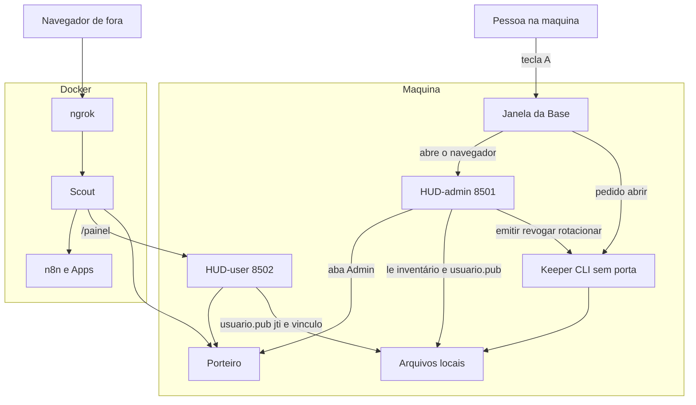

# Desenho: HUD-admin, HUD-user e Keeper

Registro de desenho. Não muda código, script, teste nem CI. A base é `control-plane-plus` no commit `cd25d02`.

O desenho anterior está em `docs/desenho-acesso-multiusuario.md`. O que aquele texto marca como já no código continua valendo. Este arquivo é o passo seguinte.

Prioridade: uso diário de pé, com trilha, alertas e sessões visíveis. O webhook de alerta não muda: continua GET, sem token, de propósito.

As questões (a) a (d) estão fechadas abaixo. O meio de três decisões aprovadas mudou para o POC caber numa pessoa e para fechar o lockout e o alcance do Docker. A intenção delas permanece.

## 1. Intenção que permanece, e o meio que mudou

| Decisão | Intenção | Meio neste texto |
| --- | --- | --- |
| 1 | Um campo Token por tela. O validador descobre o tipo. Recusas distintas | O HUD-user tem o único campo Token. O HUD-admin, no fim, não tem campo de colar. Os dois validadores recebem a string já normalizada |
| 2 | HUD-admin só na máquina. HUD-user é o único painel no túnel. O user entra com JWT da conta e vínculo de IP | Igual. O login do convidado já vinculado lê `usuario.pub` no disco e não chama o Keeper |
| 3 | Rótulos Base e Apps. `APPS_BOOT` com leitura da chave antiga | `APPS_BOOT` vazio não apaga `STACKS_BOOT` preenchido |
| 4 | Todo passo de auth grava `passo`, `resultado` e `motivo` de uma lista fixa. A tela não inventa motivo | A tela mostra o próximo passo, mapeado desse código. O código fica só em `auth.jsonl`. A trilha de caminho e o webhook não leem esse arquivo |
| 5 | Keeper separado dos dois Streamlits. O admin do HUD obedece o Keeper nas chaves | Sem porta HTTP. O Keeper é um comando de curta duração, chamado na máquina. Uma porta em `127.0.0.1` seria alcançável pelo n8n via `host.docker.internal` |
| 6 | Um gesto na máquina emissora abre o admin, sem colar JWT, e não se copia para outra pessoa | O gesto é a tecla A na janela do `iniciar_servicos.ps1`, não um botão dentro do Streamlit. Um botão na 8501 rodaria no processo do host para qualquer cliente que alcançasse a porta, inclusive um container |
| 7 | Fatias separadas. Documento fora da branch de comportamento | Igual |

O JWT de usuário não carrega o IP. As claims são conta, listas, prazo e `jti`. O IP é o registro do Porteiro (`conta_vinculada`, `vinculo: ativo`, status `aprovado`). «Rotativo» é o prazo do token e a rotação da chave.

## 2. O que o código faz hoje

Dois processos do mesmo `control_plane/app.py`:

| Processo | Modo | Onde escuta | Quem entra |
| --- | --- | --- | --- |
| Console | `PANEL_MODE=console` | `127.0.0.1:8501` | Dois campos na mesma tela: «Token de acesso» e «Token de admin». O JWT de usuário aqui não exige vínculo de IP |
| Borda | `PANEL_MODE=edge` | `127.0.0.1:8502`, caminho `/painel` | Um campo, «Token de acesso». Sem o HMAC do Porteiro o login nem começa. JWT de admin é recusado. Vínculo de IP é obrigatório para sair de aguardando |

O JWT de admin nasce em `python -m control_plane.admin_token`, vale 5 minutos, e o `jti` vale uma vez. A privada fica em `.n8groker/admin.key`. O Streamlit só lê `admin.pub`. A sessão já aberta continua admin até o WebSocket cair: o painel não confere o JWT de novo. `--rotate` guarda a pública anterior por 300 segundos.

O JWT de usuário nasce na aba Admin do console. Esse processo lê `usuario.key`. Vários `jti` da mesma conta podem estar vivos. Revogar um sobe a geração daquela conta. Rotacionar a chave de usuário vale na hora, sem os 300 segundos, e sobe a geração de todas as contas. O cookie do Scout cai no pedido seguinte.

Quem aprova e vincula é a pessoa, na aba Admin do console (8501). Essa aba chama `http://127.0.0.1:5676` por baixo. A pessoa não abre a porta 5676. A URL pública não aprova.

`st.context.ip_address` não prova máquina local. No Streamlit 1.64, peer `127.0.0.1` vira `None`. No Docker Desktop, `host.docker.internal` alcança porta do host em loopback, e o n8n já usa esse nome. O Scout recusa escuta ou destino `5676` e `5677` numa rota manual, com uma exceção: a rota `porteiro-manual` segue o upstream do ambiente, e o boot grava esse upstream com PATCH. Destino `8501` não está na lista recusada.

A trilha de caminho é `.n8groker/trilha/trilha.jsonl`. O alerta olha os últimos 20 resultados por IP nesse arquivo e conta `BLOQUEIO` antes de `LIBERADO`. A função que grava apaga o motivo se o texto contiver `token`, `senha`, `password`, `cookie`, `authorization`, `bearer` ou `eyj`. O webhook de alerta é GET, sem token.

Na aba Infraestrutura o botão é «Iniciar núcleo». Não existe «Parar núcleo». A tecla G abre o painel. A tecla Q encerra o núcleo e as stacks que estiverem no ar. `STACKS_BOOT` vazio sobe só o núcleo.

O boot cria, antes do compose, HMAC, tokens do Porteiro, `sessao.key`, geração, auditoria, trilha e `usuario.key` se faltar. Não cria `admin.key`. O Scout monta arquivos avulsos. `admin.key` e `usuario.key` ficam de fora. Entram no container: token do painel do Porteiro, `sessao.key`, geração, HMAC e a pasta da trilha.

A seção 10 do desenho anterior (JWT em todo pedido no portal) não está no código e este desenho não a liga.

## 3. Componentes

| Nome | O que é |
| --- | --- |
| HUD-admin | O console de hoje, porta 8501. Só a máquina |
| HUD-user | A borda de hoje, porta 8502, caminho `/painel`. Único painel no túnel |
| Keeper | Comando curto na máquina, sem porta. Gira e emite chave. Não é um terceiro Streamlit |
| Janela da Base | O `iniciar_servicos.ps1`. Não se chama HUD |
| Base | Porteiro, Scout, ngrok, os dois painéis e a rede |
| Apps | n8n e a stack LLM |

Os dois HUD continuam dois processos do mesmo `app.py`. Partir em dois programas fica para depois, se ainda fizer falta.

O convidado não passa pelo Keeper. O Docker não tem seta até o Keeper: não há porta para chamar. O túnel não tem seta até o HUD-admin.

## 4. Portas

| Peça | Porta | Bind | Túnel |
| --- | --- | --- | --- |
| HUD-admin | 8501 | `127.0.0.1` | Não. O Scout recusa essa porta, inclusive como upstream da `porteiro-manual` e no valor que o boot grava |
| HUD-user | 8502, caminho `/painel` | `127.0.0.1` | Sim, depois do Porteiro, com IP aprovado. Único painel no túnel |
| Keeper | Nenhuma | Não escuta | Não |
| Porteiro visitante | 5677 | `127.0.0.1` | Sim, upstream do Scout até a sessão escolher o App |
| Porteiro, uso da aba Admin | 5676 | `127.0.0.1` | Não |
| Scout portal | 4050 | `127.0.0.1` no host. O ngrok fala com `scout-backend` na rede | Sim, é a entrada |
| Scout API | 8765 | `127.0.0.1` | Não |
| API do ngrok | 4040 | `127.0.0.1` | Não |
| n8n | 5678 | `127.0.0.1` | Sim, na raiz, se a conta puder abrir |
| Langfuse | 3000 | `127.0.0.1` | Sim, se a conta puder abrir |
| Worker do Langfuse | 3030 | `127.0.0.1` | Não |
| LiteLLM | 4000 | `127.0.0.1` | Sim, se a conta puder abrir |
| MinIO | 9090 | `127.0.0.1` | Não |
| Postgres, Redis, ClickHouse | Sem publish | Rede Docker | Não |
| Ollama, se local | 11434 | localhost | Não |

Lista proibida para escuta, destino e upstream, em toda rota do Scout, na `porteiro-manual` também, e no número que o boot grava em `SCOUT_UPSTREAM_PORT` ou no alvo do ngrok: `8501`. Se o ambiente pedir `8501`, o boot não aplica, mantém o destino seguro que já tinha (o Porteiro na `5677` quando era esse o caso) e avisa. O Keeper não entra nessa lista porque não tem número. Se um dia ganhar porta, o número entra na mesma lista nos três lugares: rota manual, `porteiro-manual` e boot.

## 5. Responsabilidades

| Peça | Faz | Não faz |
| --- | --- | --- |
| Keeper | Emite JWT de usuário, revoga `jti` e conta, gira as chaves de admin e de usuário, grava o ticket do gesto A | Não escuta porta. Não aprova IP. Não sobe Docker. Não gira `sessao.key`, HMAC nem tokens do Porteiro. Não é chamado pelo HUD-user |
| HUD-admin | Contas, listas, fila, aprovar, reprovar, vincular, inventário, trilha, sessões, backup, diagnóstico, ligar Base e Apps. Pede ao Keeper para emitir e girar | Não cola JWT de admin no estado final. Não lê privada. Não é destino do túnel. Não tem botão Parar base |
| HUD-user | Um campo Token. Lê `usuario.pub` e o `jti` no disco. Aplica o vínculo de IP. Mostra o próximo passo | Não chama o Keeper. Não abre sessão admin. Não cria conta. Não gira chave |
| Janela da Base | Sobe a Base, os dois HUD e os Apps pedidos. Tecla A chama o Keeper e abre o navegador. Tecla Q encerra a Base, os Apps e o processo do Keeper se ele ainda estiver vivo | Não se chama HUD. Não reescreve `.env` |
| Scout | Túnel, origem, cookie, escolha de App, Porteiro, trilha de caminho, alertas. Passos de auth vão para `auth.jsonl` | Não vê chave de admin nem de usuário. Não aponta para `8501` |
| Porteiro | Fila, aprovação, bloqueio, vínculo. HMAC no `/painel` | Não emite JWT. A pessoa não opera nele direto |

Contas e listas em `users.json` continuam na tela do HUD-admin. Isso não é operação de chave.

## 6. Contrato do Keeper

Um processo por pedido. O HUD-admin ou a janela da Base roda o comando e espera no máximo 3 segundos. Não há URL. O segredo de máquina fica em `.n8groker/maquina.key`, fora do `.env`, fora do compose e fora de volume. O comando não recebe esse segredo em argumento. O Keeper lê o arquivo. Se o arquivo não existir, o primeiro boot da máquina cria. Container não o monta.

O filho grava `.n8groker/keeper.pid` ao nascer e apaga ao sair. A tecla Q mata esse PID se o arquivo ainda existir.

Entrada: `python -m control_plane.keeper <pedido>`, com um JSON opcional no stdin. Saída: uma linha JSON e código 0 ou 2. A linha não leva chave privada. Só o pedido `emitir` devolve o JWT, uma vez, no campo `jwt`.

| Pedido | stdin | Resposta quando dá certo | Quando recusa |
| --- | --- | --- | --- |
| `status` | vazio | `{"ok": true, "motivo": "ok"}` | timeout ou `{"ok": false, "motivo": "chave"}` se faltar `maquina.key` |
| `abrir` | vazio | `{"ok": true, "motivo": "ok"}`. Grava o ticket se não houver um ainda válido. Não imprime o ticket | `chave` se faltar `admin.key` e a criação inicial falhar, ou se faltar `maquina.key` |
| `emitir` | `{"conta", "ver", "operar", "abrir"}` | `{"ok": true, "motivo": "ok", "jwt": "..."}` | `conta` |
| `revogar-jti` | `{"jti"}` | `{"ok": true, "motivo": "ok"}` | `formato` |
| `revogar-conta` | `{"conta"}` | `{"ok": true, "motivo": "ok"}` | `conta` |
| `rotacionar` | `{"alvo": "admin"}` ou `{"alvo": "usuario"}` | `{"ok": true, "motivo": "ok"}` | `chave` |

`abrir` é idempotente por 60 segundos: se já existe ticket novo ainda não consumido, o segundo pedido não grava outro e não gira chave. O primeiro `abrir` numa máquina sem `admin.key` cria essa chave e segue. É o único lugar que cria a chave de admin. `rotacionar` gira e não abre o painel.

Fora do prazo de 3 segundos o chamador mata o filho, trata como Keeper fora e não tenta de novo sozinho no mesmo rerun.

## 7. Fluxos

### 7.1 Boot

1. O script prepara os arquivos de hoje e, se faltar, `maquina.key`. Não cria `admin.key` neste passo. Quem cria é o primeiro gesto A.
2. Sobe rede, Scout, ngrok para `scout-backend`, Porteiro e os dois HUD em `127.0.0.1`.
3. Antes de gravar o upstream da `porteiro-manual` ou o alvo do ngrok, recusa `8501`.
4. Apps, nesta ordem: se `APPS_BOOT` tiver valor, vale ela. Se `APPS_BOOT` estiver ausente ou vazia e `STACKS_BOOT` tiver valor, sobe o valor antigo e avisa. Se as duas tiverem valor e forem diferentes, vale `APPS_BOOT` e avisa. O `.env` não é reescrito. O mesmo aviso aparece na aba Diagnóstico.
5. Não há botão Parar base. Q encerra a Base, os Apps que estiverem no ar e o PID do Keeper. Ollama e Docker Desktop só fecham se o script os abriu nesta sessão.

### 7.2 Gesto A, «Gerar e abrir»

1. A pessoa está na máquina, com a janela da Base aberta. Aperta A.
2. A janela chama `abrir` no Keeper, com o timeout de 3 segundos.
3. Se der certo, o Keeper deixa um ticket em `.n8groker/admin-abrir.ticket`, por 60 segundos, modo restrito. Não é JWT, não vai para a URL, não é impresso. A janela abre `http://127.0.0.1:8501`.
4. O HUD-admin, num rerun em que ainda não é admin, vê o ticket, grava a sessão e apaga o arquivo. Um rerun seguinte, já admin, não lê e não apaga ticket. Não chama o Keeper para isso.
5. Se o ticket sumiu entre a leitura e o rerun, a tela fica sem sessão e sem mensagem de erro repetida.
6. Keeper fora: a janela diz a frase, o HUD-admin mostra o banner «Keeper fora, não dá para emitir nem girar chave», e a aba Diagnóstico ganha uma linha com essa falha, sem segredo. Emitir e girar ficam desligados. O inventário, que é leitura de disco, continua.
7. Copiar a URL para outro computador não abre admin. O ticket ficou nesta máquina e some ao ser usado.
8. Header de túnel na 8501 não consome ticket e não abre admin.
9. O colar do JWT de admin só sai numa fatia posterior, depois que este gesto passar no Windows, inclusive com o PC reiniciado e sem processo do Keeper já de pé. Até lá o colar antigo continua como saída de emergência.

Reiniciar o PC mata a sessão do navegador e não deixa daemon para subir. O gesto A não depende de serviço escutando. Depende do Python da máquina, de `maquina.key` e da janela da Base. O comando `rotacionar` sozinho continua sem abrir o painel. Quem abre é só `abrir`.

### 7.3 Segundo navegador na mesma máquina

A tecla A de novo, com a primeira sessão já admin, cria outro ticket se o anterior já foi consumido. O primeiro rerun, que já é admin, não come esse ticket. O segundo navegador, ainda sem sessão, consome. As duas sessões convivem. Nenhuma das duas vale em outra máquina. A tecla A não gira chave e não derruba a primeira sessão.

### 7.4 Emissão do JWT de usuário

1. A sessão admin já está aberta.
2. O formulário no HUD-admin manda conta e listas.
3. O HUD chama `emitir` no Keeper. A privada não entra no Streamlit. O JWT aparece uma vez para copiar.
4. Emitir não apaga `jti` anteriores da mesma conta.
5. A trilha de auth grava `auth.emitir`, resultado `ok`, motivo `ok`, sem o JWT.
6. Com o Keeper fora, o banner aparece e nada é emitido. Quem já entrou no túnel não cai por isso.

### 7.5 Login do convidado pelo túnel

1. O navegador de fora entra no ngrok e no Scout.
2. IP novo ou origem nova em `/painel` recebe a página 202. O Streamlit não abre.
3. A pessoa dona aprova e vincula na aba Admin do HUD-admin (8501). A aba fala com `127.0.0.1:5676`. `/n8n/aprovar` não grava o vínculo. `/n8n/vincular` grava, no par já aprovado.
4. Um outro PR, já em andamento no código atual, trata o navegador novo num IP já aprovado e o botão único «Liberar este IP para esta conta». Este desenho não muda esse fluxo.
5. Em `/painel` há um campo Token. A string passa pela normalização única e pelos validadores. O HUD-user lê `usuario.pub` e o registro de `jti` no disco. Não chama o Keeper.
6. JWT de admin neste campo não abre admin. Motivo `tela`.
7. JWT válido sem vínculo ativo fica em aguardando, listas vazias.
8. Com vínculo, as listas são as daquele token.
9. Escolher um App segue o caminho atual: ticket de sessão, cookie, origem, Porteiro, upstream. A raiz sem sessão continua 403.
10. Keeper fora não derruba esse login.

### 7.6 Revogação

1. Revogar um `jti` marca o registro e sobe a geração daquela conta. O cookie cai no pedido seguinte. Outras contas ficam.
2. Revogar a conta marca todos os `jti`, põe status inativo e sobe a geração.
3. Revogar um `sid` no Scout derruba só aquele cookie. O JWT pode seguir válido.
4. `jti` e conta passam pelo Keeper. O `sid` continua na API local do Scout, chamada pelo HUD-admin em loopback.

### 7.7 Rotação, uma regra só

Admin e usuário caem na checagem seguinte. Não há folga de 300 segundos para nenhum dos dois.

1. Só o Keeper gira. O HUD pede `rotacionar`.
2. A pública nova passa a valer na hora. A pública anterior fica no disco só para o motivo `rotacionado`. Ela não abre sessão.
3. Chave de usuário: o `kid` deixa de bater, a geração de cada conta sobe, o cookie cai no pedido seguinte. A sessão admin não usa essa chave.
4. Chave de admin: o Keeper aumenta um número em `.n8groker/admin-geracao`. O HUD-admin lê esse arquivo em todo rerun, sem chamar o Keeper. Se o número da sessão for menor, a sessão fecha. O próximo acesso é a tecla A.
5. Keeper fora não gira e não mexe nesse número. A sessão admin já aberta continua. O convidado continua lendo o `usuario.pub` que está no disco.

### 7.8 Sessões já abertas

| Evento | Admin já aberto | Convidado já aberto | Cookie do Scout |
| --- | --- | --- | --- |
| Giro da chave de usuário | Continua | Cai na próxima atualização, motivo `rotacionado` | Cai no pedido seguinte |
| Giro da chave de admin | Cai na próxima atualização, porque o número no disco mudou | Não usa essa chave | Não usa essa chave |
| Revogar `jti` ou a conta | Continua | Cai na próxima atualização | Cai no pedido seguinte |
| Revogar um `sid` | Continua | A tela pode seguir até a próxima ida ao Scout | Aquele `sid` para |
| Keeper fora | Continua. Emitir e girar ficam desligados | Continua, se o vínculo e o `usuario.pub` seguem válidos | Continua |
| Fechar o navegador | Some. A tecla A abre de novo | Some. O cookie pode seguir se IP, origem e geração baterem | Regra de hoje |

O WebSocket não é cortado no mesmo instante. A checagem seguinte recusa. A geração em `sessoes-geracao.json` continua regravada no mesmo arquivo, para não quebrar a montagem no Docker Desktop.

## 8. Normalização, motivos e trilha

Uma função só, antes dos dois validadores: tira BOM, aspas em volta e todo espaço. Os dois veem a mesma string. Vazio depois disso é motivo `vazio`, e o outro validador não corre.

No HUD-user, `aud` de admin vira `tela` mesmo com assinatura boa. No HUD-admin, depois que o colar sair, não há campo Token.

O arquivo de auth é `.n8groker/trilha/auth.jsonl`, dentro da pasta que o Scout já monta. O leitor de `trilha.jsonl` não passa a ler a pasta inteira. Os últimos 20 resultados do alerta não veem este arquivo. O passo leva o prefixo `auth.`, que a trilha de caminho não usa: `auth.login`, `auth.emitir`, `auth.revogar`, `auth.rotacionar`, `auth.sessao`. O resultado é `ok` ou `recusado`. `LIBERADO` e `BLOQUEIO` ficam só em `trilha.jsonl`. O webhook não recebe evento de auth e não muda de contrato.

O motivo guardado é o código. A frase não entra no arquivo, porque a trilha apaga a palavra token. A tela mostra só o próximo passo.

| Código | Próximo passo na tela |
| --- | --- |
| `ok` | Segue. Sem frase de erro |
| `vazio` | Preencha o campo |
| `formato` | Peça outro token ao dono |
| `chave` | Espere o dono. Falta a chave nesta máquina |
| `assinatura` | Peça outro token ao dono |
| `prazo` | Peça outro token ao dono. Este venceu |
| `revogado` | Peça outro token ao dono |
| `repetido` | Volte ao navegador em que você já entrou |
| `conta` | Espere o dono |
| `tela` | Esta tela não aceita este acesso |
| `sessao` | Volte ao navegador em que você entrou |
| `origem` | Espere o dono aprovar esta origem |
| `rotacionado` | Peça outro token ao dono. A chave girou |
| `relogio` | Acerte o relógio desta máquina e peça outro token |

`rotacionado` é `kid` diferente da pública atual, ou assinatura que só bate na pública anterior. Não entra. `relogio` é token ainda no futuro, além da tolerância de 30 segundos que o código já tem. Token vencido continua `prazo`. O motivo `expirado` de hoje vira `prazo`. O motivo `borda` vira `tela`.

## 9. Inventário

A aba Admin do HUD-admin mostra, lendo o disco, sem o Keeper e sem a privada:

- Se `admin.pub` e `usuario.pub` existem, e o `kid` curto da chave de usuário.
- O número de `admin-geracao`.
- Os `jti` ainda no prazo: conta, validade, revogado ou não.
- Se `maquina.key` existe. Só sim ou não.
- Se `sessao.key`, a chave HMAC e os dois tokens do Porteiro existem, com a frase de recuperação de cada um.

Emitir, revogar e girar ficam desligados enquanto o banner do Keeper estiver na tela. A lista continua visível.

## 10. Recuperação dos arquivos que o Keeper não gira

**`sessao.key`.** O cookie do túnel deixa de validar e o convidado cai no pedido seguinte. O admin da máquina não usa esse cookie. Pare o Scout, apague o arquivo se ele estiver vazio ou corrompido, suba de novo com `iniciar_servicos.ps1` para o boot criar outro, e só então suba o Scout, para a montagem ver o arquivo. Quem tinha cookie entra de novo em `/painel`.

**Chave HMAC (`porteiro-hmac.key`).** O HUD-user não abre: falta o cabeçalho assinado. O n8n em `127.0.0.1:5678` não cai. O boot cria o arquivo se ele estiver ausente ou vazio. Reinicie o Porteiro e o HUD-user para os dois lerem a mesma chave. Se trocar o arquivo com o Scout no ar, pare o Scout antes, pelo mesmo motivo da montagem.

**Tokens do Porteiro (`porteiro-painel.token` e `porteiro-n8n.token`).** A aba Admin recebe 403 na fila se o token do painel não bater. O workflow de aprovação recebe 403 se o token do n8n não bater. O visitante no túnel não cai por isso. Não apague à toa. Se apagou, o boot gera outro e regrava `porteiro-n8n.env`. Recrie o container do n8n para ele ver o env novo. A aba Admin lê o arquivo novo na hora.

## 11. Menor prioridade

Numa fatia tardia, sem misturar com o gesto A nem com o botão «Liberar este IP para esta conta»:

- **Encerrar este IP.** Na aba Admin, tira o vínculo daquela conta com o IP e não marca `bloqueado`. O IP aprovado pode seguir no n8n. O próximo login da conta nesse IP volta a aguardando. Não é bloquear e não é o botão de liberar.
- **Nomes.** HUD é só o HUD-admin e o HUD-user. A janela do script deixa de se chamar HUD: o botão «Abrir HUD do núcleo» passa a «Abrir a janela da Base». A tecla G abre a página do HUD-admin e não entra como admin. A tecla A entra. A tecla Q encerra.

## 12. Fatias

Cada fatia é uma branch. Este arquivo é a fatia 0.

Pré-requisito, noutro PR, no código atual, já em andamento: navegador novo num IP aprovado e o botão único «Liberar este IP para esta conta». Este desenho não redesenha isso.

1. **Rótulos Base e Apps, e a leitura de `APPS_BOOT`.** Vazio não esconde `STACKS_BOOT`. Aviso no boot e na aba Diagnóstico. Sem botão Parar base.
2. **Normalização única, próximo passo na tela, `auth.jsonl`.** Webhook e `trilha.jsonl` intactos.
3. **Um campo Token no HUD-user.** JWT de admin vira `tela`. O colar de admin no console continua.
4. **Trava da porta 8501** na rota manual, no upstream da `porteiro-manual` e no valor gravado pelo boot. Pode andar junto com a 1 e a 2.
5. **Keeper CLI, contrato, inventário, banner, timeout de 3 segundos, linha no Diagnóstico, Q mata o PID, uma regra de rotação.** O colar de admin continua.
6. **Tecla A, ticket, rerun idempotente, segundo navegador.** O colar continua até o ensaio no Windows, com o PC reiniciado e sem Keeper de pé.
7. **Tirar o colar de admin.** Só depois desse ensaio. PR separado da fatia 6.
8. **Tirar o login de usuário do console.** Espera o pré-requisito e a fatia 3. Pode andar em paralelo com a 5 e a 6, porque não mexe no colar de admin.
9. **Encerrar este IP e os nomes da seção 11.** Por último entre as fatias de comportamento.
10. **Guias de uso.** Depois da fatia que cada texto descreve. PR separado do código.

Riscos que a ordem segura:

| Fatia | Risco | Limite |
| --- | --- | --- |
| 1 | As duas chaves no `.env` | Vazio cai no valor antigo. Não gravar `.env` |
| 2 | Motivo com a palavra token some. Alerta muda se `auth.jsonl` entrar na janela de 20 | Código curto. Arquivo separado. Webhook sem evento de auth |
| 3 | Admin aceito na 8502 | Teste: JWT de admin na borda não liga sessão admin |
| 4 | Boot deixa de aplicar um upstream errado e o túnel muda de destino | Recusa só a porta proibida. O destino seguro permanece |
| 5 | Dois escritores na mesma chave. Inode novo na geração | Um escritor, o Keeper. Gravar no mesmo arquivo. Colar de admin ainda entra |
| 6 | A tecla A falha e, se o colar já tiver saído, ninguém entra | O colar sai na fatia 7, depois do Windows |
| 7 | Ensaio incompleto | Não juntar com a fatia 6 |
| 8 | Convidado sem o conserto do navegador novo perde o atalho do console | Esperar o outro PR |
| 9 | «Encerrar este IP» confundido com bloquear | Texto do botão diz que o IP não fica bloqueado |

## 13. Impacto em documentos existentes

Nenhum outro documento foi editado.

`GUIA-DE-USO` e `TOUR-EM-VIDEO` não estão na árvore de `control-plane-plus` em `cd25d02`. Quando existirem, o impacto previsto é:

**GUIA-DE-USO**

- Base e Apps no lugar de núcleo e stacks. Sem botão Parar base. Q encerra Base, Apps e o Keeper se estiver vivo.
- `APPS_BOOT` vazio não apaga `STACKS_BOOT`.
- Admin entra pela tecla A, não por JWT colado.
- Convidado: um campo Token no túnel, com o próximo passo na tela.
- Chave de admin e de usuário gira pelo Keeper. Keeper fora não derruba quem já entrou.
- A janela do script não se chama HUD.
- O webhook de alerta segue sem token.

**TOUR-EM-VIDEO**

- Cena do campo «Token de admin» ou do JWT impresso fica velha na fatia 7.
- Cena que disser núcleo, ou que mostrar Parar núcleo, fica velha na fatia 1.
- Cena do login no túnel com frase genérica fica velha na fatia 2.
- Cena do Keeper só depois que a tecla A existir. Não regravar o tour na branch do código.

Ficam para PR posterior, sem edição agora: `docs/ENTENDA-O-PROJETO.md`, `docs/desenho-acesso-multiusuario.md`, `README.md`, `DOCUMENTACAO.md`, `control_plane/README.md`.

## 14. O que este desenho não faz

- Não altera o webhook de alerta.
- Não mexe em `master`.
- Não commita `.env`, `.n8groker/` nem `controle_acesso.json`.
- Não liga a seção 10 do desenho anterior.
- Não redesenha o navegador novo no IP aprovado nem o botão «Liberar este IP para esta conta».
- Não dá porta ao Keeper.
